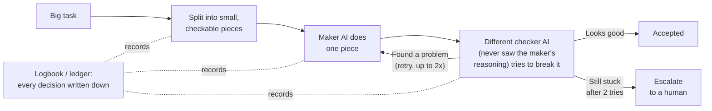

# The layman's intuition: what `dag` is, and why it exists

**Audience:** Anyone. No engineering background needed. If you can picture a newsroom, you can understand this page.

**TL;DR.** `dag` is a way of getting careful work out of an AI by *not* trusting any single answer it gives. Instead of one AI writing one reply in one shot, `dag` splits the job into small pieces, has a *different* checker inspect each piece without seeing how it was made, writes every decision down in a logbook, and stops retrying after a fixed number of tries. It is built for high-stakes work where a plausible-but-wrong answer is expensive (`plugins/dag/skills/dag/DESIGN.md` §1, §6.5).

---

## The problem, from first principles

Ask a large language model (LLM — the kind of AI behind chat assistants) a hard question and it will almost always give you a fluent, confident answer. The catch: fluent and confident are *not* the same as correct. The model is very good at *sounding* right, which is exactly what makes a wrong answer dangerous — it slides past you.

So the honest starting point is: **you cannot trust one shot.** Not because the model is bad, but because a single pass has no one checking it. The whole `dag` design is a set of five habits that a careful *human* team would use to avoid the same trap.

Think of a newsroom publishing a story that had better be true.

## The newsroom analogy

Imagine a small newsroom with three roles and one strict rule.

**The reporter** writes the story.

**The fact-checker** verifies it — but here is the twist that makes it work: the fact-checker *never sees the reporter's notes or reasoning*. They get the finished article and go re-check every claim from scratch, from original sources. Why keep them apart? Because if the fact-checker reads the reporter's justification first, they start nodding along to it. Sharing the reasoning would just spread the reporter's blind spots to the checker. Keeping them apart forces a genuinely independent second look.

**The editor** keeps a logbook. Every decision — who's on the story, what "done" means, what was checked, what got sent back — goes in the book. Nobody in this newsroom works "from memory." If you want to know why something was decided, you open the book and read it.

And the rule: **if a story keeps failing fact-check, you don't rewrite it forever.** After a couple of rounds you stop and escalate it to a human editor to make the call.

That newsroom *is* `dag`. Now let's map the five habits directly onto it.

## The five habits

### 1. Don't trust one shot

The reporter's first draft is never the published story. In `dag`, no answer is accepted just because the AI produced it. Every result must survive an independent check before it counts (`DESIGN.md` §1: the pipeline "verifies every unit with an *independent* adversarial checker" and "refuses to assert unbacked claims").

### 2. Split big work into small, checkable pieces

You don't fact-check a 5,000-word investigation as one blob — you break it into individual claims you can each verify on their own. `dag` does the same: it chops the task into **atomic units**, where "atomic" means one clear goal, small enough that a checker can judge it right-or-wrong from the piece alone, without redoing the whole task (`plugins/dag/skills/dag/references/methodology.md` §Decomposition: a unit must be "Single responsibility," "Independently verifiable," and "Budget-fit"). Smaller pieces are easier to check and can be worked on in parallel. And when the raw material is genuinely huge — thousands of documents, millions of rows — `dag` still splits the *work* rather than trying to hold it all at once: it partitions the material into slices, works each slice on its own, and spot-checks a representative *sample* instead of re-doing every one (`data-partitioning.md` §1: "Partition the *work*, not the *context*"; §3.4: the checker re-runs the work on a sample and compares).

### 3. A *different* checker, who can't see your reasoning

This is the heart of it. The checker is a *separate* AI instance whose job is not to agree but to **break** the result — find the missed requirement, the unsupported claim, the made-up citation (`methodology.md` §Verification: "a single model instance that both makes and checks its own work suffers confirmation bias," so the checker is separate and "incentivized to refute"). Crucially, the checker is given the finished work and the original instructions, but **not** the maker's chain of thought (`methodology.md` §Verification: "The verifier receives the brief, the debrief, and the artifacts — **not** the executor's reasoning"). That's the fact-checker who never saw the reporter's notes. For the highest-stakes pieces one checker isn't enough: `dag` puts a *panel* of three independent checkers on it, each looking through a different lens — did it meet the requirements, can the results be reproduced, did it stay in scope — and goes with the majority (a genuine split still escalates to a person) (`methodology.md` §Verification: "Panel of 3 is the DEFAULT on high-stakes units — distinct lenses, discrete majority").

### 4. Write everything down (the ledger)

The newsroom's logbook is, in `dag`, a folder on disk called the **run directory** — the single source of truth for the whole job. The AI keeps almost nothing "in its head"; it reads and writes files: a living plan, an append-only decision log, a progress log, and more (`DESIGN.md` §3: "the **run directory** ... is the single source of truth. Dag holds almost no state in its own context"). The payoff: nothing gets quietly rediscovered or re-argued later, and if the job is interrupted, it can be picked back up from the files (`DESIGN.md` §4, requirement 13: "Ledger is truth").

### 5. Stop after a bounded number of retries

When the checker rejects a piece, `dag` feeds the specific complaints back and tries again — but **at most twice**. If it still fails after that, `dag` does not loop forever; it hands the disagreement to a human to decide (`methodology.md` §Self-learning: correction loop is "**Cap at 2 retries.** If it still fails, it is a disagreement ... not an infinite loop"). Bounded effort, then escalate — just like the newsroom's rule.

## One picture

Read it left to right: split the work, a maker does a piece, a separate checker attacks it, and either it's accepted, sent back for a bounded retry, or escalated to a person. The dotted logbook underneath is writing *all* of it down as it happens.

## A tiny worked example

Say the task is "tell me the three cheapest ways to ship this product to Canada, with sources."

- **One shot** would give you a confident list. Some prices might be invented. You'd have no way to tell which.
- **`dag`** splits it: one piece finds carrier options, one checks each price against the carrier's own published rate, one confirms Canada is actually served. A *separate* checker re-opens each cited rate page to confirm it's real (`methodology.md` §Verification: for each claim "the verifier independently confirms the evidence is real ... reproduces results where feasible"). Anything that can't be backed by a real source is flagged "could not verify" rather than stated as fact (`DESIGN.md` §4, requirement 10). Every choice lands in the logbook. If a price can't be confirmed twice over, it escalates to you instead of being smoothed over.

Same question. The difference is that the second version *earns* your trust instead of asking for it.

## What `dag` honestly does **not** guarantee

A page about a system that demands evidence had better hold itself to the same bar. So, plainly:

- **The "budget" (how much the AI is allowed to read per piece) is mostly a discipline, not a hard wall.** The platform can't yet force a hard cap on what a piece actually consumes; `dag` checks the *declared* number and leans on good habits for the rest (`DESIGN.md` §6, limitation 1).
- **The checker's independence is attested, not cryptographically proven.** The checker declares it didn't see the maker's reasoning, and the two are separate instances — but they still share the same underlying model, and nothing can *prove* the blindness (`DESIGN.md` §6, limitation 2).
- **"Self-learning loops" is a borrowed label, not an official term.** The idea `dag` actually implements — *decouple the maker from the checker* — is a well-attested practice credited to Boris Cherny, a co-creator of Claude Code; the specific phrase is not in the official docs, and `dag` labels that provenance rather than inventing authority for it (`DESIGN.md` §5; `methodology.md` §Verification).
- **The "stop after 2 retries" rule rests on a *checkable* termination argument, not a claim that the system is proved correct for every possible input.** The strength of that argument — and the difference between *machine-checked*, *hand-proved*, and merely *asserted-but-consistent* guarantees — is the subject of the formal-methods page (see `03-formal-methods.md`). This page only claims the intuition; it does not claim a proof.

That last honesty is itself the point: `dag` exists so that "I'm confident" is replaced with "here's who checked it, how, and where it's written down."

---

*New here? Start at [Home](Home.md). Curious how the underlying AI actually produces text (and why one shot is risky)? See [how LLMs work](02-llm-workings.md). Want the rigor behind the "bounded retries" claim? See [formal methods](03-formal-methods.md).*
