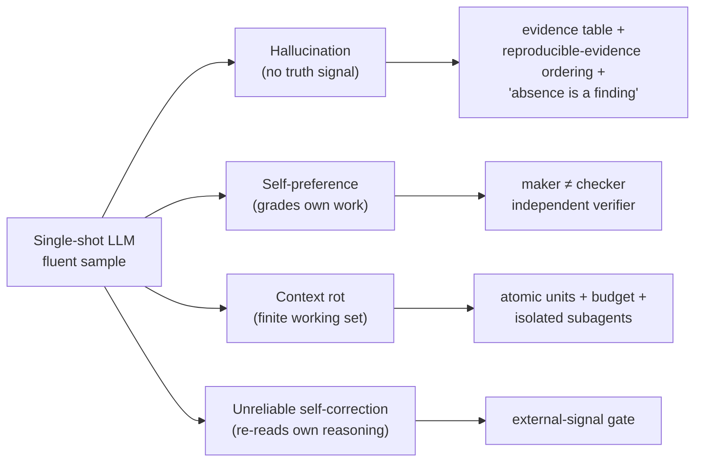
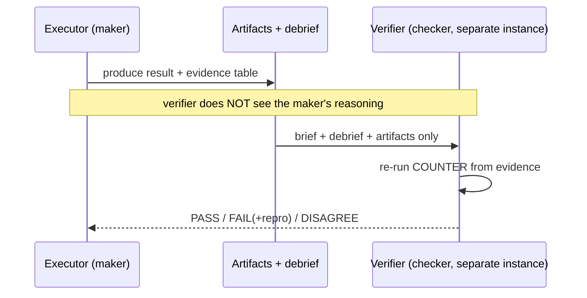

# How LLMs actually fail — and how dag counters each mode

**Audience:** engineers who use LLMs and want to know *why* a single well-phrased prompt is not trustworthy for correctness-critical work — and what dag does about it, mechanism by mechanism.

**TL;DR.** A single-shot LLM answer is a fluent sample from a model that has no built-in "am I right?" signal, no memory of what it already forgot, and a documented bias toward its own output. dag does not try to make the model smarter; it wraps the model in *process* — a typed evidence table, a maker≠checker split, an isolated per-unit context budget, external-signal gates, and (when the data itself won't fit) partitioning the *work* rather than the context — so that each named failure mode has a named counter. Every mechanism below carries a repo-file locator so you can open it and check. Where a guarantee is only partial, this page says so out loud.

---

## 1. First principles: why one prompt is not enough

Forget "hallucination is a bug." It is the *default behavior* of the object. An LLM is a next-token distribution. Sampling from it produces text that is locally plausible everywhere and globally verified nowhere. Three structural facts follow, and each maps to a failure mode:

1. **No intrinsic truth signal.** The model cannot tell a fact it retrieved from a fact it confabulated — both are just high-probability continuations. → *hallucination*.
2. **No neutral self-evaluation.** Ask the same model "is this good?" and it grades its own homework; it is measurably biased toward text it produced. → *self-preference / confirmation bias*.
3. **A finite, degrading working set.** Everything the model "knows" for this task is whatever is in its context window right now; pile on more and earlier material gets diluted and mis-weighted. → *context rot*.

dag's stance (`references/methodology.md:4-5`): the three goals are **verified correctness, zero hallucination, and no rediscovery.** The rest of this page is how those goals cash out against each failure mode.

---

## 2. The failure-mode → counter-mechanism map

| Failure mode | What it looks like | dag counter-mechanism | Repo locator |
|---|---|---|---|
| **Hallucination** | Confident, fabricated citation / API / number | Typed **claim→evidence table**, **executable > located > asserted** ordering; *absence is a finding* | `references/evidence-standards.md:10-41`, `:117-119` |
| **Self-preference / confirmation bias** | Model approves its own output | **maker ≠ checker**: independent adversarial verifier; **panel-of-3 default** on high-stakes | `references/methodology.md:241-289`, `:342-345` |
| **Context rot** | Later facts crowd out earlier ones; budget blown | **Atomic units** + **per-unit budget** + **isolated subagents** | `references/methodology.md:175-208`, `:224-230` |
| **Unreliable intrinsic self-correction** | "Let me reconsider…" degrades a correct answer | **External-signal gate** on every correctness check | `references/methodology.md:346-348`, `:241-289` |
| **Dataset larger than context** | Relevant data can't fit one window; stuffing it dilutes everything | **Partition the *work*, not the *context*** — map-reduce onto the DAG, each unit a bounded op over a shard *locator* | `references/data-partitioning.md:8-20`, `references/methodology.md:184-188` |

The first four are sampling or behavior pathologies of the model itself and get a subsection each below (§3–§6); the fifth is a *scale* limit — the data simply won't fit — handled by partitioning (§7), whose full pattern lives on `12-large-dataset-partitioning.md`.

---

## 3. Hallucination → the evidence table and "absence is a finding"

**The mechanism.** Every executor attaches an **evidence table** to its debrief; a claim without admissible evidence is a FAIL regardless of how plausible it reads (`references/evidence-standards.md:3-8`, `:153-154`). Crucially, "admissible" is *adaptive to the claim type* — you don't cite a blog for a code fact, and you don't cite code for a world fact. The taxonomy (`references/evidence-standards.md:31-41`):

- **Code behavior** → the code at `path:line` **plus a run** (test/REPL/command output). Reading a function name and inferring behavior is inadmissible.
- **Empirical/world fact** → a primary source, quoted, dated, with URL; two independent sources for contested facts.
- **Provenance/quote** → the exact source verbatim, verified to exist *before* quoting.
- …and Numeric, Causal, API-contract, Design/judgment, each with its own admissible/inadmissible column.

**Prefer evidence a machine can regenerate — executable > located > asserted (PR2).** Not all admissible evidence is equal. dag ranks it (`references/evidence-standards.md:10-29`): (1) **executable / reproducible** — a command + its output, a re-run test, a diff of expected vs actual, a re-derived number (the verifier *re-runs it* and compares); (2) **located but static** — a `file:line` or a dated URL + quoted section (the verifier *re-opens it*); (3) **asserted** — "I checked and it holds," admissible only when 1–2 are genuinely infeasible, and then labeled `ASSUMPTION:` with its blast radius. This ordering is *load-bearing, not stylistic*: a re-run's correctness does **not** depend on the checker's reasoning depth — the machine settles it — so reproducible evidence is **model-independent** (a modest verifier re-running a test reaches the same verdict a stronger one would). Structure substitutes for raw model IQ, and a claim that *could* have been made executable but is only asserted is a weaker debrief the verifier down-ranks or rejects (`references/evidence-standards.md:22-29`; verifier checklist `:134-135`). The same property is what makes data-parallel verification possible at all — see §7.

**Worked example.** You ask an agent "does `verify()` reject expired tokens?" A single-shot model answers "yes" because that is what a function called `verify` *should* do. dag's rule: that answer is inadmissible until you show the code line **and** a run where an expired token is actually rejected (`references/evidence-standards.md:36`). Name-reading is explicitly listed as inadmissible.

**The part most systems skip — absence is a finding.** The single most important anti-hallucination behavior is saying "I could not verify X" *out loud* rather than papering over it (`references/evidence-standards.md:117-119`). A gap is a legitimate, required output. This is also why the highest-severity hallucination class is fabricated citations/APIs/paths, and verifiers hunt those first (`references/evidence-standards.md:107-109`).

> Practice note: this very page follows the rule — every mechanism claim above carries a `path:line`. If you find one that doesn't resolve, that's a finding, not a nitpick.

---

## 4. Self-preference / confirmation bias → maker ≠ checker

**The mechanism.** A single model instance that both *makes* and *checks* its own work suffers confirmation bias, so dag makes the checker a *separate* instance that is *incentivized to refute* (`references/methodology.md:243-247`). This is not a style preference; it is grounded in the research the repo cites: LLM judges provably favor their own outputs — self-preference tied to self-recognition, and it *persists even when authorship is hidden* (`references/methodology.md:342-345`, attributing **arXiv:2410.21819** and **NeurIPS'24 2404.13076**).

The verifier's rules make the independence real (`references/methodology.md:249-269`):

- **Independence of context.** The verifier gets the brief, the debrief, and the artifacts — **not** the executor's chain of thought. It forms its own view (`:250-251`). Joint verification reinforces errors (`references/socratic-protocol.md:37`).
- **Refutation mandate.** Its job is to *break* the result — find the counterexample, the unmet criterion, the hallucinated citation, the budget breach. "A verifier that only confirms is malfunctioning" (`:252-254`).
- **Evidence re-check.** For each row in the evidence table it independently re-opens the cited page / re-runs the test (`:266-269`).
- **Verdict** is `PASS` / `FAIL` (+ minimal repro) / `DISAGREE` (a genuine judgment split → Socratic gate) (`:270-273`).

For **high-stakes** units a single verifier is not the default — an **odd panel of 3 is**. The three carry *distinct lenses* — **correctness** (criteria + evidence), **reproduce** (re-run / re-derive — executable evidence), **guardrail** (scope / non-goal / gold-plating) — and the verdict is the **discrete majority** (2-of-3); a split with no strict majority is a `DISAGREE` routed to a human, **never** a softmaxed or averaged score (softmaxing the discrete guard table would break the correction-loop termination proof) (`references/methodology.md:280-289`). Independently, each VERIFY node runs **loop-until-dry**: adversarial rounds that *accumulate* defects until a round surfaces nothing new ("dry") or a cap `R_max = 3` is hit — a bounded sweep that raises recall, node-internal so it adds no FSM edge (`references/methodology.md:274-279`). Both are enforced *post-hoc* by `validate_run.py` **I16**, not as a live gate. Routine units may use a single verifier. See `06-verification.md` for the full verification phase.

---

## 5. Context rot & budget → atomic units, a per-unit budget, and isolation

**The mechanism.** dag decomposes work into **atomic units**, each of which must be *independently verifiable* and **budget-fit**: its entire required context (brief + the files it must read) "fits comfortably under 32K" and, "if the context won't fit, split it" (`references/methodology.md:177-188`). Each unit runs in an **isolated subagent context** whose only channel in is a self-contained brief — "the *only* channel into the executor's isolated context" — that inlines the load-bearing facts and points to everything else by path, telling the executor to read *only* those (`references/methodology.md:224-230`). Isolation is what stops one unit's context from rotting another's.

**Be honest about the 32K number — it is disciplinary, not a hard platform cap.** methodology treats 32K as a *split threshold*: a decomposition heuristic ("if a unit's brief would need to quote more than a few files' worth of context → split", `references/methodology.md:191`), not a ceiling the platform enforces. The underlying model context window is far larger than 32K; the budget is a *self-imposed discipline* whose purpose is to keep each unit small enough to verify well and parallelize well, and to make "no rediscovery" affordable. The design rationale for treating budget as discipline is pointed to as **DESIGN §6.1** in the repo's design notes (I grounded the enforced behavior in `references/methodology.md:184-188` / `:190-195`, which I opened; the DESIGN §6.1 pointer I did **not** re-read for this page — treat it as a cross-reference, not a verified quote).

Why the discipline pays for itself: fan-out earns its ~4–15× token cost *only* for high-value, decomposable, parallel work, and most multi-agent failures are architectural (bad specs, no persisted state, no termination condition), not model-quality (`references/methodology.md:356-359`, attributing **anthropic.com/engineering/multi-agent-research-system** and **arXiv:2503.13657**). Small, typed, isolated units are the architecture that makes fan-out worth it. The dependency graph then sorts units into **waves** that run in parallel (`references/methodology.md:197-201`). See `03-formal-methods.md` for the graph's acyclicity guarantee and `07-accuracy.md` for how this bounds error.

---

## 6. Unreliable intrinsic self-correction → an external-signal gate

**The failure mode.** Left to itself, a model asked to "reconsider" will manufacture doubt about answers that were already correct and *degrade* them — unprompted self-correction of reasoning is unreliable (`references/socratic-protocol.md:26-30`).

**The mechanism.** dag's hard-won principle #2: **ground every correctness gate in an EXTERNAL signal** — a test, tool output, an independent verifier, or a rubric — *never* the model re-reading its own reasoning, because "intrinsic self-correction of reasoning is unreliable and can *degrade* output" (`references/methodology.md:346-348`, attributing **arXiv:2310.01798**). This is why the correction loop feeds *specific verifier findings* back rather than a vague "try again," and why the Socratic self-interrogation answers COUNTER *from source/test/first principles, not by re-reading the draft* (`references/socratic-protocol.md:37`, `references/methodology.md:28-31`).

The anti-oscillation invariant the brief names for this — **AO-4** — belongs to the AO-1…AO-7 family that the correction loop relies on (referenced at `references/methodology.md:297`, formalized in `references/self-learning-loops.md:323-324`: "the external signal that authorizes a retry is the independent verifier's `FAIL` … never the executor's self-review — AO-4"). See `04-self-learning-loops.md` for the full AO-1…AO-7 catalog.

The same anti-manufacture discipline governs Socratic questioning itself: it is **selective, not ritual** — run only on a *material* surface where a wrong answer changes the deliverable (`references/socratic-protocol.md:17-30`, `references/methodology.md:353-355`, attributing **arXiv:2309.11495**, **arXiv:2409.00557**). "If a move finds nothing, write 'sought X; none found' and move on. Never invent a counterexample to look diligent" (`references/socratic-protocol.md:29-30`).

---

## 7. Dataset larger than context → partition the work, not the context

**The failure mode.** This one is not a sampling pathology — it is a *capacity* limit: the finite working set (§1, fact 3) taken to dataset scale. When the relevant data (thousands of contracts, a 10M-row table, a large corpus) cannot fit one context window, stuffing it in dilutes and mis-weights everything, and no amount of prompting recovers the lost signal.

**The mechanism.** dag's rule is **partition the *work*, not the *context*** (`references/data-partitioning.md:8-20`). A subagent never needs the dataset in context — it needs a bounded brief that touches data *by reference* (a grep, a query, a byte-range, a shard id) and emits a compressed result; the raw data stays on disk, and only the instruction + compressed output ever live in a window. This is the same "reasoning budget, not a data budget" discipline as the 32K threshold (`references/methodology.md:184-188`). A judgment-heavy pass over many slices becomes a **parametric map wave** — one brief *template* over a manifest of shard locators — fanned back in by a **reduce tree**; still independent units and just more waves, so the DAG's acyclicity is unchanged (`references/methodology.md:203-207`). This is *why the executable > located > asserted ordering from §3 is load-bearing beyond hallucination*: a verifier that re-runs a bounded op on a shard locator and diffs the result never needs the raw data in context, which is what makes data-parallel verification possible at all (`references/evidence-standards.md:22-29`). First decide the **mechanical-uniform vs judgment-heavy fork** — uniform ETL is a *script* dag orchestrates and re-runs on a sample, not units it shards (`references/data-partitioning.md:22-37`). The full pattern lives on `12-large-dataset-partitioning.md`.

---

## 8. Never overstate the guarantee

The counters above reduce failure rates; they do not make an LLM sound. Two honesty rules the repo enforces, which this page mirrors:

- **Structure ≠ correctness.** A schema guarantees valid *structure*, not correct *content* — "validity ≠ correctness" (`references/methodology.md:349-352`, attributing **arXiv:2501.10868**, **arXiv:2408.02442**). The evidence table can be schema-valid and still contain a wrong claim; that is what the *verifier*, not the schema, is for.
- **Some checks verify plumbing, not genuineness.** dag is explicit that certain invariants (e.g. AO-2 as I14, AO-6 as I15) are *presence-gated and self-reported* — "they check *plumbing*, not genuineness" — and this limitation is recorded on purpose (`references/methodology.md:315-319`).

When you cite a guarantee elsewhere in this wiki, use the repo's three-tier legend and nothing stronger: **machine-checked (in scope)** vs **hand-proved** vs **asserted (consistent)**. Never "proved for all inputs." The formal tiers and what each covers live in `03-formal-methods.md` and `10-proof-appendix.md`.

---

## See also

- `01-layman-intuition.md` — the same ideas without the locators.
- `06-verification.md` — the maker≠checker phase in full.
- `04-self-learning-loops.md` — the AO-1…AO-7 invariants and the bounded correction loop.
- `12-large-dataset-partitioning.md` — the dataset > context counter (map-reduce onto the DAG) in full.
- `03-formal-methods.md` / `10-proof-appendix.md` — what "guarantee" means here, tier by tier.

*Every mechanism claim on this page resolves to a file under `plugins/dag/skills/dag/references/`. Open one and check — absence of a resolvable locator would itself be a finding.*
