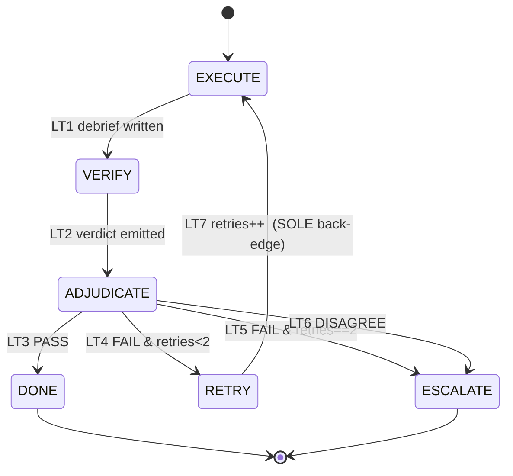

# Formal Methods — how dag proves its own rules

**Audience:** technical (readers comfortable with a state machine, an inductive
invariant, and a bounded model check).

**TL;DR.** dag guards its pipeline at *two* levels. A **runtime validator**
(`scripts/validate_run.py`) checks one concrete run's artifacts; a **design-time proof
layer** (TLA+ in `formal/Pipeline.tla`, Alloy in `formal/WorkGraph.als`) proves the
*rules themselves* can't be violated by any run in scope. This page explains the finite-
state machine, the four proved properties, and — just as important — the exact strength
of each claim, using the project's own three-word proof-status legend and never
overstating it.

---

## 1. Two layers of assurance (start here)

The single most important idea on this page is that dag makes *two different kinds* of
guarantee, and they are not interchangeable.

- **Runtime enforcement** — `scripts/validate_run.py` inspects a *specific run's*
  artifacts: schema validity, a fail-closed acyclic DAG, missing-verification rejection,
  the loop bound, and so on (`references/state-machine.md` §5). It answers: *did this run
  obey the rules?*
- **Design-time proof (this page)** — TLA+/Alloy prove the *rules themselves* cannot be
  bypassed by *any* run they model: a gate can never be skipped, the correction loop
  always terminates, the work graph is always acyclic under a wave layering, and verifier
  independence is a structural — not incidental — property
  (`references/formal-models.md` lines 10–18).

Why bother with the second layer at all? Because the validator inspects *one run's
artifacts*, not the rule-space. It can tell you *this* run didn't bypass a gate; it can
never tell you *no* run can. The proof layer gives exactly that missing guarantee — and
only that (`references/formal-models.md` §"Covered by one layer only", lines 446–450).

The **proof-status legend** — used verbatim throughout, and worth memorizing before you
read a single "✓":

> *machine-checked* — a model checker explored the state space (in a bounded scope) and
> reported no error · *hand-proved* — a rigorous, checkable argument, not run by a tool
> here · *asserted* — imposed structurally / by fiat and shown *consistent*, not derived
> (`references/formal-models.md` lines 63–66).

Note what is deliberately absent from that legend: any claim of an unbounded,
all-inputs proof. Nothing on this page makes one. A machine-checked result is checked
*in scope*; an
asserted invariant is *consistent*, not *derived*; and — the sharpest caveat — a green
check on a model never proves the *running system* obeys the modeled rule (Residual A,
§7).

---

## 2. The pipeline as a finite-state machine

The pipeline is a finite-state machine whose states are the **9 phases** (0–8) plus the
**executor↔verifier loop substates** inside Phase 6 (`references/state-machine.md` §0–§1).

| Phase | State | Kind |
|---|---|---|
| 0 Bootstrap | `P0_BOOTSTRAP` | linear |
| 1 Personas | `P1_PERSONAS` | human gate |
| 2 Clarification | `P2_CLARIFICATION` | human gate |
| 3 Cartography | `P3_CARTOGRAPHY` | linear |
| 4 Decomposition | `P4_DECOMPOSITION` | linear (self-critique) |
| 5 Briefing | `P5_BRIEFING` | linear |
| 6 Execute+Verify | `P6_EXECUTE_VERIFY` | **composite (loop)** |
| 7 Disagreement | `P7_DISAGREEMENT_GATE` | human gate (as-needed) |
| 8 Synthesis | `P8_SYNTHESIS` | linear |
| — | `DONE` | terminal |

Each phase has an **exit gate**; you advance only when the gate holds
(`references/state-machine.md` §2–§3). Inside Phase 6, each unit runs a small loop:
`EXECUTE → VERIFY → ADJUDICATE`, and `ADJUDICATE` branches on the verifier's verdict over
the partition `{PASS} ∪ {FAIL}×{retries<2, retries==2} ∪ {DISAGREE}`
(`references/state-machine.md` §1a, §2a). The crucial structural fact — the whole
termination story hangs on it — is that the loop has **exactly one back-edge**:
`RETRY → EXECUTE` (LT7, `references/state-machine.md` §2a line 116; the sole-back-edge note is at line 118).



The TLA+ spec (`formal/Pipeline.tla`) composes *two* machines over one variable tuple: a
**phase machine** (safety only) and a **loop machine** (liveness), linked at exactly one
point — the loop reaching `DONE` satisfies Phase 6's "all units passed" gate, action
`LinkP6` (`formal/Pipeline.tla` lines 15–19, 100–108). The phase gates are deliberately
**unfair** (a human gate may stall forever), so the model claims *safety* — never
liveness — about the phase machine (`formal/Pipeline.tla` lines 86–89, 237–239). Only the
automated loop is fair (`WF_vars(LoopNext)`), and that fairness plus the variant is what
buys termination.

The four properties below map onto this FSM as follows: Properties 1–2 are the TLA+ phase
and loop machines; Properties 3–4 are the Alloy structural model of the work graph.

---

## 3. Property 1 — Gate ordering (SAFETY, TLA+) · *machine-checked* + *hand-proved*

**The claim.** In every reachable state, the current `phase` implies that every strictly-
earlier spine phase's exit gate already holds. Two named specializations
(`formal/Pipeline.tla` lines 247–255):

```
(phase ∈ {P3,…,DONE}) ⇒ gate["P2"]     no Cartography before clarifications  (I8)
(phase ∈ {P8,DONE})   ⇒ gate["P6"]     no Synthesis before every unit PASS    (I10)
```

**The bad behavior it excludes** (the COUNTER): reaching P3's work before P2's gate, or
reaching P8 (synthesis) while a unit is still un-PASSed
(`references/formal-models.md` §1 lines 152–153).

**Why it holds — the intuition.** Two facts make it an *inductive invariant*
(`references/formal-models.md` §1 hand-proof, lines 155–172):

1. **Gates are monotone.** The only writers of `gate` are `Complete(p)` and `LinkP6`,
   each flipping one entry `FALSE→TRUE`; nothing sets `TRUE→FALSE`. Once a gate holds, it
   holds forever (`formal/Pipeline.tla` lines 93–108).
2. **`phase` only advances through the guarded `Advance`.** `Advance(p)` requires
   `gate[p]=TRUE` before setting `phase'=Succ(p)`; the P6↔P7 excursion moves sideways and
   changes no gate (`formal/Pipeline.tla` lines 111–136).

So the only way to make a clause's antecedent newly true is to `Advance` past that phase's
gate — which establishes it — and monotonicity keeps every earlier gate true. This is
*hand-proved* in full in `references/formal-models.md` §1.

**Tool-status: *machine-checked* (in scope) by TLC, plus *hand-proved*.** `GateOrdering`
is declared as an `INVARIANT`, and TLC held it across the entire reachable state space
(see §5 for the exact numbers). This is a *safety* property: a bad ordering is a bad
*state*, and the checker visited every reachable state.

---

## 4. Property 2 — Bounded-loop termination (LIVENESS, TLA+) · *machine-checked* + *hand-proved*

**The claim** (`Termination`, a `PROPERTY` under `WF_vars(LoopNext)`,
`formal/Pipeline.tla` lines 265–267):

```
(lstate = "EXECUTE") ~> (lstate ∈ {"DONE","ESCALATE"})
```

Read `~>` as *leads-to*: from `EXECUTE` the loop *always eventually* reaches a terminal.
From `Init` (`lstate="EXECUTE"`) this is just `<>Terminated`.

**The bad behavior it excludes** (COUNTER): a fair run that spins the correction loop
forever — unbounded retries, never terminating.

**Why it holds — the variant argument.** The proof is a textbook well-founded variant
(`references/formal-models.md` §2 lines 197–214), with the measure
`V = MaxRetries − retries ∈ {0,1,2}` (`formal/Pipeline.tla` line 67):

- **A. One back-edge.** Of actions LT1–LT7, only `LRetry` (RETRY→EXECUTE) returns to an
  earlier state; every other edge is forward or into an absorbing terminal
  (`formal/Pipeline.tla` lines 154–196).
- **B. Strict descent.** `LRetry` does `retries' = retries+1`, so `V' = V−1`; no other
  action touches `retries`. `V` strictly decreases on the only cycle and never rises.
- **C. Floor-guarded back-edge.** `LRetry` is reachable only via `LRetryBranch`, whose
  guard is `retries < MaxRetries`, i.e. `V > 0` (invariant `BackEdgeGuarded`,
  `formal/Pipeline.tla` line 260). At `V=0` the back-edge is disabled and `ADJUDICATE` can
  fire only PASS→DONE or the two ESCALATE edges — all terminal.
- **D. No deadlock + fairness.** Every non-terminal loop state has an enabled action, and
  `WF_vars(LoopNext)` forces progress. A measure that strictly descends on the only cycle,
  whose back-edge is disabled at the floor, cannot recur infinitely: ≤ `MaxRetries=2` laps
  ⇒ ≤ 3 executions, then a terminal.

The argument is *parametric in any finite N* (`V = N − retries`), so a configurable cap
never weakens termination (`references/formal-models.md` §2 lines 216–217).

**Tool-status: *machine-checked* (in scope) by TLC, plus *hand-proved* (variant).** The
auxiliary safety invariants `LoopBound`, `VariantOK`, and `BackEdgeGuarded`
(`formal/Pipeline.tla` lines 258–260) mechanize claims B–C. The fairness the liveness
check needs is carried by `SPECIFICATION Spec`'s `WF_vars(LoopNext)`
(`formal/Pipeline.tla` line 239).

---

## 5. The TLC run — one command, both TLA+ properties

The TLA+ properties are checked by a single command
(`references/formal-models.md` lines 85–89):

```sh
export JAVA_HOME=$(/usr/libexec/java_home)
"$JAVA_HOME/bin/java" -cp /tmp/tla2tools.jar tlc2.TLC \
    -config formal/Pipeline.cfg formal/Pipeline.tla
```

> **One command reproduces all of this (plugin 1.9.0).** `bash scripts/run_formal.sh` now fetches
> both jars (checksum-verified), runs TLC and both Alloy files headlessly, and — as of WP-F/D1 —
> **asserts** the literal state counts (853 / 408 / depth 36), the "2 branches of temporal properties"
> line, and Alloy's `SUMMARY: 8/8`; a gutted `.cfg`/`.als` now FAILs instead of passing vacuously. Add
> `--maxfuel32` to also run the parametric MaxFuel=32 check
> (`references/formal-models.md` §Tool-status, lines 47–50). The rest of this section is what that
> script does by hand. Plugin **1.9.0** (depth & retrieval enforcement, invariants **I26–I34**) added
> **no FSM state, transition, guard, or gate** — it is classified **PRESERVES** (zero REVISES) against
> the correction-loop termination proof, AO-1..7, I1–I25, and the FSM edge set — so every figure in
> this section (853 / 408 / depth 36; Alloy 8/8) is left **unchanged**.

**Reported TLC result** (2026-07-10, TLC 2.19, JDK 25.0.3 — *after* adding the Bounded Graph
Amendments `Amend` action, the `fuel` variable, the `FuelBound` invariant, and the `Quiesce`
property; `references/formal-models.md` lines 91–104), quoted verbatim:

```
TLC2 Version 2.19 of 08 August 2024 (rev: 5a47802)
Implied-temporal checking--satisfiability problem has 2 branches.
Finished computing initial states: 1 distinct state generated ...
Progress(36): 853 states generated, 408 distinct states found, 0 states left on queue.
Checking 2 branches of temporal properties for the complete state space with 816 total distinct states
Finished checking temporal properties in 00s
Model checking completed. No error has been found.
853 states generated, 408 distinct states found, 0 states left on queue.
The depth of the complete state graph search is 36.
```

So: **853 states generated, 408 distinct, search depth 36, no error, TLC 2.19 on JDK 25.**
The empty queue means the *complete* reachable state space was explored, so every
`INVARIANT` (`TypeOK`, `GateOrdering`, `LoopBound`, `VariantOK`, `BackEdgeGuarded`, **`FuelBound`**)
held in every reachable state and **both** temporal properties — `Termination` and the
Bounded-Graph-Amendments **`Quiesce`** (the "2 branches of temporal properties" line) — held on
every fair behavior (`references/formal-models.md` lines 106–116). Pinning `MaxFuel = 2` in
`Pipeline.cfg` keeps those counts stable; re-running the identical model with `MaxFuel = 32` (the
shipped runtime ceiling) only lengthens the same terminating behaviours — **2,923 generated / 1,608
distinct / depth 156, no error** (both temporal branches still hold; all six invariants pass)
(`references/formal-models.md` §"`MaxFuel` scope (F1)", lines 418–425).

**Historical context — why 328 and not 327 (the BRK-11 `ToEscalate` fix).** Before the Bounded
Graph Amendments, the model checked at **715 generated / 328 distinct / depth 28** with a *single*
`Termination` branch, and that 328 was itself one distinct state larger than an earlier 327. The
delta was fully accounted for: `ToEscalate` (the T10 edge P6→P7) previously guarded on
`verdict = "DISAGREE"` only, so a *retries-exhausted FAIL* escalation — an `lstate="ESCALATE"`
reached via LT5 (`verdict=FAIL ∧ retries==2`) — could never leave Phase 6 and stuttered there
forever. Widening the guard to `verdict ∈ {"DISAGREE","FAIL"}` routed **both** ESCALATE origins to
the Phase-7 human gate, admitting exactly one new reachable state
(`phase=P7 ∧ verdict=FAIL ∧ retries=2`) and enlarging the space 327 → 328
(`references/state-machine.md` §1a, T10; the regression probe
`P7OnlyViaDisagree ≡ (phase="P7") ⇒ (verdict="DISAGREE")`, which *held* on the pre-fix model, now
**reports a violation on purpose**). **This is now history:** the current model is **408 distinct**
(not 328), because the BGA **`fuel`** budget + the **`FuelBound`** invariant + the **`Quiesce`**
bounded-amendment-quiescence property grew the reachable space to **853 / 408 / depth 36** with a
*second* temporal branch. That FAIL-origin escalate is simply **subsumed** in the 408-state count —
it is no longer the headline delta (`references/formal-models.md` lines 106–116).

**Did the liveness test have teeth?** A liveness property can pass *vacuously*. The
project records an adversarial non-vacuity check (`references/formal-models.md` lines
118–135): in a throwaway `Broken.tla`, `LRetry` was mutated to *not* increment `retries`
(so `V` stops decreasing on the back-edge), and TLC then **reported a liveness
counterexample** — a lasso closing on the `EXECUTE→VERIFY→ADJUDICATE→RETRY→EXECUTE` spin
(`Temporal properties were violated`). The shipped spec (which keeps the increment)
passes; the mutant fails. That is the external signal that the counter-increment is
load-bearing and the check is genuine.

---

## 6. Properties 3 & 4 — the Alloy structural model (`formal/WorkGraph.als`)

Alloy models *structure*, not time. Edge semantics: `d in u.depends` ⇔ graph edge
`{from=d, to=u}` ("u consumes d") (`formal/WorkGraph.als` lines 13–14, 27–31). Both
properties below are checked in a **bounded scope** — Alloy verifies an assertion only up
to a finite size, so "no counterexample" means "none *in that scope*," not "none exist."

### 6a. Property 3 — DAG acyclicity · *machine-checked* (no counterexample) + *hand-proved*

**The claims** (`formal/WorkGraph.als` lines 69–76):

```alloy
assert Acyclic { no (^depends & iden) }                             // no unit reaches itself
assert LayeringImpliesAcyclic {
  (WaveLayering and PositiveWaves) => no (^depends & iden) }         // waves ⇒ DAG (I3)
```

where `WaveLayering ≡ all u | all d : u.depends | d.wave < u.wave`
(`formal/WorkGraph.als` line 56).

**Why `check Acyclic` passes — and *not* by fiat.** This is the subtle part. The model
imposes the wave discipline as a structural *fact* `WaveLayered`
(`formal/WorkGraph.als` line 65) — the Phase-4 layering the decomposition actually
produces. The standalone `Acyclic` assertion then reports *no counterexample* **because**
a valid layering forces a DAG (the `LayeringImpliesAcyclic` theorem), **not** because
acyclicity was assumed. Remove that fact and `depends` is unconstrained: a self-loop
`u in u.depends` becomes a counterexample and the check *fails*. So the layering fact is
load-bearing for the check (`references/formal-models.md` §3 lines 264–270).

**The hand-proof of `LayeringImpliesAcyclic`.** Suppose a cycle
`u₀→u₁→…→uₖ=u₀`. `WaveLayering` gives `u₀.wave < u₁.wave < … < uₖ.wave = u₀.wave`, hence
`u₀.wave < u₀.wave` — a contradiction in the strict order on ℤ. So no cycle
(`references/formal-models.md` §3 lines 257–262). This is precisely *why* the validator's
wave-layering check (I3) is sufficient for a DAG.

**Check commands & scope** (`formal/WorkGraph.als` lines 87–88):

```
check Acyclic                for 7 but 5 Int
check LayeringImpliesAcyclic for 7 but 5 Int
```

The scope `7 but 5 Int` bounds every sig to 7 with Int bitwidth 5 (−16..15). A *global*
bound is required, not a bare `7 Unit, 5 Int`: `Unit.executor` makes `Persona` reachable,
so a partial scope list leaves `Persona`/`Verifier` unbounded and the command won't run
(`references/formal-models.md` §3 lines 278–281).

**Tool-status: *machine-checked* (bounded scope — no counterexample) + *hand-proved*.**
Both `check`s run headless (Alloy 6, bundled SAT4J) and report no counterexample; the
hand-proof is the checkable argument for *why*.

### 6b. Property 4 — Verifier independence · *asserted* (consistent) + *machine-checked* (no counterexample)

This property has a *different, weaker* status than the others — read the label carefully.

**The claims** (`formal/WorkGraph.als` lines 47, 50, 83–84):

```alloy
fact  Independence   { no reasoningSeen }                                    // I1: relation empty
fact  MakerNotChecker{ all v:Verifier, u:v.checked | v.persona != u.executor } // maker != checker
assert VerifierBlind        { no reasoningSeen }
assert DistinctMakerChecker { all v:Verifier, u:v.checked | v.persona != u.executor }
```

**The bad behavior it excludes** (COUNTER): a verifier reading the executor's chain-of-
thought for a unit it judges, or a unit being verified by its own maker
(`references/formal-models.md` §4 lines 305–306).

**Why it is *asserted*, not derived.** `reasoningSeen ⊆ checked` (fact `SeenSubsetChecked`,
`formal/WorkGraph.als` line 42) makes the relation *meaningful*; `Independence` then forces
it **empty**. Given that fact, both asserts hold *trivially*. So this is honestly labeled
**asserted** — imposed by fiat and shown *consistent* — **not a derived theorem**
(`references/formal-models.md` §4 lines 308–316). The model *encodes* the invariant that
the schema's `executor_reasoning_seen: {const:false}` and the maker≠checker rule require;
it does not *prove* it from more primitive facts.

**Non-vacuity — is it satisfiable at all?** An over-constrained model can "prove"
everything vacuously. The `run WitnessGraph` command exhibits a concrete instance — a real
dependency edge, a real verification, acyclic, independence respected — proving the
constraints are *satisfiable together* (`formal/WorkGraph.als` lines 95–100;
`references/formal-models.md` §4 lines 313–316):

```
check VerifierBlind        for 7 Unit, 5 Verifier, 5 Persona, 5 Int
check DistinctMakerChecker for 7 Unit, 5 Verifier, 5 Persona, 5 Int
run   WitnessGraph         for exactly 4 Unit, exactly 2 Verifier, exactly 3 Persona, 5 Int
```

**Tool-status: *asserted* (structural, shown consistent) + *machine-checked* (bounded
scope — no counterexample, instance found).** The green checks confirm consistency in
scope; they do **not** upgrade the claim to *derived*, and — critically — even a green
Alloy check would **not** prove the *real system* enforces independence. See Residual A.

---

## 7. Same invariants, two layers — and the honest residual

The two layers guard the *same* core invariants from different angles
(`references/formal-models.md` §"Consistency", lines 437–444). This is the runtime split
the acceptance criteria ask to be named explicitly:

| Invariant | Design-time proof (this page) | Runtime enforcement (`validate_run.py`) |
|---|---|---|
| Gate ordering (I8/I10) | Prop 1 `GateOrdering` (TLC, in scope) | phase-vs-gates ordering + I9/I10 presence |
| Loop bound / termination (I4) | Prop 2 `Termination`+`LoopBound` (TLC, in scope) | `retries ≤ 2`, `iteration ≤ retries+1` |
| DAG acyclic (I3) | Prop 3 `Acyclic` (hand-proved + Alloy, in scope) | fail-closed cycle detection on `edges ∪ deps` |
| Verifier independence (I1) | Prop 4 `Independence` (asserted, consistent) | `executor_reasoning_seen const:false` + I1b `maker!=checker` |
| Bounded-amendment quiescence (I18, BGA) | `Quiesce` (TLC, in scope; non-vacuous vs a keep-fuel mutant) + `Amendment.als` wave-layering (Alloy, in scope) | I18 fuel bound (`fuel_remaining == fuel_initial − Σ fuel_cost ≥ 0` + revision/`amendments_applied` bookkeeping) |
| Sign-off gate (D-06) | precedence `gate["P8"] ⇒ DONE` covered by Prop 1's `GateOrdering`; the `signoff_confirmed` *flag itself* is runtime-only | `REQUIRED_GATES`: `gates.signoff_confirmed` **required at `DONE`** — a run at DONE without it is INVALID (`references/state-machine.md` §3 lines 176–178, T12 line 105) |

The runtime validator additionally enforces a fleet of data-shape invariants the models
don't model — I5–I7, I9, **I11–I16**, **I-dod**, the persona-identity reconciliations
**I1c**/**I1d**, and the Bounded Graph Amendments frozen-prefix + scope + graph-closure checks
(**I17**/**I19**/**I3b**/**I3c**) — so the runtime catalog now spans **I1–I34** (plus
**I1b**/**I1c**/**I1d**/**I3b**/**I3c** and **I-dod**). Three of these — I14, I15, I16 — are the post-hoc,
*offline* checks added since the earlier releases; each gates **no** transition (and never
guards the sole back-edge LT7), so each **preserves** the termination proof
(`references/state-machine.md` §4 lines 203–205):

- **I14 (AO-2 `do_not_touch` disjointness).** On a retry (`debrief.iteration>1`), the new
  `verify.defects[].criterion` set must be disjoint from the retry's
  `debrief.prior_feedback.do_not_touch`; a non-empty intersection ⇒ non-zero exit
  (`references/state-machine.md` §4 line 203).
- **I15 (AO-6 responsive change).** A retry carrying a `prior_feedback` echo must record a
  present, non-empty `debrief.prior_feedback.changes_made` (`references/state-machine.md`
  §4 line 204).
- **I16 (panel discipline).** A `high-stakes` unit's `verify.json` must carry a `panel[]` of
  ≥3 members spanning the distinct correctness / reproduce / guardrail lenses, whose top-level
  `verdict` equals the **discrete majority** of the panel verdicts (a no-majority split ⇒
  `DISAGREE` — *no softmax*), with `verify_rounds ∈ [1,3]` (`references/state-machine.md`
  §4 line 205).

It also enforces **I-dod** (a post-clarification structural artifact requires a schema-valid
`clarifications.json` with non-empty `definition_of_done` **and** `non_goals`, fail-closed even
when the file is absent — `references/state-machine.md` §4 line 206, §5 lines 247–248).
Conversely, only the *models* prove the rules themselves can't be bypassed.

**Model simplifications (surfaced, not hidden).** `Pipeline.tla` is a deliberately small
model; three abstractions are called out and each is *safety-preserving* (it removes
behaviors, so it can only make `GateOrdering` easier to hold):
the `L*` loop actions aren't per-action phase-gated (locality to P6 is enforced by
`LinkP6` alone); `Resolve` returns to P6 without re-arming the loop (post-escalation
recovery and P2/P3/P4 rollback are out of model scope); and `gate["P0"]`/`gate["P5"]` have
no runtime flag (they're linear, non-gated phases)
(`references/formal-models.md` §"Model simplifications", lines 452–498).

**Residual A — the load-bearing caveat.** A green check on any of these models does **not**
prove the *running system* obeys the rule. `executor_reasoning_seen=false` and the Alloy
`Independence` fact are **self-attestations**; no platform hook intercepts subagent I/O.
The model proves the invariant is *well-formed and consistent* — never that the deployment
honors it (`references/formal-models.md` Residual A, lines 505–508;
`references/state-machine.md` §5 A). Related residuals B–E cover PASS *correctness*,
budget truthfulness, genuine model-distinctness behind a persona label, and truly-reusable
tags — all *semantic* judgments left to the independent verifier, not the formal layer
(`references/formal-models.md` lines 509–518). The formal layer proves the *plumbing and
the rules*; correctness-of-content stays an external signal.

---

## 8. Socratic self-interrogation (this page's own audit)

Per the project's own protocol (`references/socratic-protocol.md`), run on this page's
load-bearing claim.

- **FORK (premise + falsifier).** *Premise:* every formal claim on this page is faithful to
  the cited repo file and states the exact proof-status the source assigns, never
  overstating. *Falsifier:* any sentence here whose strength exceeds its source — e.g.
  calling Property 4 "proved," calling an Alloy check unbounded, or asserting an
  all-inputs/unbounded proof.
- **COUNTER (decoupled hunt + outcome).** I re-checked each property's status word against
  the source table (`references/formal-models.md` lines 68–74) *independently of my prose*:
  Prop 4 is labeled *machine-checked + asserted (structural, consistent)* there, and this
  page says exactly that (§6b) rather than "proved"; the TLC numbers (853/408/36) are quoted
  verbatim from lines 94–104; the Alloy scopes are quoted from `formal/WorkGraph.als` lines
  87–90. **Outcome: premise HOLDS** — no claim found exceeding its source; no unbounded
  all-inputs proof is asserted anywhere on the page.
- **PIVOT.** If the source proof-status table (`references/formal-models.md` lines 68–74) or
  the TLC transcript (lines 91–116) said something different from what I transcribed, the
  page's faithfulness claim would flip. The page is pinned to those exact lines.
- **RESIDUAL / confidence.** *high* — every claim carries a repo-file locator and I did not
  re-run the tools myself; I report the transcript and scopes as the repo records them, which
  is the correct evidence type (provenance-quote / code-behavior) for a documentation unit.

---

*Cross-references (same `wiki/` folder): the pipeline FSM and its guards/invariants are the
subject of the state-machine page; the executor↔verifier correction loop and its
termination argument are detailed alongside. Ground truth for everything above:
`plugins/dag/skills/dag/references/formal-models.md`,
`plugins/dag/skills/dag/references/state-machine.md`,
`plugins/dag/skills/dag/formal/Pipeline.tla`,
`plugins/dag/skills/dag/formal/WorkGraph.als`.*
