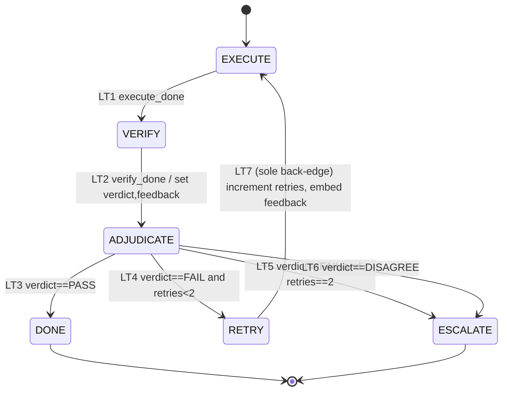

# Self-Learning Loops

**Audience:** technical — engineers and reviewers who want to trust the pipeline's *"it always halts, it never spins, it actually learns"* claims rather than take them on faith.

**TL;DR.** Dag runs two feedback loops. The **correction loop** re-runs one work unit against an *independent* verifier, capped at 2 retries, then escalates to a human — and it provably terminates. The **learning loop** promotes a lesson to a shared ledger *only* when it is generalizable and keyed to a verifiable outcome, then force-injects it into later briefs. This page presents the correction-loop finite-state machine, its termination proof (four claims + a well-founded variant), the ≤12-transition bound, and the seven anti-oscillation invariants — with the load-bearing detail that the anti-oscillation checks are **post-hoc validator predicates, never a live guard on the loop's only back-edge**.

Everything here traces to `plugins/dag/skills/dag/references/self-learning-loops.md` (cited below as `self-learning-loops.md §N`). Where a guarantee's strength matters, this page uses the proof-status legend:

- **machine-checked (in scope)** — mechanically enforced by `validate_run.py` over emitted artifacts;
- **hand-proved** — a finite, human-checkable argument (a skeptic can walk the rows/edges);
- **asserted (consistent)** — stated as a design rule, consistent with the model but not mechanically re-derived here.

This page never says a guarantee holds "for all inputs." It says exactly what the source says.

---

## 1. Two loops, and why bounding both matters

Think of a single work unit as a small experiment: an executor subagent does the work, an **independent** verifier judges it. Two things can go wrong across a whole run, and each has its own loop.

- **Correction loop (within one unit).** The verifier says `FAIL` with concrete, actionable feedback; the executor gets one more attempt carrying that feedback. The danger is *unbounded retries* or *oscillation* (the verifier flip-flopping pass↔fail forever). Dag caps retries at 2, then hands an unresolved split to a human (`self-learning-loops.md §Intro`, §4.1).
- **Learning loop (across units).** A lesson learned in unit U03 should inform U09's brief — but only if it *generalizes*. The danger is *over-fitting*: injecting a one-off quirk into unrelated units, wasting budget and misleading them. Dag admits a lesson to the shared `LEARNINGS.md` only when it is generalizable and keyed to a **verifiable outcome** (`self-learning-loops.md §4.2`).

The first principle behind both: **every gate is anchored to an external signal** — an independent verifier verdict, a schema check, a cited finding — never the model re-reading and rationalizing its own reasoning (`self-learning-loops.md §Grounding`). The maker never judges its own work.

Both loops are *bounded*: the correction loop by the retry cap + termination proof (§3–§4 below), the learning loop by the generalizability gate + a temporal (wave-based) propagation rule that never binds a brief retroactively (`self-learning-loops.md §4.3`, property 1).

---

## 2. The correction loop as a state machine

The correction loop is formalized as a finite-state machine (`self-learning-loops.md §1`).

**States** `Q = { EXECUTE, VERIFY, ADJUDICATE, RETRY, ESCALATE, DONE }` (`§1.1`). `EXECUTE` is the entry state for every unit. `ESCALATE` and `DONE` are **terminal (absorbing)** — control leaves the automated loop.

| State | Kind | On entry (paraphrased from `§1.1`) |
|-------|------|-----------------------------------|
| `EXECUTE` | action | Executor runs the current attempt from its brief; on a retry the brief **embeds the prior `feedback`**. Emits `debrief.json` + artifacts. |
| `VERIFY` | action | An **independent** verifier (sees brief + debrief + artifacts, **not** the executor's reasoning or identity) emits the verdict/feedback JSON, schema-validated. |
| `ADJUDICATE` | decision (no side effects) | Reads `verdict` + the `retries` counter; selects exactly one out-edge via the exhaustive guard table. |
| `RETRY` | action | `retries := retries + 1`; builds the next brief carrying prior `feedback`; logs the iteration in `PROGRESS.md`. |
| `ESCALATE` | terminal | Writes `disagreement.md`; hands to the Phase-7 human gate. |
| `DONE` | terminal | Marks unit `PASS`; appends any generalizable `LEARNINGS` entry; propagates handoff notes. |

**Loop variables** carried in `fsm-state.json` (`§1.2`). The one that carries termination is `retries`:

- `retries` — int, invariant `0 ≤ retries ≤ 2` (schema `maximum: 2`), init `0`. **Monotone**: only `RETRY` writes it, and only `+1`; never reset within a unit.
- `iteration` — int ≥ 1, bound `iteration ≤ retries + 1` (invariant I4; the validator checks the upper bound).
- `verdict` — enum `{PASS, FAIL, DISAGREE, ⊥}`, set by `VERIFY`, read by `ADJUDICATE`.
- `feedback` — object or null, the last verifier feedback consumed by the next `EXECUTE`.

`MAX_RETRIES = 2` is the **default and the hard schema ceiling** (`maximum: 2`). Crucially, the termination argument is *parametric in any finite bound N* — so making the cap configurable never weakens termination (`§1.2`, §6.4; see §5 below).

### 2.1 The mermaid state diagram



The single cycle is `EXECUTE → VERIFY → ADJUDICATE → RETRY → EXECUTE`, and it is entered only through **LT7**, the sole back-edge.

---

## 3. The transition table (LT1–LT7)

The complete transition relation is seven rows: `State × event/guard → action → next state` (`self-learning-loops.md §1.3`). Reproduced faithfully:

| # | From | Event / guard | Action | To |
|---|------|---------------|--------|----|
| **LT1** | `EXECUTE` | `execute_done` (debrief + artifacts written) | — | `VERIFY` |
| **LT2** | `VERIFY` | `verify_done` (schema-valid verify.json) | set `verdict`, `feedback` | `ADJUDICATE` |
| **LT3** | `ADJUDICATE` | `verdict == PASS` | — | `DONE` |
| **LT4** | `ADJUDICATE` | `verdict == FAIL ∧ retries < 2` | — | `RETRY` |
| **LT5** | `ADJUDICATE` | `verdict == FAIL ∧ retries == 2` | — | `ESCALATE` |
| **LT6** | `ADJUDICATE` | `verdict == DISAGREE` | — | `ESCALATE` |
| **LT7** | `RETRY` | `retry_prepared` (LT4 held ⇒ `retries<2`) | `↑retries`; embed `feedback` in next brief | `EXECUTE` |

Two structural facts to internalize:

1. **`EXECUTE`, `VERIFY`, `RETRY` each have a single unconditional out-edge** (LT1, LT2, LT7). No choice, no way to stall.
2. **`ADJUDICATE`'s guards LT3–LT6 partition the whole reachable input space** `{PASS} ∪ {FAIL}×{retries<2, retries==2} ∪ {DISAGREE}` — so `ADJUDICATE` *always* has exactly one enabled transition: no deadlock, no non-determinism (`§1.3`). `verdict == ⊥` cannot occur at `ADJUDICATE` because it is reachable only via LT2, which sets `verdict`.

**Why there is no "non-actionable FAIL" branch.** The verify contract makes a `FAIL` *schema-invalid* unless it cites a specific unmet criterion and a non-empty `actionable_changes` list. A verifier that cannot name a concrete, retryable defect **must** emit `DISAGREE` (→ `ESCALATE` via LT6), not `FAIL`. So every `FAIL` reaching `ADJUDICATE` is already actionable, and the FAIL branch reduces to the counter guard alone (`§1.3`, the "Why no non-actionable FAIL branch" note). This is invariant **AO-3** (§6).

### The sole back-edge, LT7

Only **LT7 (`RETRY → EXECUTE`)** points back to an already-reachable earlier state. Every other row is strictly forward or into an absorbing state (`§2 Claim A`). This single fact is what makes termination a short, checkable argument rather than a hope — and it is why the anti-oscillation checks must stay *off* this edge (§7).

---

## 4. Termination: four checkable claims + a variant

The source proves: **from `EXECUTE`, every run reaches a terminal state (`DONE` or `ESCALATE`) after a bounded number of transitions** (`self-learning-loops.md §2`). This is a **hand-proved** argument — four claims a skeptic verifies by reading the seven rows. Below, each in my own words with its locator.

**Claim A — exactly one back-edge, and it is the counter increment (`§2 Claim A`).** Enumerate all seven edges. Six are forward or terminal (LT1, LT2, LT3, LT5, LT6, and LT4 which goes *forward* into `RETRY`). The only edge whose target is an already-reachable earlier state is **LT7**. Therefore the *only* cycle in the entire graph is `EXECUTE → VERIFY → ADJUDICATE → RETRY → EXECUTE`, and every traversal of it passes through LT7 exactly once. You verify this by reading the rows — no other row points backward.

**Claim B — a well-founded variant strictly decreases on every cycle (`§2 Claim B`).** Define the variant

```
V = MAX_RETRIES − retries = 2 − retries
```

Since `0 ≤ retries ≤ 2`, we have `V ∈ {0, 1, 2}` — a non-negative integer bounded below by 0. LT7 does `retries := retries + 1`, so each cycle traversal does `V := V − 1`: **strictly decreasing by exactly 1**. No other transition changes `retries` (Claim A plus the monotone rule of §1.2), so `V` never increases. A strictly-decreasing measure over a well-founded set (non-negative integers) cannot decrease forever.

**Claim C — the back-edge is guarded by `V > 0` (`§2 Claim C`).** LT7 is reachable only through LT4, whose guard is `retries < 2`, i.e. `V > 0`. So the cycle can be *entered* only while `V > 0`. Once `V = 0` (`retries == 2`), LT4 is disabled and `ADJUDICATE` can select only LT3 (`PASS → DONE`), LT5 (`FAIL → ESCALATE`), or LT6 (`DISAGREE → ESCALATE`) — all terminal. A well-founded measure that strictly descends on the only cycle *and* whose back-edge is disabled at the floor cannot be traversed infinitely: at most `MAX_RETRIES = 2` traversals occur.

**Claim D — no deadlock; both terminals are reachable (`§2 Claim D`).** Every non-terminal state has an enabled out-edge for every reachable input: `EXECUTE`, `VERIFY`, `RETRY` unconditionally (LT1, LT2, LT7); `ADJUDICATE` because LT3–LT6 are exhaustive. So the machine can never get stuck in a non-terminal state. Both terminals are genuinely reachable:
- `DONE`: any attempt can pass — `EXECUTE → VERIFY → ADJUDICATE` with `verdict = PASS` (LT3).
- `ESCALATE`: a first verdict `DISAGREE` (LT6); **or** the trace `FAIL, FAIL, FAIL` driving `retries 0 → 1 → 2` then LT5. So the retry budget can genuinely be exhausted and the escape hatch is genuinely reachable — the cap is not decorative.

**The load-bearing point (`§2`, closing note).** The guarantee is **not** "we cap it." It is that the *only* cycle strictly descends a well-founded, floor-bounded variant whose back-edge is disabled at the floor, `ADJUDICATE`'s guards are exhaustive (no deadlock), and both absorbing states are reachable. The cap `2` is merely the floor value of `V`.

### 4.1 The transition bound (loop ≤ 11, round figure ≤ 12)

Because the straight-line segments are finite, total transitions before halt are (`self-learning-loops.md §2`, "Bound"):

```
(MAX_RETRIES + 1)·|EXECUTE→VERIFY→ADJUDICATE|  +  MAX_RETRIES·|RETRY|
   = 3·3  +  2·1  =  11  loop transitions
```

i.e. **≤ 3 executions, ≤ 3 verifications, ≤ 2 retries, then exactly one terminal edge**. The terminal `DONE`/`ESCALATE` edge is the *last* of the ≤3 `ADJUDICATE` out-edges, not an extra step. Counting the single entry edge into `EXECUTE`, the round figure **≤ 12** cited in `SKILL.md` Phase 6 holds as a valid (non-tight) bound. Each state's internal work is itself finite — the executor runs under a 32K budget, and the `VERIFY` node is a single pass, a **fixed odd panel of 3** (the PR1 default on `high-stakes` units), and/or a **loop-until-dry sweep bounded by `R_max = 3` rounds** (dry-or-cap ends the node) — so wall-clock work is finite too (`self-learning-loops.md §2`, "Bound", `:159-162`).

### 4.2 Why the cap is 2, and why the proof survives any N

The exact value is a cost/benefit knob, not a correctness constant (`self-learning-loops.md §6.4`). A bounded retry count is what matters; `2` retries (3 attempts) matches `SKILL.md`/`methodology.md` and the guardrail literature — once external feedback is exhausted, more retries rarely help and intrinsic self-correction can *degrade* a correct answer. The recommendation is default `MAX_RETRIES = 2`. There is **no separate `max_retries` field**: the shipped schema constant *is* the exposed ceiling — `fsm-state.schema.json`'s `loop.retries.maximum: 2` (`fsm-state.schema.json:53`) — so there is no second mirror to keep in sync (`self-learning-loops.md §6.4`, `:661-663`).

The important property: the §4 proof is **parametric in any finite `N`** (use variant `V = N − retries`). The same four claims go through unchanged, so configurability never weakens termination — a real property, not an assertion (`§6.4`).

---

## 5. The learning loop (across units), in brief

The learning loop is where a lesson from one unit binds later briefs. It is bounded by *admission* and *scope*, not by a retry counter.

**Admission — the generalizability gate (`self-learning-loops.md §4.2`).** A lesson enters `LEARNINGS.md` **only if** it is generalizable *and* keyed to a verifiable outcome (a verify verdict, a test result, a cited finding — never a self-assessment). The vocabulary is exactly **three** selector kinds — `"all"`, a unit-id `"U0X"`, or a pattern `"tag:<T>"` (`self-learning-loops.md:349-357`) — and admission is **selector-kind asymmetric**, *not* one uniform ≥2 rule (`:402-416`):
- an `"all"` selector is admissible **iff the graph has ≥ 2 units** (an `all` scope on a 1-unit graph is not a pattern);
- a `"tag:<T>"` selector is admissible **only if ≥ 2 units in `GRAPH.md` carry tag `T`** (so a one-off cannot masquerade as a pattern);
- a unit-id `"U0X"` selector is a **deliberate single-target** application — it cannot force-inject beyond its one unit, so it is **always admissible** (no ≥2-carrier re-proof, no ≥2-unit-id requirement). A lesson that should bind two units names them as two `"U0X"` selectors (or a `"tag:<T>"`).

A `"phaseN"` selector was **removed** from the vocabulary (**BRK-09**): no unit carries a `phase` field in `graph.schema.json`/`brief.schema.json`, so it was mechanically unevaluable (`:359-360`). An unknown selector kind is a hard `I12 selector` FAIL, never a silent skip (BRK-08).

A **pattern (`tag:`) or `all`** lesson that would match only a single unit is **rejected** — it belongs in that unit's `debrief.json`, not the shared ledger; the `"U0X"` selector is the explicit exception, admitted as a deliberate single-unit binding (`:413-416`). Tags are drawn from an enumerated registry `V_tag` (`§4.2`, `:362-370`), so matching is mechanical set-membership, **no NLP** — this is what makes admission a check a validator can enforce. One member carries extra weight: **`high-stakes`** is both an ordinary `V_tag` member for tag-scoped propagation *and* an **operational** marker (PR1 verifier hardening) — a unit tagged `high-stakes` is verified by the **default odd panel of 3** with distinct correctness / reproduce / guardrail lenses, and its `verify.json` MUST carry that `panel[]`, enforced post-hoc by `validate_run.py` **I16** (`self-learning-loops.md:372-376`; `state-machine.md:205`; see §7).

**Propagation — the wave-based rule (`self-learning-loops.md §4.3`).** For every entry `E` and every unit `U` whose brief is generated in a wave **no earlier than** `E.since_wave` (`U.wave ≥ E.since_wave`), if `E.scope` matches `U`, then `U`'s brief MUST list `E.id` in `learnings_applied` and quote the lesson. Three properties keep this safe rather than blind: it is **temporal** (never retroactive), **scoped** (set-membership, never global), and **complete** — `applies()` carries a matching disjunct for each of the **three** enforced selector kinds (`all`, `unit-id`, `tag`) and **no `phase` disjunct** (`self-learning-loops.md:429-456`), so no admitted learning can pass the gate yet match zero units, and an unrecognized selector is a hard `I12 selector` FAIL.

**Persistence across runs (`self-learning-loops.md §4.4`).** Lessons can persist beyond one run via a project store (`.dag/learnings/*.json`) and a user/global store (`~/.claude/dag/learnings/*.json`), override order project > user. Every mechanism here is **additive + post-hoc + offline**: *none gates the FSM*, so the §4 termination proof is untouched. A key honesty note from the source: an *imported* lesson is treated as **advisory** until re-grounded to a this-run signal — an un-re-grounded import is not an external signal that binds briefs (the **AO-4** tie, `§4.4`). Re-grounding is keyed on a local `grounding` marker, **not** cryptographic provenance — a verifiable cross-party trust model is explicitly deferred (`§4.4`, "Honest boundary"). Two 1.7.0 hardenings tighten the plumbing without touching the proof: an import's `origin.store` provenance stamp is trusted **only when corroborated by real store membership** — an uncorroborated self-stamp FAILs `I12 import provenance`, so a run-local entry can no longer forge a stamp to self-exempt from the ≥2-carrier re-proof; and on re-grounding, `since_wave` is set to the **current brief frontier** (the earliest wave whose briefs are not yet generated), **not** the imported default of `1` — pinning it at `1` would retroactively require propagation into already-executed briefs, breaking forward-only (`self-learning-loops.md §4.4`).

---

## 6. The seven anti-oscillation invariants (AO-1 … AO-7)

Each is either mechanically checkable or a hard structural rule (`self-learning-loops.md §5`).

- **AO-1 — Monotone counter (no reset).** `retries` is append-only within a unit; only LT7 writes it, only `+1`. This is the mechanical core of *both* termination and anti-oscillation — the variant `V` strictly descends and no path re-inflates the budget.
- **AO-2 — Never re-verify a PASSED claim.** A criterion once `PASS` enters `feedback.do_not_touch`; a retry must not re-open it and the verifier must not re-litigate it. Enforced **post-hoc** by validator predicate **I14** (see §7). Kills pass→fail→pass ping-pong.
- **AO-3 — No vague FAIL.** Every `FAIL` defect cites a specific unmet acceptance criterion from the brief; a FAIL citing none is schema-invalid ⇒ the verifier must use `DISAGREE`. This is what makes LT4's target actionable.
- **AO-4 — External-signal gate.** A retry is authorized *only* by an independent verifier's `FAIL`, never by executor self-review. The executor cannot self-trigger a retry.
- **AO-5 — Genuine split ⇒ human, not loop.** An objectively irresolvable executor↔verifier split is `DISAGREE → ESCALATE` (LT6, Phase 7), never an unbounded retry. The loop never tries to "win" a judgment call by re-running.
- **AO-6 — New-evidence requirement.** Each retry's debrief must cite ≥1 change responsive to the prior `actionable_changes`. Enforced **post-hoc** by validator predicate **I15** (see §7). A no-progress "spin in place" is thereby visible — and because AO-1 increments regardless, no-progress still terminates via the counter.
- **AO-7 — Verifier independence per iteration.** Every `VERIFY` (including retries) is a fresh independent verifier that does not see the executor's reasoning or identity; `verify.executor_reasoning_seen == false` is an invariant.

The subtle oscillation risk — a verifier flip-flopping pass↔fail on the same criterion — is neutralized by **AO-2 + AO-1**: even a flip-flopping verifier cannot prevent halt, because `retries` rises regardless of verdict content (`§6.1`).

---

## 7. The load-bearing insight: I14/I15 are POST-HOC, never a live guard on LT7

This is the single most important design decision on the page. AO-2 and AO-6 are mechanized as validator predicates **I14** and **I15** (`self-learning-loops.md §3` "Consumption contract", §5 AO-2/AO-6). They are:

```
I14 (AO-2):  ∀ unit, iter=n>1 with prior_feedback.do_not_touch present :
               { verify.defects[].criterion } ∩ prior_feedback.do_not_touch == ∅
I15 (AO-6):  ∀ unit, iter=n>1 with a prior_feedback echo :
               prior_feedback.changes_made is present and non-empty
```

Both are **presence-gated, post-hoc, offline** reads over emitted artifacts in `validate_run.py`, each a **no-op when the echo is absent** — so neither can gate the loop (`§3`, "Consumption contract"). Status: **machine-checked (in scope)** — mechanically enforced by the validator, with violations routed to a report/`ESCALATE`, *not* to a transition guard.

**Why they must stay off the back-edge.** Suppose you instead made I14 (or I15) a **live guard on LT7** — "only take `RETRY → EXECUTE` if `do_not_touch` is disjoint / `changes_made` is non-empty." Then when the predicate is violated, `RETRY` would have **no enabled out-edge**. `RETRY` has exactly one out-edge (LT7, unconditional); disable it and `RETRY` becomes a **deadlock** — a non-terminal state with no way out. That directly breaks **Claim D** (no deadlock), and with it the whole termination guarantee (`§5` AO-2, the "02/P1 FLAG"; `§6.1`).

So the discipline is explicit and repo-wide: **added loop invariants must be offline validator predicates over emitted artifacts, with violations routed to `ESCALATE` — never a live guard on the loop's sole back-edge.** AO-1 still owns halt; I14/I15 add enforcement *without* touching the proof. This matches the hard-won learning recorded in the repo's `CLAUDE.md` ("Enforce loop invariants post-hoc, never as a live guard on the only back-edge").

**Named limitation L1 — narrowed by PR-6 (stated honestly, `§5` AO-2/AO-6; `state-machine.md:203-204`).** The *offline* I14/I15 predicates fire only when the retry's `prior_feedback` echo is present. That echo used to be evadable by omission — but **PR-6 closed that half**: on a retry (`iteration ≥ 2`) the `prior_feedback` echo, with non-empty `changes_made` (AO-6) and the `do_not_touch` field (AO-2), is now **schema-required** (`debrief.schema.json:90-119`), so a retry that omits the block is **schema-invalid** (dropped before the I14/I15 comparison), *not* silently skipped. What survives L1 is the *content* limitation: I14/I15 read the executor's **self-reported** echo — not the authoritative prior verify — because the validator retains only the *latest* `verify.json` per unit, so they check *presence/plumbing*, not genuineness; the **independent verifier remains the semantic backstop** (**Limitation F, narrowed**). This is the "validity ≠ correctness" boundary (`§6.5`): the validator checks the plumbing (contract shape, the counter, `do_not_touch` disjointness, scope membership), while whether a criterion is *truly* met remains the verifier's — ultimately a human's — judgment.

**I16 — panel discipline, the same post-hoc family (PR1).** The 1.2.0 verifier hardening adds a third offline predicate, **I16**, built in exactly the shape of I14/I15. For a `high-stakes` unit it requires `verify.json` to carry a `panel[]` of ≥ 3 members covering distinct correctness / reproduce / guardrail lenses; requires the panel's top-level `verdict` to equal the **discrete majority** of the panel verdicts (a no-majority split ⇒ `DISAGREE` → `ESCALATE` via LT6 — **no softmax**); and requires the loop-until-dry `verify_rounds ∈ [1,3]` (`state-machine.md:205`; `self-learning-loops.md:159-175`). Like I14/I15 it is **presence/shape-checked and gates no transition** — genuine lens diversity and real recall stay verifier judgment (**Limitation H**, `state-machine.md:326-337`).

**Classification — PR1 verifier hardening PRESERVES termination (softmax would REVISE it).** The panel-of-3 default and the loop-until-dry sweep are **node-internal work inside `VERIFY`**: neither adds a row to the §3 transition table, neither introduces a second back-edge, and neither touches the variant `V = 2 − retries` (only LT7 writes `retries`). The panel is a *fixed* odd fan-out (3) and the sweep is *bounded* (`R_max = 3`, dry-or-cap), so `VERIFY`'s internal work stays finite and Claims A–D hold **verbatim** (`self-learning-loops.md:164-175`). The load-bearing constraint: the panel is aggregated by **discrete majority**, keeping the `ADJUDICATE` guard table boolean and mutually-exclusive; **softmaxing the panel would REVISE (break) the proof** — a thresholded/averaged score collapses the exhaustive, mutually-exclusive `ADJUDICATE` guard partition and its discrete split→`DISAGREE` routing — and is therefore forbidden. Same discipline as I14/I15: **a post-hoc offline predicate over emitted artifacts, never a live guard on LT7.**

---

## 8. What you can and cannot claim

Stating the guarantee at its true strength (mirroring the source's own hedges):

- **Termination of the correction loop** — *hand-proved* (`§2`): a finite, skeptic-checkable argument over 7 rows and 1 back-edge. Parametric in any finite `N`. Not "proved for all inputs" in an automated sense on this page — it is a human-checkable proof. (That same property is *also* **machine-checked (in scope)** by TLC as the liveness property `Termination`; see [`03-formal-methods.md`](03-formal-methods.md) and the reproduced transcript in [`10-proof-appendix.md`](10-proof-appendix.md).)
- **No deadlock / exhaustive adjudication / bounded ≤12 transitions** — *hand-proved* (`§1.3`, `§2`).
- **AO-2 / AO-6 enforcement (I14 / I15)** — *machine-checked (in scope)*: validator predicates, but *presence/plumbing only* (L1, narrowed by PR-6's schema-required retry echo), with the independent verifier as semantic backstop.
- **Panel discipline (I16, high-stakes)** — *machine-checked (in scope)*: a post-hoc predicate over the panel's presence/shape and its **discrete-majority** aggregation (no softmax), gating no transition; genuine lens diversity stays a verifier call (Limitation H).
- **Learning-loop admission + propagation** — *machine-checked (in scope)* for scope *breadth* (set-membership over `V_tag`); whether a lesson is *genuinely* generalizable is a verifier/human call (`§4.2`, `§6.5`).
- **Cross-run trust model** — *asserted (consistent)* and explicitly *deferred*: re-grounding uses a local marker, not cryptographic provenance (`§4.4`).

Source of record for every claim above: `plugins/dag/skills/dag/references/self-learning-loops.md`.

---

## See also

- `plugins/dag/skills/dag/references/self-learning-loops.md` — the formal model this page documents (the ground truth).
- `plugins/dag/skills/dag/references/socratic-protocol.md` — the FORK·COUNTER·ADMIT·PIVOT·RESIDUAL protocol the loops embed at every gate.
- Sibling wiki pages live in this `wiki/` folder (the pipeline phases, the state machine, and the ledger).
