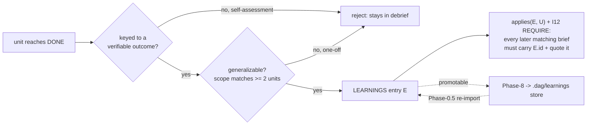

# How `dag` learns — capture, generalize, propagate

**Audience:** technical — anyone who wants to understand how a lesson from one work unit is turned into a rule that later units are *forced* to carry, and how that survives across runs.

**TL;DR.** When a unit fails and gets fixed, `dag` can distill the fix into a **LEARNINGS entry** — but only if the lesson is keyed to an *external verifiable outcome* (not the model's own opinion) and is *generalizable* to **≥ 2 units**. A one-off stays in that unit's debrief. An admitted lesson is scoped with a small, mechanical **SelectorSet**, and a validator predicate (`applies()` / **I12**) then *requires* every later applicable brief to quote and apply it. Lessons can also persist across runs through two on-disk stores, but that store discovery/merge is **prose the model runs at intake** — the validator only checks the result **post-hoc**, and none of it touches the termination proof.

This page traces [`self-learning-loops.md §4`](../plugins/dag/skills/dag/references/self-learning-loops.md) and the **I11/I12** rows of [`state-machine.md §4`](../plugins/dag/skills/dag/references/state-machine.md). It is a sibling of [`04-self-learning-loops.md`](04-self-learning-loops.md) (the correction loop that *produces* the verdicts a lesson is keyed to) and [`06-verification.md`](06-verification.md) (the independent verifier that emits them).

---

## The problem: how do you learn without learning noise?

A pipeline that never repeats a mistake sounds obviously good — until you notice the two ways it goes wrong. **Learn too little** and every run rediscovers the same wall. **Learn too much** and you pollute future work with over-fit "lessons" (`self-learning-loops.md §6.2` gives the canonical bad case: *"a unit needed python3.11 f-string syntax"* blindly injected into a research unit — wasted budget, actively misleading).

So `dag`'s learning loop is built around a single discipline: **a lesson is only real if an external signal produced it and it applies to more than one unit.** Everything below is machinery to make that discipline *mechanically checkable* rather than a good intention.

The whole loop, at a glance:



---

## 1. Capture — keyed to an outcome, never to self-assessment

A lesson enters `LEARNINGS.md` **only if** it is *generalizable* **and** *keyed to a verifiable outcome* — a verify verdict, a test result, or a cited finding (`self-learning-loops.md §4.2`). This is the anti-self-review stance the whole skill is built on: the grounding for any gate is an **external signal**, never the model re-reading its own reasoning (`self-learning-loops.md §Grounding`, lines 19–25; it ties this to the **AO-4** external-signal gate in §5).

The **entry schema** has this canonical *required* field set (`self-learning-loops.md §4.2`):

```
id, trigger, lesson, how_to_apply, scope{applies_to, excludes, expiry}, evidence, since_wave
```

The two fields that carry the "external-signal" discipline:

- **`trigger`** — *the verifiable outcome that produced the lesson*, e.g. `"U0X verify FAIL: <criterion>"`, a test result, or a cited finding id. The schema note is explicit: it **MUST reference an external signal, not a self-assessment** (`§4.2` field table).
- **`evidence`** — a locator for that signal: a `verify.json` path, a cited finding id, or a `command → output` (`§4.2`).

`promotable` is deliberately **optional** and *not* in the required set — the propagation predicate keys off `since_wave`, never `promotable` (`§4.2`, and again `§4.3`). `since_wave` is the wave from which the lesson starts binding later briefs; it is what makes propagation *temporal* rather than retroactive (see §4 below).

> **Why "keyed to an outcome" matters.** If lessons could be keyed to the model's own confidence, the loop would amplify its own errors — the exact failure mode `dag` is designed against. Anchoring to an external verdict is what makes a "learning" a signal rather than noise (`§Grounding`; `§6.3`).

---

## 2. The generalizability gate — the ≥ 2-unit rule

A lesson is admissible in `LEARNINGS.md` **only if** its `applies_to` would match **≥ 2 units in the run**, checked mechanically against the DAG (`self-learning-loops.md §4.2`, "Generalizability gate"):

- an `"all"` or `"phaseN"` selector trivially can (a phase holds ≥ 2 units in a non-trivial run);
- a **`"tag:<T>"`** selector is admissible **only if ≥ 2 units in `GRAPH.md` carry tag `T`** — so a one-off cannot masquerade as a pattern;
- a bare unit-id set is admissible only if it lists **≥ 2** unit-ids.

A lesson matching a single unit is **rejected** and belongs in that unit's `debrief.json`, not the ledger (`§4.2`). This is the over-fitting guard: it keeps the ledger generalizable, so reflections are keyed to outcomes rather than free-floating self-assessment (`§4.2`; `§6.2`).

The corresponding invariant is **I12**'s second half: *"a `tag:T` scope is admissible only if ≥ 2 units carry T"* (`state-machine.md §4`, I12 row).

> **Honest boundary.** The gate checks scope **breadth** mechanically. Whether a lesson is *truly* generalizable — as opposed to merely matching two units — remains a verifier/human judgment (`state-machine.md §5`, Limitation **E**; `self-learning-loops.md §6.5`). Do not overstate this: the ≥ 2 check is *asserted (consistent)* discipline made mechanical, not a proof that the lesson is good.

---

## 3. Scope — the four-kind SelectorSet and the `V_tag` registry

Scope is expressed as a **SelectorSet**: each element of `applies_to` is exactly one of four *mechanical* selector kinds — no free-text NLP anywhere (`self-learning-loops.md §4.2`, SelectorSet table):

| Selector | Written as | Matches unit `U` when |
|----------|-----------|-----------------------|
| unit-id | `"U0X"` | `U.id == "U0X"` |
| phase | `"phaseN"` | `U.phase == "phaseN"` |
| **pattern (tag)** | `"tag:<T>"` | `T ∈ U.tags` — set membership |
| all | `"all"` | always (subject to `excludes`) |

The load-bearing design choice is the **pattern** kind: *a pattern is a tag, not prose.* `T` must come from `V_tag`, a **documented, enumerated registry seeded in `GRAPH.md`**, extended only by adding to the registry — never by ad-hoc strings (`§4.2`). The seed vocabulary is:

```
V_tag = { research, schema, validator, code, template-edit, prose-edit,
          design, verification, loop, socratic, synthesis, ops }
```

Correspondingly **every unit declares an explicit `tags: [T ∈ V_tag]` set** in its `GRAPH.md` row (mirrored into its brief) — which is exactly what turns "does this pattern apply?" into a mechanical set-membership test a validator can enforce, instead of natural-language matching (`§4.2`).

Membership is invariant **I11**: every unit/brief `tag` must be a member of the tag domain (`state-machine.md §4`, I11 row).

### The domain got wider than one run: `V_tag_eff`

Ring 04/G1 widened the I11/I12 tag domain from the run-local `V_tag` to

```
V_tag_eff = global ∪ project ∪ run_local
```

The global tier is the registry `~/.claude/dag/tags.json` (schema `schemas/tags.schema.json`), UNIONed in when present; an **absent or invalid file ⇒ `global_tags = ∅` ⇒ `V_tag_eff = V_tag`**, the backward-compatible anchor (`self-learning-loops.md §4.2`, "Effective tag domain"; `state-machine.md §4` I11 row + `§5` Limitation **G**). No project tag store exists yet, so today `V_tag_eff = global ∪ run_local`, but the union is written so a project tier drops in trivially (`§4.2`).

The crucial "no overstatement" point the reference makes itself: this is a **domain revision** (the set of admissible tags grows), but the *kind* of test does not change — it stays exact Python set-membership over a finite enumerated string set, **no NLP** (`§4.2`; `state-machine.md §5` Limitation G). And the domain is *never* widened silently or on bad data: an invalid registry falls back to run-local `V_tag`.

**Authored-vs-imported carve-out.** A run-local one-off (`L#` id, not store-loaded) still needs **≥ 2 current-run carriers** to admit a `tag:T` scope. But an **imported / already-generalized** entry (store-loaded id, or a `G#` global id) is **EXEMPT from that ≥ 2-carrier re-proof** — while still governed by the I12 propagation predicate (`§4.2`; `state-machine.md §4` I12 row). Mnemonic from the source: *`L#` = re-proved each run; `G#`/store-loaded = imported, exempt from re-proof only.* The exemption **trusts** the `G#`-id/store provenance as the "already-generalized" signal — a deliberate **provenance-trust boundary**, not a cryptographic proof (`§4.2`; `state-machine.md §5` Limitation G).

---

## 4. Propagation — `applies()` and the I12 REQUIRE rule

Capture and scope are only half the story. The payoff is *force-injection*: once a lesson exists, later applicable briefs **must** carry it. This is the propagation rule (`self-learning-loops.md §4.3`).

**Rule.** For every entry `E` and every unit `U` whose brief is generated in a wave **no earlier than** `E.since_wave` (`U.wave ≥ E.since_wave`), if `E.scope` matches `U`, then `U`'s brief MUST list `E.id` in a `learnings_applied` field **and** quote `E.lesson` + `E.how_to_apply` in its context section (`§4.3`).

The matching predicate and the requirement, verbatim from `self-learning-loops.md §4.3`:

```
applies(E.scope, U) ≡
      (    "all"     ∈ E.scope.applies_to                      // all-selector
        ∨  U.id      ∈ E.scope.applies_to                      // unit-id selector
        ∨  U.phase   ∈ E.scope.applies_to                      // phase selector
        ∨  ∃ "tag:T" ∈ E.scope.applies_to :  T ∈ U.tags )      // pattern/tag selector — set membership
   ∧ ¬( U.id ∈ E.scope.excludes )

REQUIRE  ∀ E ∈ LEARNINGS, ∀ U ∈ briefs with U.wave >= E.since_wave :
             applies(E.scope, U)  ⇒  E.id ∈ U.brief.learnings_applied
```

The validator runs this over the learnings ledger × `units/*/brief.md`; a violation is a **non-zero exit** (`§4.3`). This is invariant **I12** (`state-machine.md §4`, I12 row).

Three properties keep it *safe rather than blind* (`§4.3`):

1. **Temporal (wave-based).** A learning binds only briefs whose wave is **no earlier than** its `since_wave` — never retroactively.
2. **Scoped, not global.** Every disjunct is set-membership on `scope`; a correctly-scoped one-off (or a mis-scoped lesson caught by the §4.2 gate) is **not** force-injected into unrelated units.
3. **No silent drop (pattern completeness).** Every selector kind admissible in §4.2 — `all`, `unit-id`, `phase`, **and `tag`** — has a matching disjunct here, so no admitted learning can pass the gate yet match zero units (`§4.3`; the COUNTER in `§6.2` walks the repro: a `tag:schema` lesson matches every `schema`-tagged unit, and any such brief lacking it in `learnings_applied` ⇒ validator non-zero exit).

Because `U.tags` and `T` both range over the enumerated `V_tag`, the whole predicate stays mechanical set-membership (`§4.3`). This requires `brief.schema.json` to carry both `learnings_applied: [string]` and a per-unit `tags: [T ∈ V_tag]` field (mirrored from `GRAPH.md`), which is what makes the tag disjunct checkable at all (`§4.3`; `state-machine.md §3` G-brief).

> **Proof status.** I11/I12 are validator-enforced **post-hoc predicates** — *asserted (consistent)* design properties made mechanically checkable, not a *hand-proved* or *machine-checked* theorem. What they cannot decide stays a human/verifier call (see the boundary in §3 and §6).

---

## 5. Across-run persistence (§4.4) — stores, expiry, supersedes, decay

Everything above lives within one run. Rings 03/04 let a lesson persist **beyond one run** through two on-disk stores. The single most important honesty note, stated up front in the source: **all of §4.4 is additive + post-hoc + offline; none of it gates the FSM, so the §2 termination proof is untouched** (`self-learning-loops.md §4.4` preamble). Store discovery, merge, and promotion **at runtime** are **prose Dag executes at Phase-0.5 intake**; `validate_run.py` independently *re-discovers* the stores and checks the *result* post-hoc so the I12 predicate ranges over the merged set (`§4.4` preamble). Only the named validator predicates are mechanically enforced.

**Two stores, override order project > user** (`§4.4`, first bullet). Project `.dag/learnings/*.json` (ring 03/P1) and user/global `~/.claude/dag/learnings/*.json` (04/G2), each file one `$defs/entry` object, schema-validated. A malformed entry is **REPORTED and DROPPED, never a crash**. On an `id` **or** `scope.applies_to` collision the higher-precedence (project, then user) entry wins and the shadowed one is dropped. Absent stores ⇒ zero change.

**Advisory imports until re-grounded (03/P4) — the AO-4 tie** (`§4.4`, second bullet). Where I12 consumes the finalized learning set, the validator **partitions** it:

- **active** = run-local authored entries ∪ imported entries carrying `grounding == "re-grounded"`;
- **advisory** = imported entries (`eid ∈ store_ids` or a `G#` id) **without** that marker.

The I12 required-propagation predicate and the §4.2 admission gate **iterate the `active` set only** — so the §4.3 `REQUIRE` quantifier ranges over `active`, not the full merged set. An advisory entry is still **loaded and reported** (`advisory import (not force-injected): <id>`) but its omission from a brief **never `rep.fail`s**. This is the **AO-4** tie: an un-re-grounded import is *not* an external signal that binds briefs — only a run-local authored entry, or an import you have **re-grounded to a THIS-run signal**, is (`§4.4`; AO-4 in `§5`). A re-grounded import re-enters `active` and is governed by I12 (incl. the ≥ 2-carrier carve-out) exactly like a run-local entry. `grounding` is an **optional** top-level field (load-bearing value `"re-grounded"`). **Honest boundary from the source:** re-grounding is keyed on a same-project `grounding` marker — *a local trust signal, not cryptographic provenance*; a verifiable cross-party trust model is deferred ring-05 work, out of scope (`§4.4`).

**Promotion → persistence → re-import cycle (03/P2)** (`§4.4`, third bullet). Phase-8 writes each `promotable:true`, non-expired entry into `.dag/learnings/<id>.json` (upsert by `id`; a `run`-scoped entry is *never* persisted); Phase-0.5 re-reads it. This is a **prose step** — the validator does **not** auto-write; its 04/G3 hook only surfaces a non-gating `NOTE  G3 promotion (advisory)` line per `promotable` entry, eligible for **human** promotion to `~/.claude/dag/principles.md`.

**`expiry` — loader-side grammar, not a schema enum (03/P3)** (`§4.4`, fourth bullet). `scope.expiry` parses as:

```
run | project | runs:N | date:<iso>
```

An expired entry — a `runs:N` budget exhausted via `applied_count`, a past `date:`, or a `run`-scoped entry loaded from a store — is **EXCLUDED from propagation and REPORTED** (`learnings expiry (03/P3): <id> EXCLUDED …`), never a hard-fail. An **unparseable / unrecognized `expiry` fails OPEN** (inert) — never a crash, never a silent exclusion. The loader-side grammar is what `validate_run.py`'s `_expiry_expired` enforces; any other value is inert (`§4.2` scope field; `§4.4`).

**Decay / GC (04/G5)** (`§4.4`, fifth bullet). `max_idle_runs` / `last_applied_run` / `last_confirmed` / `applied_count` drive idle-decay, **extending** the P3 traversal (one loop, not a duplicate). Today it is **decidable only for `max_idle_runs == 0`** on a store-loaded, not-applied/confirmed-this-run entry (`learnings decay/GC (04/G5): <id> EXCLUDED … ARCHIVE-not-delete`). `max_idle_runs ≥ 1` needs a cross-run idle counter a single-run validator cannot derive, so it is left **inert / fail-safe** (documented limitation). **ARCHIVE-not-delete**: the validator only *reads*, never mutates the source file.

**`scope.model` narrowing (04/G4)** (`§4.4`, sixth bullet). An optional `scope.model` makes an entry bind only when the run's `fsm-state.model` matches (fnmatch glob OR prefix). A model-agnostic entry = all models; an absent run model with `scope.model` set ⇒ **fail-closed (not injected)**. It can **only narrow** (before G4, `scope.model` was ignored = applied to all).

**Contradiction / `supersedes` (03/P5)** (`§4.4`, last bullet). An entry with `supersedes: ["<id>"]` **excludes** the superseded entry from propagation (`learnings contradiction (03/P5): <id> superseded …`). Two live entries competing for the same `scope.applies_to` **with no `supersedes` ordering** are surfaced as a **non-failing human-escalation** `NOTE  contradiction (03/P5): … NOT auto-picked` — never auto-picked, never a `rep.fail`, because complementary-vs-contradictory cannot be decided without NLP (this is the **AO-5** "genuine split ⇒ human" stance, `§5`).

---

## 6. What is mechanical vs. what is judgment (do not round up)

This page is about a system that insists on evidence, so it states its own limits at their true strength. The validator mechanically enforces the *plumbing*: schema-validity, **I11** tag-membership over `V_tag_eff`, and the **I12** propagation predicate + admission gate with the 04/G1 carve-out (`state-machine.md §5`). What it **cannot** enforce (`state-machine.md §5`, Limitations **E**, **G**):

- **E** — whether a `tag` genuinely denotes a reusable pattern. I12 enforces ≥ 2 carriers + presence; *"is this lesson truly generalizable"* stays a verifier/human judgment.
- **G** — the tag-domain widening is a *domain revision* with a *provenance-trust* boundary (it trusts a `G#` id or store origin as the "already-generalized" signal), not a cryptographic proof. It never weakens I12 propagation, but the trust is a deliberate boundary, not a guarantee.
- **Runtime store handling is prose.** Store discovery / merge / promotion at runtime is executed by the model at Phase-0.5; the validator only re-discovers and checks **post-hoc** (`§4.4` preamble). If the model skips the intake step, the validator's independent re-discovery is the backstop — but the *runtime* injection into briefs is model discipline, not a platform hook.

Mirror the legend exactly: I11/I12 and the §4.4 store predicates are **asserted (consistent)** design properties made *mechanically checkable post-hoc* — not **hand-proved** theorems and not **machine-checked** over a bounded model. Never say "propagation is proved for all inputs"; say the predicate is validator-checked over the ledger × briefs, with the semantic questions (is the lesson good? is the tag a real pattern? is the import trustworthy?) left honestly to a verifier or human.

---

## See also

- [`04-self-learning-loops.md`](04-self-learning-loops.md) — the bounded correction loop whose `FAIL` verdicts are the *external signals* a lesson is keyed to (AO-1…AO-7 live there).
- [`06-verification.md`](06-verification.md) — the independent verifier that emits those verdicts.
- [`03-formal-methods.md`](03-formal-methods.md) — what "invariant" and "post-hoc predicate" mean here.
- [`10-proof-appendix.md`](10-proof-appendix.md) — the TLA+/Alloy layer, and precisely what is and is not machine-checked.
