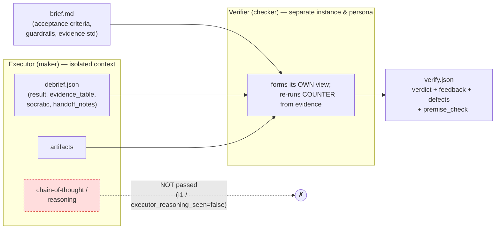
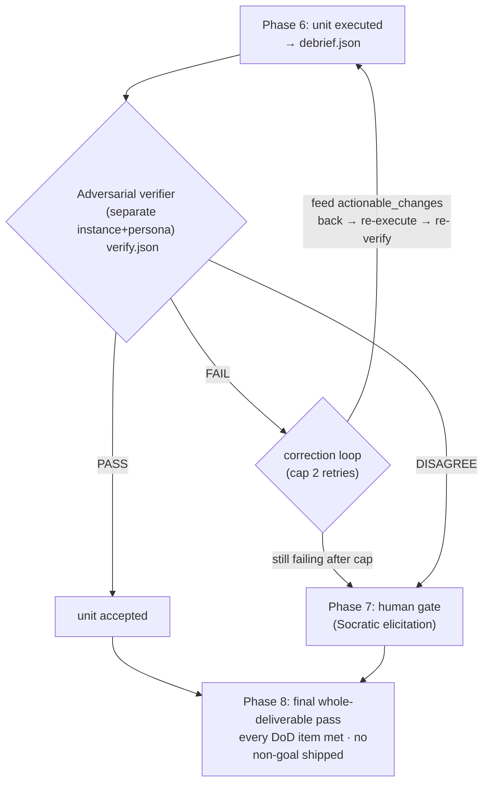

# Verification — the maker is never the checker

**Audience:** technical (LLM / agent-systems). Pairs with
[07-accuracy.md](07-accuracy.md) (evidence standards) and
[04-self-learning-loops.md](04-self-learning-loops.md) (the correction loop this feeds).

**TL;DR.** Dag never lets the instance that produced a work unit sign off on it. A *separate*
verifier persona receives the brief, the debrief, and the artifacts — but **not** the
executor's chain-of-thought — and is incentivized to *refute*. Its verdict is a machine-checkable
`verify.json` (PASS / FAIL / DISAGREE) with a no-vague-FAIL rule and an independent premise
re-check. This same discipline runs three times: per unit (Phase 6), on genuine splits
(Phase 7 → human), and on the whole deliverable (Phase 8).

> **Proof-status legend** (used verbatim below): *machine-checked (in scope)* = a validator/schema
> enforces it on emitted artifacts; *hand-proved* = argued on paper, not mechanized; *asserted
> (consistent)* = a self-attestation the system records but cannot mechanically confirm. This page
> is about a system that insists on evidence, so it never says "proved for all inputs."

---

## 1. Why the maker cannot be the checker

Start from first principles. If you ask a model to grade its own answer, you are asking a
process to find the flaws in the very thing it just decided was flawless. That is not skepticism;
it is confirmation bias with extra steps.

The repo states the core idea plainly: *"a single model instance that both makes and checks its
own work suffers confirmation bias. So the checker must be a separate instance that is
incentivized to refute"* (`references/methodology.md` §Verification, lines 245–247).

Two research results the repo leans on (attributed exactly as it attributes them, in
`references/methodology.md` §Hard-won principles #1, lines 342–345):

- **LLM judges provably favor their own outputs** — self-preference tied to self-recognition,
  which *persists even when authorship is hidden*. *(arXiv:2410.21819, NeurIPS'24 2404.13076.)*
- And a corollary the repo pairs with it (#2, lines 346–348): **ground every correctness gate in an
  EXTERNAL signal** — a test, tool output, an independent verifier — never the model re-reading
  its own reasoning, because *intrinsic self-correction of reasoning is unreliable and can degrade
  output*. *(arXiv:2310.01798.)*

The second point is the sharp one: self-correction isn't just weak, it can make a *correct*
answer *worse*. So Dag doesn't hand the executor a mirror. It hands the result to someone else.

---

## 2. Independence of context — the verifier is blind to reasoning

Separateness of *instance* isn't enough; the verifier must also be separate in *what it sees*.
The rule (`references/methodology.md` §Verification, lines 250–251):

> **Independence of context.** The verifier receives the brief, the debrief, and the artifacts —
> **not** the executor's reasoning/chain of thought. It forms its own view.

Why exclude the chain-of-thought? Because reading the maker's reasoning is how you get *joined*
verification — you inherit its framing and re-confirm its errors. The Socratic protocol says this
directly: *"Joint verification reinforces errors; this is why the verifier re-runs COUNTER from
evidence rather than reading the executor's reasoning"* (`references/methodology.md` §Socratic,
lines 28–31; `references/socratic-protocol.md` COUNTER row, line 37: "answered *independently of
your draft* … not by re-reading and rationalizing your own reasoning").

**How it's mechanized.** The `verify.json` artifact carries a boolean the schema *pins* to false:

```json
"executor_reasoning_seen": { "type": "boolean", "const": false }
```

(`schemas/verify.schema.json`, lines 14–18). A report where this is anything but `false` is
schema-**invalid** — that structural fact is *machine-checked (in scope)*. The repo labels this the
independence invariant (the brief and the validator's invariant set call it **I1**; its
machine-checkable form is exactly this schema `const`). A companion, **I1b**, is the
*persona-distinctness* half: the verifier's persona must differ from the maker's — a checker
optimizing for a *different* thing (`references/methodology.md` §Personas, lines 80–82: *"The
Adversarial Verifier persona must be able to reach the opposite conclusion from the executor
without penalty; never staff it as a rubber stamp"*).

Be honest about the seam: the schema can prove the *field says* `false`, but it cannot prove the
verifier *actually* never saw the reasoning — that is a **self-attestation**, *asserted
(consistent)*, not a platform guarantee. The schema itself says so at line 17: *"Self-attestation,
not a platform guarantee (see state-machine Limitation A)."* See §11.

**Structural persona identity (1.7.0 — I1c / I1d).** I1/I1b compare only the *declared* graph
personas; nothing tied the *actual* artifact personas to them, so one persona could execute a unit
*and* verify it while I1b still printed PASS. 1.7.0 closes that at the artifact layer. **I1c**
reconciles the emitted artifacts against the graph: for a unit carrying both a `debrief.json` and a
`verify.json`, `debrief.persona == graph.executor_persona`, `verify.verifier_persona ==
graph.verifier_persona`, and the two are **distinct** — maker ≠ checker at the *artifact* layer, not
merely in the declaration. **I1d** requires every *working* persona — each unit's executor/verifier,
each `brief`/`debrief` persona, and every panel member — to be a member of the confirmed
`personas.json` roster, so a working persona can no longer be a fabricated string absent from it
(`references/state-machine.md` I1c/I1d, lines 189–190). Both are post-hoc/offline and gate no
transition; a genuinely distinct *model* behind a distinct label stays unobservable (Limitation D).

### Data-flow: what the verifier can and cannot touch



The dashed red edge is the whole point: the executor's reasoning is *inside the box* and never
crosses into the verifier. Everything the verifier reads (brief, debrief, artifacts) is an
*emitted, inspectable artifact* — the same evidence a third stranger could open.

---

## 3. The refutation mandate

A verifier that only confirms is broken. The mandate
(`references/methodology.md` §Verification, lines 252–254):

> **Refutation mandate.** Its job is to *break* the result: find the counterexample, the unmet
> criterion, the unsupported claim, the hallucinated citation, the budget breach. A verifier that
> only confirms is malfunctioning.

Note the incentive design in §Personas (lines 74–82): the critic *"optimizes for a different thing
than the proposer (proposer = ship the simplest correct change; critic = find the input that
breaks it)"* and *"must be able to reach the opposite conclusion … without penalty."* PASS is not
the default the verifier is nudged toward; a clean break earns as much as a clean pass.

---

## 4. Guardrail / scope-creep check

Refutation isn't only "did it do too little?" — it's also "did it do too *much*?" Dag treats
delivered-but-unasked-for work as a defect, not a gift
(`references/methodology.md` §Verification, lines 260–265):

> **Guardrail compliance.** … every artifact traces to an acceptance criterion (which in turn
> traces to a Definition-of-Done item), and nothing on the unit's Non-Goals / guardrails list was
> built. **A delivered non-goal is a FAIL, not a bonus** — scope creep is a defect the checker must
> catch, the same as an unmet criterion.

This closes the loop opened in Phase 2, where the Definition of Done and the Non-Goals / Guardrails
list are *mandatory* outputs (`references/methodology.md` §Clarification, lines 127–132). The
verifier's two-sided test: **every DoD item met** *and* **no non-goal shipped**. Phase 8 applies the
identical check at task scope (lines 264–265).

**Mechanized in 1.8.0 — I22 `guardrail_compliance`.** 1.8.0 puts the scope-creep half of that test
on a machine-checkable footing. `verify.json` MAY carry an optional `guardrail_compliance[]` block —
one attestation row per non-goal checked, each `non_goal` a **verbatim** `clarifications.json.non_goals`
string and `status` one of `respected` / `violated` / `not-applicable` (`schemas/verify.schema.json`
`guardrail_compliance`, lines 169–181). `validate_run.py`'s **I22** reads it *offline*: adoption-closure
(once *any* verdict-bearing verify carries the block, every one must), verbatim membership, and coverage
of the unit's `non_goal_refs` are all mechanical — and it carries **one decidable-bite semantic clause:
a `violated` row on a `PASS` verdict is a FAIL**, mechanizing Phase 6's *"a delivered non-goal is a FAIL,
not a bonus"* (`references/state-machine.md` I22, line 214). It gates no transition (**PRESERVES**
termination) and is presence/shape-checked — whether a `respected` row is *genuinely* respected stays
verifier attestation (Limitation L).

---

## 5. Evidence re-check — reproduce, don't trust

Every debrief carries an **evidence table**; the verifier re-audits it row by row
(`references/methodology.md` §Verification, lines 266–269):

> **Evidence re-check.** For each claim … the verifier independently confirms the evidence is real
> and admissible … It reproduces results where feasible (run the test, open the cited page,
> re-derive the number).

The admissibility rules live in [evidence-standards.md](../plugins/dag/skills/dag/references/evidence-standards.md).
Evidence is judged *by claim type* — code claims want `path:line` **plus a run**, world-facts want a
primary dated source (two if contested), quotes must be verified verbatim before use
(`references/evidence-standards.md`, taxonomy table lines 33–41; operating rules lines 92–128). Two
rules the verifier weaponizes:

- *"Fabricated citations/APIs are the highest-severity hallucination — verifiers hunt these first"*
  (rule 4, lines 107–109).
- *"A debrief with an unbacked material claim is a **FAIL**, regardless of how plausible the claim
  is"* (closing line, lines 153–154).

And the anti-hallucination rule that cuts *both* ways: *"Absence of evidence is a finding"* (rule 7,
lines 117–119) — a verifier that can't reproduce a claim must *say so*, not wave it through. The
per-claim checklist the verifier runs is at `references/evidence-standards.md` lines 130–151.

**Mechanized in 1.9.0 — I30 `retrieval_coverage`.** The reproduce-don't-trust discipline extends to
*retrieval* in 1.9.0. When a unit's brief owes claims or names required sources, the verifier files an
optional `retrieval_coverage` block on `verify.json`: its own **re-derived** comparison of the debrief's
evidence against the brief's `claims_owed` / `required_sources`, plus reopen/chase probe records
(`schemas/verify.schema.json` `retrieval_coverage`, lines 112–168). `validate_run.py`'s **I30**
re-computes coverage *offline* — owed_check totality (set-equality with the brief's owed ids), non-empty
`row_refs`, a probe floor (≥1 reopen probe on external coverage), and a target-list superset — enforcing
one **headline clause: a `PASS` carrying an *uncovered* owed id (or a not-consulted required source) is a
FAIL** (`references/state-machine.md` I30, line 222). A `covered-downgraded` status (parametric-only /
vendor-silent coverage) is a legal, verifier-visible confidence downgrade on PASS, never silently
relabeled `covered`. Like I22 it gates no transition (**PRESERVES** termination); probe *genuineness*
stays attestation (Limitation S).

**CB-1 — what makes retrieval failure FAIL-able under I6.** I30 lives on the verifier's side of the
ledger; the clause that turns an uncovered claim into an actual unit FAIL is **CB-1**. When a brief's
`claims_owed` / `required_sources` are non-empty, the orchestrator appends the **verbatim CB-1 line to
that unit's `acceptance_criteria`** (I29 clause 4, `references/state-machine.md` I29, line 221). This
matters because §6's I6 rule requires every `defect.criterion` to be a *member* of the brief's acceptance
criteria: without CB-1 there is no criterion to fail an under-retrieved unit against — *"that one line is
what makes retrieval failure FAIL-able under I6"* (the bridge is whitespace-normalized presence-checked).

---

## 6. The verdict / feedback JSON contract

The verifier's output is not prose — it's `units/<UID>/verify.json`, a machine-checkable extract
(`schemas/verify.schema.json`). Required fields: `unit_id`, `verifier_persona`, `verdict`,
`iteration`, `executor_reasoning_seen`, `feedback`, `defects`, `socratic`, `premise_check` (line 8).

**Three verdicts** (`verdict` enum, line 12; semantics in `references/methodology.md` lines 270–273):

| Verdict | Meaning | Schema constraint (*machine-checked, in scope*) |
|---|---|---|
| `PASS` | criteria met, evidence sound; **MAY carry `minor` observations** | **no blocker/major defect** — every defect present must have `severity: minor` (schema `allOf`, lines 209–219). This is the **coverage-first** revision of **I6** (PR1): a clean pass is *not* `defects == []`, it is "no *blocking* defect." A `defects == []` PASS still validates (backward-compatible). (`state-machine.md:195`; `references/self-learning-loops.md` lines 592–605.) |
| `FAIL` | specific defect + minimal repro | `>=1` defect **and** non-empty `feedback.actionable_changes` (schema `allOf`, lines 194–208) |
| `DISAGREE` | genuine judgment split, no objective resolution → Phase 7 | a `disagreement` object with `why_unresolvable` set (schema `disagreement`, lines 104–111; `allOf`, lines 220–230) |

**Coverage-first, not triage-first.** The verifier's reporting rule is *recall before triage*:
report **every** defect it finds, each tagged with a `severity` (`blocker | major | minor`) — never
self-censor "small" findings, and never apply an "only report high-severity" filter, which lowers
recall on *any* model (`references/methodology.md` §Verification, lines 255–259; `SKILL.md` lines
609–612). Severity *ranks* a finding; it does not decide whether to report it. This is exactly *why*
the I6 PASS clause was revised: a criterion carrying only a `minor` observation can still PASS, so
the verifier is never structurally incentivized to hide it. The schema encodes the revision directly
— its overview calls this the *coverage-first* clause, and the PASS `allOf` forces every PASS defect
to be `minor`-only (`schemas/verify.schema.json`, description line 5; `allOf` lines 209–219).

**Coverage-first reaches the anti-oscillation guard, too (1.7.0 — I14/AO-2 severity scoping).** The
retry-time AO-2 check (**I14**) forbids a retry from re-opening a criterion a prior verdict sealed
into `feedback.do_not_touch`. 1.7.0 **scopes that disjointness to `blocker|major`**: a *minor*
coverage-first observation on a sealed criterion is now **reportable** (an advisory NOTE), not a
FAIL — otherwise coverage-first (report *every* defect) and anti-oscillation (don't churn sealed
work) would be jointly unsatisfiable. A `blocker`/`major` defect landing back on a `do_not_touch`
criterion is still a non-zero exit (`references/state-machine.md` I14, line 203).

**The no-vague-FAIL rule.** You cannot fail a unit with a shrug. A FAIL is *schema-invalid* unless
it carries at least one `defect` — and each defect must name a `severity`
(blocker/major/minor) and a `criterion` (schema `defects.items`, lines 65–79) — **and**
`feedback.actionable_changes` is non-empty (FAIL `allOf`, lines 194–208). The schema description states it outright: *"FAIL is schema-INVALID
unless it carries >=1 defect (each naming a criterion) AND feedback.actionable_changes is
non-empty"* (line 5). So a FAIL is always *actionable*: it tells the next iteration exactly what to
change.

**Defects cite brief criteria, not the verifier's taste.** Each `defect.criterion` must be a member
of the brief's `acceptance_criteria` — *"membership cross-checked by the validator"* (schema
`defects` description, line 67; the `criterion` field at line 74; the validator's I6 FAIL-criterion
cross-check in `scripts/validate_run.py`). That keeps the verifier honest: it can only fail you against a criterion you
were given, not one it invented.

**The feedback object** (schema `feedback`, lines 54–63) has two halves that make the correction loop
productive:

- `actionable_changes` — concrete edits for the next iteration (required; non-empty on FAIL).
- `do_not_touch` — what was already correct and must be *preserved*. This is what stops a retry from
  regressing the parts that passed.

---

## 7. Premise-check — the backstop against premise deflection

A clever self-check can defeat itself by examining a *safe* premise and ignoring the real one —
"premise deflection." The repo names the antidote
(`references/methodology.md` §Hard-won principles #6, lines 360–363):

> A self-check must confirm the **PREMISE** is the load-bearing claim before hunting a
> counterexample … The independent verifier confirms the premise, then **re-runs COUNTER from
> evidence**.

This is mechanized as the required `premise_check` object (`schemas/verify.schema.json`, lines
92–103), with four required fields:

```json
"premise_check": {
  "executor_premise_quoted":       "…",      // the maker's stated load-bearing claim, verbatim
  "is_load_bearing":               true,      // did the verifier agree that's THE claim?
  "counter_reran_independently":   true,      // COUNTER re-run decoupled, from evidence
  "outcome":                       "…"        // what the independent re-run found
}
```

The schema's own gloss (line 95): the verifier *"first confirmed the executor's stated premise is
the deliverable's LOAD-BEARING claim, then RE-RAN COUNTER on it independently (decoupled, from
evidence, never by reading executor reasoning)."* This is the COUNTER move of the Socratic protocol
(`references/socratic-protocol.md`, COUNTER row line 37) executed by the *checker*, not the maker —
the second, independent pass that catches a premise the maker quietly swapped.

The verifier also files its **own** 4-key `socratic` block (`premise` / `counter` / `pivot` /
`confidence`) on its verdict (schema `socratic`, lines 80–91) — same shape and rules as any debrief block, with
`counter` required to record an *outcome*, not a promise (`references/socratic-protocol.md`, lines
59–64).

---

## 8. Panels — the default on high-stakes units

For a routine unit one good skeptic is enough. For a **`high-stakes`** unit, one isn't — so in 1.3.0
a **panel of three is the *default*, not a special case reserved for "irreversible" work**
(`references/methodology.md` §Verification, lines 280–289; `SKILL.md` lines 615–620):

> **Panel of 3 is the DEFAULT on `high-stakes` units — distinct lenses, discrete majority.** A unit
> tagged `high-stakes` is verified by an **odd panel (3)** of independent verifiers with **distinct
> lenses**, not three clones: **correctness** (criteria + evidence), **reproduce** (re-run / re-derive
> — executable evidence), **guardrail** (scope / non-goal / gold-plating). … Take the **discrete
> majority** (2-of-3); a split with no strict majority ⇒ `DISAGREE`.

Three facts make this a mechanism, not a slogan:

- **The trigger is a tag, checked mechanically.** `high-stakes` is a first-class member of the run's
  tag vocabulary `V_tag`; a unit that carries it *requires* the panel. Routine units may still use a
  single verifier.
- **The aggregate is a discrete majority — never a softmax.** The panel verdict is the *mode* of the
  three verdicts (2-of-3); a no-majority split routes to `DISAGREE` → Phase 7 (the AO-5
  genuine-split route). It is **not** averaged or thresholded into a score
  (`schemas/verify.schema.json` `panel[]`, lines 24–43; `references/self-learning-loops.md` lines
  272–277). This is load-bearing, not stylistic: softmaxing the discrete guard table would collapse
  the exhaustive, mutually-exclusive `ADJUDICATE` guard partition and **break the termination
  proof**, so it is forbidden (`references/self-learning-loops.md`, PR1 FLAG, lines 164–175).
- **Enforced post-hoc by I16 — and it adds no FSM edge.** Recording a panel is *node-internal* work
  inside the single VERIFY transition: no new back-edge, so the correction-loop termination proof is
  untouched. `validate_run.py`'s **I16** check reads the emitted artifacts *offline* and requires a
  high-stakes unit's `verify.json` to carry a `panel[]` (≥3 members covering the
  correctness/reproduce/guardrail trio) whose discrete majority equals the top-level `verdict`
  (`references/state-machine.md` I16, line 205). Being post-hoc, it can never sit as a live guard on
  the loop's sole back-edge and deadlock it — the same discipline as I14/I15.
- **Independence, not just distinct lenses (1.7.0 — I16 extension).** Distinct lenses alone did not
  stop a panel of three *clones* — three copies of one persona behind the correctness / reproduce /
  guardrail labels. 1.7.0 extends I16 to require the members' declared `verifier_persona`s to be
  **pairwise distinct** *and* **none equal to the unit's executor persona** — a panelist may not be
  the maker, and there are no clones behind the lenses (`references/state-machine.md` I16, line 205).
  Independence is the whole point of the panel; like the rest of I16 it is presence/shape-checked and
  gates no transition.

**Loop-until-dry (a bounded recall sweep).** Inside one VERIFY node the verifier may run repeated
adversarial rounds that **accumulate** defects until a round surfaces **no new defect** ("dry") or it
hits the cap `R_max = 3`; the verdict is read off the accumulated set. It records the optional
`verify_rounds` (1..3) and `converged` fields (`schemas/verify.schema.json`, lines 44–53;
`references/methodology.md` §Verification, lines 240–245). A single pass misses the tail; a bounded
sweep raises recall — and being bounded it stays finite and adds no edge, so termination holds. If it
stops at the cap rather than dry, `converged: false` says so honestly (coverage may be incomplete).

**Per-panelist audit files (D-04).** A panel MAY additionally persist *each member's full report* as
`units/<U>/verify_p<N>.json` — same `verify.schema.json`, same `executor_reasoning_seen: false` —
alongside the aggregated `verify.json` and its `panel[]`, purely for audit. The validator
**validates any such file if present** (schema-valid, blind, `unit_id` matching its directory) but
never *requires* one and never lets a panelist file override the aggregated verdict the correction
loop reads (`SKILL.md` lines 620–625). This is D-04: blessed-but-optional per-panelist evidence.

**Depth-tier `full` widens the panel trigger (1.9.0 — DT-K6).** The panel is normally armed by the
`high-stakes` tag alone. The 1.9.0 depth-tier subsystem adds a fourth knob, **DT-K6 (panel scope)**: at
the `light` and `standard` tiers panel scope is "I16 as-is," but at the **`full`** tier it **extends the
panel to every `design` / `schema` / `validator`-tagged unit**, not only `high-stakes` ones — checked by
I28's P4 floor-conformance clause (*"full-tier panel on design/schema/validator-tagged units,"* reusing
the existing I16 panel shapes) (`references/state-machine.md` I28, line 220). The knob is upward-only —
raising the tier can add panels, never remove them — and it changes *which* units get a panel, not the
discrete-majority mechanics above.

The first-principles insight is unchanged — an odd count guarantees a majority, and *different
lenses* (not three clones) maximize the attack surface; it's the persona-diversity principle from
§Personas applied to the verifier seat. What 1.3.0 adds is making it the **default where stakes are
high**, aggregating it **discretely**, and auditing it **structurally**.

> **Honest limit (Limitation H).** I16 checks *presence and shape*, not *substance*: that the
> `panel[]` exists, covers the trio, and its discrete majority matches the verdict — all mechanically
> decidable. It **cannot** confirm that the three lenses were *genuinely* applied by genuinely
> independent verifiers, or that a `converged` sweep truly exhausted the defects; those stay
> verifier/human judgment (validity ≠ correctness — `references/state-machine.md` Limitation H, lines
> 326–337). The independent panel itself is the semantic backstop; I16 only enforces its skeleton.

---

## 9. Ask-first and the bounded Socratic dialogue-series (front-of-run guardrail — I35–I40)

Verification's discipline reaches the *front* of the run, too. Before Phase 2 sets
`clarification_resolved`, the clarification gate runs a bounded Socratic **dialogue-series**
(DS-2) as node-internal conduct — riding the already-modeled T4 self-loop and adding **no FSM
state, edge, back-edge, or `REQUIRED_GATES` flag** (`SKILL.md` lines 369–401). Six OFFLINE
post-hoc invariants **I35–I40** (socratic-guardrail, 1.10.0) make that front-of-run discipline
mechanically checkable over an emitted `dialogues.json` transcript — the same way §8's I16
mechanizes the panel (`references/state-machine.md` I35–I40, lines 223–228).

**The three round kinds** (`SKILL.md` lines 375–385):

- **R-OPEN — consequential-gap ask-first.** Every gap classed *consequential* (touching a
  Definition-of-Done item, a Non-Goal, a scope boundary, or an acceptance criterion) MUST be
  *asked* with a recommended default; a `logged-default` is **not** a legal resolution source for
  such a gap. **I38 mechanizes this ask-first legality, materiality-BLIND by construction** — a run
  cannot buy a clean exit by re-labelling a consequential gap "minor" — and a non-interactive run
  with an open consequential gap **HALTS at the gate** rather than self-answering
  (`references/state-machine.md` I38, line 226; `SKILL.md` lines 375–379). Cosmetic gaps stay
  logged defaults and never enter.
- **R-FORBID — non-goal solicitation.** An **unconditional** forbid round solicits Non-Goals at
  *every* P2, so the I21/I22/I23 guardrail chain of §4 rests on an explicitly-*asked* Non-Goals
  list rather than a silently-defaulted one; "no additions" is a legal, recorded answer. (Making
  this one round unconditional is a labeled **REVISES** of the no-fixed-ritual doctrine — DP-39 —
  with its anti-theater *content* half preserved: the round mandates the asking, never manufactured
  findings — `SKILL.md` lines 328–338, 380–381.) A run may later legitimately amend its confirmed
  anchor set through a new **`revise_anchors`** amendment kind under the bounded-graph-amendment
  discipline (`references/state-machine.md` I40, line 228).
- **R-CONFIRM — item-by-item confirmation.** The final `definition_of_done` / `non_goals` lists are
  confirmed item by item (≤4 per `AskUserQuestion` page — I36 caps `items_presented` at 4, so
  stuffing FAILs; a bulk "confirm all" page is the happy path). **I36 binds every recorded
  disposition back to a presented item**, so an orchestrator cannot self-cover a DoD/Non-Goal the
  human never saw (`references/state-machine.md` I36, line 224; `SKILL.md` lines 382–385).

**Bounded — `rounds_used ≤ 3`.** The human may converge earlier, but nothing runs a fourth round;
an unconverged cap terminates into a node-internal impasse dossier (phase unchanged — no P7
transition is created). **I35** checks transcript presence, the `rounds_used ≤ 3` cap
(`len(rounds[]) == rounds_used`), and per-instance round coverage; **I37** checks the termination
bookkeeping and probe accounting (`references/state-machine.md` I35 line 223, I37 line 225;
`SKILL.md` lines 390–397). This is the front-of-run twin of §8's loop-until-dry sweep: bounded, and
finite by construction.

**Anti-drift — the confirmed anchors cannot silently move.** A round's page queue is **frozen at
round open**: an item discovered mid-round is recorded and DEFERRED to the *next* round, never
appended live, so scope cannot grow *inside* a round, and a settled item is never re-asked without
a `reopened_by` reference (`SKILL.md` lines 387–389). **I39** anchors its list↔record
reconciliation to an **immutable `anchors_baseline`** (the I17 `baseline_units` pattern), so an
uncoordinated edit of the confirmed anchor set is caught; **I40** carries a **membership-union**
rule (I20/I21/I22 accept `current ∪ anchors_retired[].prior_text`, so a legitimately-retired anchor
is still honoured) and **narrows `add_units` autonomy** — an autonomous `add_units` whose
`dod_refs` were never human-confirmed FAILs, closing a downgrade-laundering hole
(`references/state-machine.md` I39 line 227, I40 line 228).

**All six PRESERVE termination.** Every one of I35–I40 is an OFFLINE predicate over emitted
artifacts that **gates no FSM transition and never guards `LT7`** — the correction loop's sole
back-edge, the CLAUDE.md deadlock rule. So the per-unit correction-loop termination proof
(Claims A–D) is **PRESERVED**, and AO-1..7, I1–I34, the three-human-gates model, and the FSM edge
set are all unchanged (`plugins/dag/CHANGELOG.md` [1.10.0]; `SKILL.md` lines 396–401). As with I16
this is **presence/shape, not substance**: that a human *genuinely spoke*, that `q`/`a` are
verbatim-faithful, and that the forbid battery was task-tailored stay verifier/human judgment — the
honest limits catalogued as [07-accuracy.md](07-accuracy.md) Limitations **U / V / W / X**. As of
**1.10.1** the family ships unchanged (residual cleanup only); its I39-7 tightens the anchor-baseline
mirror without relaxing any guarantee (see [07-accuracy.md](07-accuracy.md)).

---

## 10. How verification interweaves across Phases 6 / 7 / 8

Verification isn't a single station at the end — the same discipline recurs at three scopes.



**Phase 6 — per unit.** Each unit gets its own verifier and its own `verify.json`. A FAIL feeds the
`actionable_changes` back into a **correction loop capped at 2 retries**; if it still fails, it is
*not* an infinite loop — it becomes a Phase-7 disagreement
(`references/methodology.md` §Self-learning loops, lines 267–271). The `iteration` field
(schema line 13, `minimum: 1`) numbers each pass.

**Phase 7 — disagreement → human.** A `DISAGREE` verdict is reserved for a *genuine* judgment split
with no objective resolution (methodology §Verification, line 239); the schema forces it to carry a
`disagreement.why_unresolvable` (schema `allOf`, lines 220–230), and it routes to a human Socratic gate — the
*elicitation* mode of the same protocol (`references/socratic-protocol.md`, lines 11–13; the gate
discipline in `references/methodology.md` §Socratic, lines 9–48). Machine disagreement escalates to
a person; it is never silently resolved by re-running the loser.

**Phase 8 — final whole-deliverable pass.** After all units pass, the guardrail + DoD check is
re-applied at *task* scope: *"every DoD item met, no non-goal shipped"*
(`references/methodology.md` §Verification, lines 264–265). Unit-level PASS does not imply deliverable-level PASS — the
seams between units are exactly where an incomplete whole hides.

Trace of authority for this section: verdict semantics and loop caps →
`references/methodology.md` §Verification / §Self-learning loops; the JSON contract →
`schemas/verify.schema.json`; evidence admissibility →
`references/evidence-standards.md`; the Socratic gate/self-mode →
`references/socratic-protocol.md`.

---

## 11. Honest limits

This page would violate its own subject if it overstated the guarantee. Two limits, stated plainly:

- **Self-attestation (Limitation A).** `executor_reasoning_seen: false` is *machine-checked (in
  scope)* as a **field value** — the schema rejects any other value. But that the verifier *truly*
  never saw the executor's reasoning is a **self-attestation**, *asserted (consistent)*, not a
  platform-enforced guarantee. The schema says so at line 17: *"Self-attestation, not a platform
  guarantee (see state-machine Limitation A)."* A dishonest or careless run could write `false` and
  still have peeked; the invariant catches structure, not intent.
- **Shared weights (Limitation D, per the repo's limitation ledger).** Maker and checker are
  *different personas / instances*, but on the same platform they may share the *same underlying
  model weights*. Self-preference research (§1) shows bias can survive hidden authorship; a separate
  persona reduces but does not *eliminate* correlated blind spots. The strongest available
  mitigation the repo names is a *different model* where possible (`references/methodology.md`
  §Hard-won principles #1, line 308: *"ideally a different model"*) plus panel diversity (§8) — both
  *reduce* correlation rather than prove independence.

  > **Grounding note.** The "Limitation A" locator is confirmed in
  > `schemas/verify.schema.json:17`. The **D** label and the full limitation ledger live in
  > `references/state-machine.md` §5 / `references/self-learning-loops.md` §5 (referenced from
  > `references/methodology.md` lines 318–319), which were **not** read for this page — treat the
  > exact "D" index as *asserted from the brief*, while the *substance* (shared-weights /
  > correlated-bias risk) is grounded in §1's cited research and methodology #1.

The takeaway is not "trust the verifier" — it's "the verifier's independence is *structurally
enforced where it can be, and honestly labeled where it can't be*." That honesty is the guarantee.

---

*Sibling pages:* [07-accuracy.md](07-accuracy.md) (the evidence rulebook the verifier applies) ·
[04-self-learning-loops.md](04-self-learning-loops.md) (where a FAIL goes next) ·
[08-how-it-fits.md](08-how-it-fits.md). This page closes the propose → critique → verify arc.
