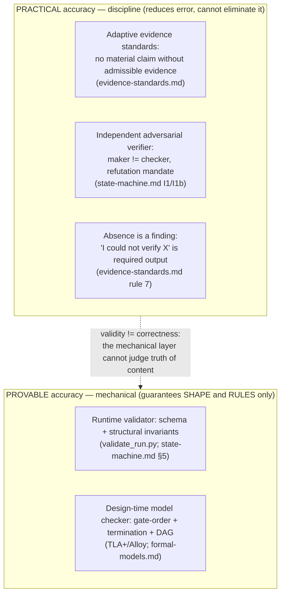

# Accuracy: practical vs provable

**Audience:** technical and skeptical — readers who want to know *exactly* what `dag`
guarantees about the truth of its output, and refuse to accept a guarantee stated one notch
too strong.

**TL;DR.** `dag` pursues accuracy on two different tracks that must never be conflated.
**Practical accuracy** is a discipline — adaptive evidence standards plus an independent
verification loop plus "absence of evidence is a finding" — that *reduces* error but can never
*eliminate* it. **Provable accuracy** is the much smaller set of things a model checker
(TLA+/Alloy) or the runtime validator can *mechanically* guarantee: those are guarantees about
**shape and rules**, not about **truth of content**. The single sentence to carry away is the
one the repo repeats verbatim: **validity ≠ correctness**
([`plugins/dag/skills/dag/references/state-machine.md` §5](../plugins/dag/skills/dag/references/state-machine.md);
[`plugins/dag/skills/dag/DESIGN.md` §6.4](../plugins/dag/skills/dag/DESIGN.md);
[`plugins/dag/skills/dag/references/formal-models.md` Residual](../plugins/dag/skills/dag/references/formal-models.md)).

Throughout, guarantees are tagged with the repo's proof-status legend and never rounded up:
**machine-checked (in scope)** · **hand-proved** · **asserted (consistent)**
([`formal-models.md` Proof-status legend](../plugins/dag/skills/dag/references/formal-models.md)).

---

## 1. The two tracks, drawn sharply

Most systems blur these; `dag` insists on the seam. Here is the whole page in one picture.

The dashed edge is the honest gap. Everything on the **provable** side is a statement about
*form* — "this artifact parses, this gate cannot be bypassed, this loop cannot diverge."
Nothing on that side can tell you the answer is *right*. That job stays on the **practical**
side, and the practical side is discipline, not proof.

---

## 2. Practical accuracy — the discipline that reduces error

### 2.1 The rule: no material claim without admissible evidence

The anti-hallucination stance is one absolute rule with an *adaptive* notion of what counts as
proof, "because a generic task may have no web-researchable facts at all — code claims are
proven by code, not citations"
([`evidence-standards.md`](../plugins/dag/skills/dag/references/evidence-standards.md), header).
Every material claim is tagged with a **claim type**, and each type has its own admissible
evidence — and its own explicitly *inadmissible* evidence
([`evidence-standards.md` claim taxonomy table](../plugins/dag/skills/dag/references/evidence-standards.md)):

| Claim type | Admissible (ground truth) | Inadmissible (reject) |
|---|---|---|
| Empirical/world fact | primary source, quoted + dated URL; two sources if contested | "I recall…", model's parametric memory |
| Code behavior | the code at `path:line` **plus a run** showing the behavior | reading a name and inferring |
| API/tool contract | official docs URL **or** an observed request/response | guessing from the function name |
| Numeric/quantitative | the measurement + how it was produced | round numbers with no derivation |
| Causal | a reproduction that toggles the cause | correlation, plausibility |
| Design/judgment | argument grounded in the *clarified acceptance criteria*, tradeoff explicit | assertion of superiority, no criteria |
| Provenance/quote | exact verbatim source + locator, confirmed to exist | paraphrase presented as a quote |

Worked example: the claim "*`verify()` rejects expired tokens*" is a **code-behavior** claim,
so a locator alone is not enough — admissible evidence is the code at `path:line` *plus* a
test/REPL/command output exhibiting the rejection
([`evidence-standards.md`, "Code behavior" row](../plugins/dag/skills/dag/references/evidence-standards.md)).
This very wiki page is held to the same bar: nearly every sentence carries a repo locator a
verifier can open, because the page is *about* a system that insists on evidence.

**Not all admissible evidence is equal — a preference ordering (PR2).** Within an admissible
claim type, `dag` prefers evidence the verifier can *mechanically regenerate* over evidence it
must take on faith, in a strict order:
**(1) executable / reproducible** — a command + its output, a re-run test, a diff of expected vs
actual, a re-derived number *with* its derivation; the verifier *re-runs* it. **(2) located but
static** — a `file:line`, a dated URL + quoted section, an observed request/response captured
earlier; the verifier *re-opens* it. **(3) asserted** — "I checked and it holds," admissible only
when 1–2 are genuinely infeasible, and then labeled `ASSUMPTION:` with its blast radius. The
ordering is *load-bearing, not stylistic*: a re-run's correctness does not depend on the checker's
reasoning depth, so reproducible evidence is **model-independent** (a modest verifier re-running a
test reaches the same verdict a stronger one would), and it is the prerequisite for data-parallel
verification. When a claim *can* be made executable, an asserted-only version is a weaker debrief
the verifier should down-rank or reject
([`evidence-standards.md`, "Evidence preference ordering" (PR2)](../plugins/dag/skills/dag/references/evidence-standards.md)).

### 2.2 Source tiers, the retrieval floor, and the fallback ladder (1.9.0)

Which admissible evidence you *may* lean on is not a free choice: externally-sourced evidence
carries a **tier tag**, and retrieval is **mandatory per claim type, not advisory**. Tier
authority is **claim-scoped, not a global ranking** — local sources are PRIMARY for
project-scoped claims and hearsay for world claims; vendor docs are PRIMARY for external
normative claims
([`evidence-standards.md`, "Source tiers & mandatory retrieval standard"](../plugins/dag/skills/dag/references/evidence-standards.md)).

**The four source tiers** ([`evidence-standards.md` tier table](../plugins/dag/skills/dag/references/evidence-standards.md)):

| Tier | Covers | Authority |
|---|---|---|
| **T-VENDOR** | official docs, changelogs, specs, standards, official API refs, the vendor's own repo | Authoritative for external normative claims; a contested/version-sensitive fact needs **two independent sources** (neither citing nor deriving from the other) |
| **T-COMM** | known-good community venues, admitted **once** into the run's SOURCES register under **K-A** (accountable venue: attributable standing/editorial control AND public correction machinery), **K-B** (chaseable to a primary or reproducible artifact), **K-C** (dated + version-matched, not stale) | Corroborative only. Sole support for a load-bearing external claim ONLY with `vendor_silent: true` + a `vendor_surface_searched` locator + the row's recorded K-B chase outcome |
| **T-LOCAL** | git log/commits/PRs/issues, archived run ledgers, learnings stores, `CLAUDE.md`, session memory, the project's own code/docs | Authoritative for **project-scoped** claims via reproducible locators (git SHA, `path:line`, PR#, ledger path; dates from metadata, never invented). **Hearsay** for world claims — never satisfies a vendor-tier obligation |
| **T-PARAM** | model parametric memory | **Never authoritative** — the fallback *floor*, admissible only as the declared final rung below, and the **only tier that is never registrable** as a source |

**The claim-type → tier standard.** The tier a claim *owes* is normative in the claim taxonomy
itself ([`evidence-standards.md`'s claim-type table](../plugins/dag/skills/dag/references/evidence-standards.md)),
not a separate ranking: an empirical/world-fact or api-tool-contract claim owes **T-VENDOR** (with
the vendor-silent T-COMM form for sole support); a project/code-state claim owes a reproducible
**T-LOCAL** locator. Direct observation (a run/reproduction with its recipe recorded) is an
evidence *form* for behavior/measurement/causal claims, **not** a source tier.

**The fallback ladder (when the live source is unreachable).** The retrieval rung is a **REQUIRED
field on every externally-sourced evidence row** — silent skipping is *impossible by
construction*. Take the **highest reachable rung**; each rung is attempted before declaring the
next ([`evidence-standards.md` fallback ladder](../plugins/dag/skills/dag/references/evidence-standards.md)):

1. **`live-fetch`** — URL + verbatim quoted span + accessed date (this run).
2. **`vendored-docs`** — local/vendored vendor docs, man pages, `--help` output: path/command +
   version + quoted span.
3. **`cached-copy`** — a previously-fetched copy whose locator is **verifier-reachable** (run dir,
   archived ledgers, repo or installed-dependency paths) + the **original** fetch date + a
   staleness note. If the verifier cannot open it, it is not a cached copy — declare
   `parametric-only`.
4. **`parametric-only`** — declared model-memory support: labeled `ASSUMPTION:` with its blast
   radius, **confidence-capped**, recorded in `residual_risks[]` when it covers an owed claim, and
   left verifier-visible for a next-higher-rung probe. It **cannot solely support** a claim an
   acceptance criterion depends on UNLESS the higher rungs are declared unreachable in the row's
   ladder fields — then the claim's confidence is capped and the gap is a recorded residual risk.

Stamping a **fresh access date on a cached or remembered source is date fabrication** — the
highest-severity hallucination
([`evidence-standards.md` rule 4](../plugins/dag/skills/dag/references/evidence-standards.md)).

**The retrieval floor — claims *owed* precede execution.** At briefing time the orchestrator
derives the unit's `claims_owed` — each `{id, type, trigger_ref, min_tier}` — from its acceptance
criteria under four rules
([`evidence-standards.md`, "Claims owed"](../plugins/dag/skills/dag/references/evidence-standards.md)):
**O1** — an external system/vendor/tool named ⇒ a world-fact entry (or an api-tool-contract entry
when the wording is contract-shaped), owed at **T-VENDOR**; **O2** — a file/code state asserted ⇒
a provenance-quote entry owed at **T-LOCAL**; **O3** — a number/threshold ⇒ a measurement owed;
**O4** — causal wording ⇒ a toggle reproduction owed. The executor may **add** claims, never
**shrink** the owed set; an empty set must say so explicitly with a reason. Every owed id must be
covered by an evidence row that lists it in `covers_owed`, matches its type, and satisfies its
`min_tier` (a T-VENDOR obligation accepts the vendor-silent T-COMM form or a declared-unreachable
parametric row, both confidence-capped; a T-LOCAL obligation accepts only reproducible local
locators). Verifiers **re-derive** the owed set via O1–O4 and treat an uncovered, mis-linked, or
under-tiered owed claim as a **defect citing that criterion**.

**The I31–I34 retrieval-ladder (RL) doctrine — mechanically checked.** The discipline above is
*enforced* by four post-hoc validator invariants (all **PRESERVES**, none a live loop guard; their
doctrine home is `evidence-standards.md` §Source tiers —
[`state-machine.md` §5](../plugins/dag/skills/dag/references/state-machine.md)):

- **I31 = RL-1 (rung presence)** — any evidence row carrying a `source_tier`/`retrieval_rung` must
  **declare its rung** (the ladder field is not optional).
- **I32 = RL-2 (parametric-downgrade consistency)** — a `parametric-only` row must be internally
  consistent with the downgrade: an `ASSUMPTION:` label + a `residual_risks` record + a confidence
  cap (parametric coverage of an owed claim cannot be reported `high`).
- **I33 = RL-3 (premise extraction)** — a **design-judgment** row must carry `extracted_premises`
  (each load-bearing factual premise pulled out as its own typed claim; an empty list needs an
  explicit none-reason — laundering must be a recorded false "none," never an omission).
- **I34 = CO-1 (per-entry owed coverage)** — for any brief with a non-empty `claims_owed`, every
  owed entry is checked for coverage per-entry: one row cannot discharge two subjects.

These check **presence/plumbing**, not genuineness (validity ≠ correctness) — the independent
verifier's re-derivation and re-open of every locator remain the semantic backstop (§4).

### 2.3 The loop that catches what slips through

Evidence standards are enforced by a person who did not write the claim. Every unit is judged
by an **independent adversarial verifier** — a separate subagent that never sees the executor's
reasoning, only the brief, the debrief, and the artifacts
([`state-machine.md` I1](../plugins/dag/skills/dag/references/state-machine.md);
see [`06-verification.md`](06-verification.md)). A debrief with an unbacked material claim is a
**FAIL** "regardless of how plausible the claim is"
([`evidence-standards.md`, closing line](../plugins/dag/skills/dag/references/evidence-standards.md)),
and a FAIL routes into the bounded correction loop
(see [`04-self-learning-loops.md`](04-self-learning-loops.md)).

### 2.4 Absence of evidence is a finding

The single most important anti-hallucination behavior is to *say "unknown" out loud*: "'I could
not verify X' is a legitimate, required output — surface it, don't paper over it"
([`evidence-standards.md` rule 7](../plugins/dag/skills/dag/references/evidence-standards.md)).
Assumptions are *labeled, never laundered into facts* — written as "ASSUMPTION:" plus why it is
reasonable plus its blast radius if wrong
([`evidence-standards.md` rule 2](../plugins/dag/skills/dag/references/evidence-standards.md)).

### 2.5 Why practical accuracy *reduces* but cannot *eliminate* error

Every mechanism above is a human/verifier *judgment* executed by a model that shares weights
with the thing it checks. The verifier can miss a fabricated locator; a plausible-but-wrong PASS
can slip through; a "genuine" socratic block can be theater. The discipline lowers the error
rate — it does not drive it to zero, and the repo never claims a rate at all. **There are no
accuracy metrics, benchmarks, or percentages anywhere in this repo, and none are invented here.**

---

## 3. Provable accuracy — what is *mechanically* guaranteed

Two mechanical layers guard the *rules*, at two different times
([`formal-models.md` intro](../plugins/dag/skills/dag/references/formal-models.md)):

- **Runtime** — `scripts/validate_run.py` inspects one specific run's artifacts and exits
  non-zero on a violation ([`state-machine.md` §5](../plugins/dag/skills/dag/references/state-machine.md)).
- **Design-time** — TLA+/Alloy prove the *rules themselves* cannot be violated by *any* run:
  gate order, loop termination, DAG acyclicity, structural verifier independence
  ([`formal-models.md`](../plugins/dag/skills/dag/references/formal-models.md); see
  [`10-proof-appendix.md`](10-proof-appendix.md)).

### 3.1 The machine-checked invariant subset (validator)

`validate_run.py` mechanically enforces this subset — every item here is *shape or structure*,
verbatim from [`state-machine.md` §5](../plugins/dag/skills/dag/references/state-machine.md) and
[`state-machine.md` §4](../plugins/dag/skills/dag/references/state-machine.md):

| Invariant | What is mechanically checked |
|---|---|
| (schema) | Schema-validity of every artifact |
| **I1** | `executor_reasoning_seen` has the `const:false` *shape* (a self-attestation — see Limit. A) |
| **I1b** | maker ≠ checker: `executor_persona != verifier_persona` per graph.json unit (persona *label* only — Limit. D) |
| **I1c** | Artifact↔graph persona reconciliation: `debrief.persona == graph.executor_persona`, `verify.verifier_persona == graph.verifier_persona`, and the two distinct — maker ≠ checker at the *artifact* level, not just the declared graph labels (still persona-label only — Limit. D) |
| **I1d** | Roster membership: every working persona (graph executor/verifier, brief/debrief, verify, each panel member) ∈ the confirmed `personas.json` roster (membership, not genuine-model staffing — Limit. D) |
| **I2** | Ledger parses: `fsm-state.json` is present and valid |
| **I3** | Fail-closed DAG acyclicity on `edges ∪ unit-deps`; authoritative `graph.json` required past decomposition |
| **I3b** | Wave layering: every unit in exactly one wave group and every `edges ∪ deps` edge rises strictly in wave (`wave(from) < wave(to)`); `waves` REQUIRED once amendments exist (post-hoc offline, +STRENGTHENS I3) |
| **I3c** | Dependency closure: every `deps`/`edges` endpoint names a current `units[].id`; a dangling or retired reference FAILs (post-hoc offline, +STRENGTHENS I3) |
| **I4** | Loop bound `retries ≤ 2`, cross-check `iteration ≤ retries+1` |
| **I5** | Budget cap `≤ 32000` on declared `budget_tokens` / `est_footprint_tokens` |
| **I6** | Evidence-bound verdicts: FAIL names ≥1 defect whose criterion ∈ brief; PASS ⇒ **no blocker/major defect** (REVISED coverage-first, PR1 — was `defects==[]`; a PASS may now carry `minor` observations) |
| **I7** | Exactly one recommended option in a disagreement dossier |
| **I8** | No open material ambiguity past Phase 2 |
| **I9** | Every debriefed unit has a `verify.json` verdict (missing-verification rejection) |
| **I10** | Synthesis completeness: at P8/DONE every debriefed unit has verdict=PASS |
| **I11** | Tag ∈ `V_tag_eff` (run-local ∪ global registry) |
| **I12** | Learnings-propagation predicate + ≥2-carrier admission gate |
| **I13** | Socratic `counter` records an *outcome* (shape only — genuineness is Limit. B) |
| **I14** | AO-2 `do_not_touch` disjointness, post-hoc offline (presence-gated + self-reported — Limit. F) |
| **I15** | AO-6 responsive-change presence, post-hoc offline (self-attested — Limit. F) |
| **I16** | Panel discipline, post-hoc offline (PR1): a `high-stakes` unit's `verify.json` carries a `panel[]` (≥3 members, distinct correctness/reproduce/guardrail lenses); the top-level `verdict` equals the **discrete majority** of the panel verdicts (a split ⇒ `DISAGREE`, no softmax); `verify_rounds ∈ [1,3]` (presence/shape only — genuine lens-diversity is Limit. H) |
| **I17** | BGA frozen executed prefix: no amendment touches a debriefed/verified unit; reconciled against the immutable `graph.json.baseline_units` (`set(units) ∪ retired == baseline ∪ ⋃ units_added`); every executed unit's graph entry matches its immutable `brief.json` (post-hoc offline) |
| **I18** | BGA fuel bound: `fuel_remaining == fuel_initial − Σ fuel_cost ≥ 0` + `fuel_before`/`fuel_after` tamper chain + records-required trigger + revision/`amendments_applied` bookkeeping (schema max 32 — the runtime backstop for the `Quiesce`/`FuelBound` design-time property) |
| **I19** | BGA amendment scope + kind closure: per-kind schema closure; `dod_refs` verbatim ∈ `definition_of_done`; `scope_change`/`cancel_unit` ⇒ `human_gate==true`; split-child coverage (presence/attestation only — genuine DoD-service and real human approval stay unobservable) |
| **I26** | SOURCES register present & complete: structural trigger, fail-closed presence (≥1 row, ≥1 CONSULTED), disposition completeness, K-A/K-B/K-C venue admissions, coverage-basis membership (post-hoc offline) |
| **I27** | Clarification sweep: nine-dimension exact-once coverage, disposition presence, cartography-round record, `resolution_source` visibility, P8 spot-check presence (post-hoc offline) |
| **I28** | Depth-tier recording + floor conformance: adoption-gated on `fsm-state.depth`; unconditional Phase-2 touch; upward-only ratchet monotonicity (per-unit time-scoped); canonical skipped-floors completeness; probe/sweep/register/panel floors; external-surface consistency (post-hoc offline) |
| **I29** | Execution-effort briefs: `claims_owed`/`required_sources` owed-entry shape, register linkage, CB-1 bridge presence, explicit-none, queued-consumer closure (post-hoc offline) |
| **I30** | Retrieval-coverage verify: `owed_check` totality + recomputed coverage arithmetic, **PASS-with-uncovered ⇒ FAIL**, probe floor, target-list superset, consulted/unreachable joins (post-hoc offline) |
| **I31** | **RL-1** rung presence — every externally-sourced evidence row declares its `retrieval_rung` (post-hoc offline; doctrine home: `evidence-standards.md` §Source tiers) |
| **I32** | **RL-2** parametric-downgrade consistency — a `parametric-only` row carries the `ASSUMPTION:` label + `residual_risks` record + confidence cap (post-hoc offline) |
| **I33** | **RL-3** premise extraction — a design-judgment row carries `extracted_premises` (or an explicit none-reason) (post-hoc offline) |
| **I34** | **CO-1** per-entry owed coverage — every entry of a non-empty `claims_owed` is covered per-entry; one row cannot discharge two subjects (post-hoc offline) |
| **I-dod** | Definition-of-Done + Non-Goals present once any post-clarification structural artifact exists (fail-closed even if `clarifications.json` absent) |
| (attestation) | The `premise_check` attestation: `counter_reran_independently==true`, PASS rejected if `is_load_bearing==false`; gate-ordering of `phase` vs `gates` |

*(The 1.8.0 guardrail/clarification family **I20–I25** — per-unit DoD/non-goal binding,
verify-time `guardrail_compliance`, P8 DoD/non-goal closure, the ambiguity-register floor,
resolution-required on resolved-material items — is enforced by the same post-hoc/offline
validator but catalogued on
[`14-validator-and-invariants.md`](14-validator-and-invariants.md); this page lists the
evidence/retrieval-facing invariants.)*

### 3.2 The machine-checked design-time properties (TLA+/Alloy)

Five properties are proved at the level of the *rules*, each tagged at its true strength
([`formal-models.md` properties table](../plugins/dag/skills/dag/references/formal-models.md)):

| Property | Tool | Proof status |
|---|---|---|
| Gate ordering (I8/I10) | TLC | **machine-checked (in scope)** + hand-proved |
| Bounded-loop termination (I4) | TLC | **machine-checked (in scope)** + hand-proved (variant) |
| DAG acyclicity (I3) | Alloy | **machine-checked (in scope)**, no counterexample + hand-proved |
| Verifier independence (I1) | Alloy | **asserted (consistent)** + machine-checked, no counterexample |
| Bounded-amendment quiescence (I18) | TLC + Alloy | **machine-checked (in scope)**, non-vacuous vs keep-fuel mutant + hand-proved (fuel variant) |

"**In scope**" is load-bearing. TLC explored a *bounded* state space — 408 distinct reachable
states, depth 36, "no error has been found"
([`formal-models.md` TLC transcript](../plugins/dag/skills/dag/references/formal-models.md)) —
and Alloy checked within a finite scope (`for 7 but 5 Int`)
([`formal-models.md` §3 check command](../plugins/dag/skills/dag/references/formal-models.md)).
That same TLC run now discharges **two** temporal properties — bounded-loop `Termination` **and**
the bounded-amendment `Quiesce` (`<>`: the fuel-bounded graph
amendments cannot re-arm the loop forever) — plus the `FuelBound` safety invariant, both added
with Bounded Graph Amendments and machine-checked non-vacuously against a keep-fuel mutant
([`formal-models.md` §5](../plugins/dag/skills/dag/references/formal-models.md)). That is **not**
"proved for all inputs." And note property 4 is **asserted (consistent)**, not
a derived theorem: the model *encodes* verifier independence by fiat and shows it satisfiable
with a witness instance — it does not derive it
([`formal-models.md` §4](../plugins/dag/skills/dag/references/formal-models.md)).

---

## 4. validity ≠ correctness — the honest gap, stated plainly

**Validity ≠ correctness.** The mechanical layers prove an artifact is *well-shaped* and that no
run can *bypass a rule*. They cannot judge whether the content is *true*. In the repo's own
words: the validator "cannot judge whether a PASS is *correct*, whether a `socratic` block is
genuine vs. theater, or whether reported tokens are truthful"
([`DESIGN.md` §6.4](../plugins/dag/skills/dag/DESIGN.md)); the FSM spec opens its boundary
section titled "**Mechanically-checked vs. semantic (honest boundary — validity ≠ correctness)**"
([`state-machine.md` §5](../plugins/dag/skills/dag/references/state-machine.md)); and the formal
layer closes with a Residual section: the proofs establish "the *plumbing and the rules*;
correctness-of-content remains the independent verifier's semantic judgment"
([`formal-models.md` Residual](../plugins/dag/skills/dag/references/formal-models.md)).

### 4.1 The semantic limitations A–H — NOT mechanically decidable

These are the things no schema, validator, or model checker can decide; they stay a
human/verifier judgment. Enumerated verbatim from
[`state-machine.md` §5, "It CANNOT enforce"](../plugins/dag/skills/dag/references/state-machine.md)
(mirrored in [`formal-models.md` Residual A–E](../plugins/dag/skills/dag/references/formal-models.md)):

- **A — verifier true-blindness is self-attested.** Whether the verifier was *truly* blind to
  executor reasoning. `const:false` / `premise_check` are self-attestations, "not platform
  guarantees (no passive hook intercepts subagent I/O)." This is the load-bearing residual for
  the Alloy independence property.
- **B — PASS-correctness (correctness, not shape).** Whether a PASS is *correct*, whether
  evidence locators actually resolve/reproduce, or whether the `socratic`/`defects`/`premise_check`
  text is *genuine* rather than theater. I13 checks the counter's *shape*; "the independent
  COUNTER re-run is the real backstop."
- **C — token truthfulness.** Whether the reported `budget_tokens` / `tokens_consumed` are
  truthful. (The schema hard-checks the *declared* number ≤ 32000; real consumption stays
  disciplinary — [`DESIGN.md` §6.1](../plugins/dag/skills/dag/DESIGN.md).)
- **D — genuine model-distinctness.** Whether executor and verifier are genuinely a *different
  model/agent* at runtime. The persona-**label** distinctness IS graph-checked (**I1b**), "but a
  genuinely distinct *model* behind the label stays unobservable to the validator."
- **E — tag-genuineness.** Whether a `tag` genuinely denotes a *reusable* pattern. I12 enforces
  ≥2 carriers + presence mechanically; "whether the lesson is *truly* generalizable stays a
  verifier/human judgment."
- **F — I14/I15 presence, not genuineness.** Whether I14/I15 *authoritatively* enforce AO-2/AO-6.
  They are "post-hoc + presence-gated + self-reported": they fire only when the retry's
  `prior_feedback` echo is present, compare the executor's *self-reported* `do_not_touch` (not
  the authoritative prior verify, since only the latest `verify.json` is retained), and I15's
  `changes_made` is executor-self-attested. "So they check *presence/plumbing*, not genuineness
  (validity ≠ correctness)."
- **G — tag-domain trust.** The I11/I12 tag domain is *widened* to `V_tag_eff = global ∪ project
  ∪ run_local`, and its authored-vs-imported carve-out **trusts** the `G#`-id / store provenance
  as the "already-generalized" signal — "a deliberate provenance-trust boundary, not a
  cryptographic proof" (an absent/invalid registry falls back to run-local, so the domain is
  never widened silently or on bad data).
- **H — I16 panel presence/shape, not genuine lens diversity.** I16 mechanically checks that a
  `high-stakes` unit carries a ≥3-member `panel[]` whose lenses cover the canonical
  correctness/reproduce/guardrail trio and whose **discrete majority** equals the top-level verdict
  (a split ⇒ `DISAGREE`, no softmax), and that `verify_rounds ∈ [1,3]` — all mechanically decidable.
  It **cannot** enforce that the three lenses were *genuinely* applied by *genuinely* independent
  verifiers, that a `converged` (dry) sweep truly exhausted the defects, or that a panelist's
  verdict is *correct* — those stay verifier/human judgment (validity ≠ correctness, the same
  boundary as I13/I14/I15). Being post-hoc, it gates no transition, so it can never deadlock the
  loop
  ([`state-machine.md:326-337`, Limitation H](../plugins/dag/skills/dag/references/state-machine.md)).

### 4.2 Reading the seam correctly

A green validator run and a clean TLC/Alloy check together tell you: *the artifacts are
well-shaped and the run obeyed the rules.* They do **not** tell you the deliverable is correct.
As the formal layer states of the Alloy independence check, "even a green Alloy check would
**not** prove the *real system* enforces it"
([`formal-models.md` §4, Tool-status](../plugins/dag/skills/dag/references/formal-models.md)).
The provable layer secures the *plumbing*; the practical layer — evidence standards and the
independent verifier — is the only thing pushing on *truth*, and it reduces error without ever
eliminating it.

---

## 5. See also

- [`06-verification.md`](06-verification.md) — the independent adversarial verifier that carries
  the practical-accuracy load (the "real backstop" behind limitations A, B, F).
- [`04-self-learning-loops.md`](04-self-learning-loops.md) — the bounded correction loop a FAIL
  enters, and the AO-2/AO-6 discipline behind I14/I15.
- [`03-formal-methods.md`](03-formal-methods.md) — the FSM/invariant/proof vocabulary this page
  leans on.
- [`10-proof-appendix.md`](10-proof-appendix.md) — the full TLA+/Alloy proof layer and exactly
  what is (and is not) proved.
