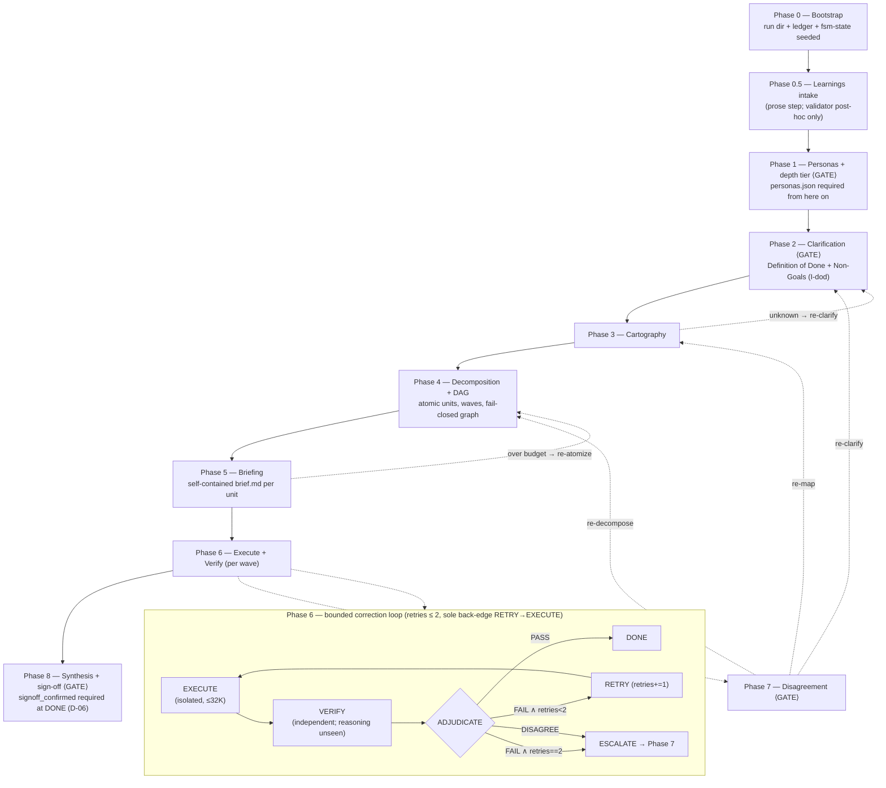

# 08 — How it all fits together

**Audience:** technical readers who have skimmed the individual phase pages and now want the *whole machine* — how the ledger, the schemas, the validator, the subagents, and the human gates compose into the one guarantee `dag` actually offers.

**TL;DR.** `dag` is not "an LLM that does your task." It is a pipeline where the main agent (Dag) never does the work itself — it spawns isolated subagents, writes every fact to disk, and refuses to advance a phase until a mechanical validator exits 0 and (at three human gates) a human says go (SKILL.md:64-125, the prime directives). The guarantee is compositional: **ledger-is-truth** makes state durable, **schemas + an explicit validator step** gate the *shape* of every handoff, **independent adversarial verifiers** attack the *truth* of every unit, and **human gates** own the decisions that matter. No single piece is trusted alone.

> **Proof-status legend (used verbatim below, never softened).** A claim is one of:
> *machine-checked (in scope)* — a validator/model-checker mechanically enforces it over emitted artifacts; *hand-proved* — argued on paper (e.g. loop termination); *asserted (consistent)* — a discipline the system relies on but cannot mechanically enforce today. Never "proved for all inputs."

*This page describes `dag` as of **plugin 1.9.0 / catalog 1.0.11** ([`plugin.json`](../plugins/dag/.claude-plugin/plugin.json) line 4; [`marketplace.json`](../.claude-plugin/marketplace.json) line 7 = catalog, line 13 = plugin). Every `file:line` locator below is re-resolved against that tree — an unresolved locator is a bug.*

---

## First principle: Dag holds almost no state

The mental model to start from: **the run directory is the program, and Dag is just an interpreter with a tiny working set.** Everything durable lives in `.wip/<date>_<time>_<label>/` — the ledger files (`PLAN/DECISIONS/PROGRESS/LEARNINGS.md`), the FSM state (`fsm-state.json`), and one folder per work unit (DESIGN.md:34-55). Dag's own context is deliberately lean; if a fact isn't written down, "it didn't happen" (SKILL.md:66-68, Prime Directive 1).

Why this matters for *composition*: because state is on disk, a backward loop (re-clarify, re-atomize) or a mid-run interruption never loses ground truth. Resumption is just "re-read `PLAN.md`'s phase table + `PROGRESS.md`'s last line" (SKILL.md:858-862). Every other guarantee on this page rides on this one — the validator reads the ledger, verifiers read the on-disk brief/debrief, and downstream briefs quote upstream debriefs' handoff notes (DESIGN.md:78-81). That last channel is the *only* way data crosses between isolated subagents (DESIGN.md:78-79): the Agent prompt tells the executor to read its `brief.md` and write its `debrief.json`, and nothing else leaks across the boundary.

---

## The nine phases, end to end

Phase names below match the SKILL.md section headers; the FSM tags them `P0_BOOTSTRAP`, … (seeded at bootstrap, SKILL.md:137-141).

**Phase 0 — Bootstrap.** Resolve the task prompt (`$ARGUMENTS`, else ask — req 16), assign a label, and run `init_run.sh` to create the run dir. That script seeds the ledger, an initial `fsm-state.json` at phase `P0_BOOTSTRAP`, and the "`<name>.md` + machine-checkable `<name>.json` sidecar" convention every later artifact follows (SKILL.md:135-141). The verbatim prompt is frozen into `INPUT.md`.

**Phase 0.5 — Learnings intake.** *Before* persona selection, fold in lessons persisted by earlier runs (project `.dag/learnings/` + user `~/.claude/dag/learnings/`). Honest boundary worth repeating: **this is a prose step Dag executes — there is no loader script, and the validator does not perform the intake** (SKILL.md:150-157). The validator's role here is strictly *post-hoc*: it independently re-discovers the same stores and reports I12 propagation as PASS/NOTE lines; it never gates the transition. Cross-run imports are **advisory until re-grounded** to a this-run signal (SKILL.md:173-182).

**Phase 1 — Socratic persona selection.** Personas are lenses, paired propose ↔ critique so no viewpoint goes unchallenged (SKILL.md:214-216). Dag triages the curated `index.json`, merges user/project personas (override order project > user > curated), synthesizes any the library lacks, and writes `PERSONAS.md` + a `personas.json` sidecar. **This is a human gate**, and it is *mechanically non-skippable*: `validate_run.py` requires `gates.personas_confirmed` from Phase 2 onward and rejects a `true` flag not backed by a valid `personas.json` (SKILL.md:255-258; DESIGN.md:87). "Right-sizing" a small task may cut ceremony but may not skip this gate (SKILL.md:253-254). **The depth tier rides this same gate** (new in 1.9.0): in the *same* `AskUserQuestion` batch as the roster — tier question first — Dag proposes a run depth (`light` | `standard` | `full`) with a four-field justification (`stakes`, `reversibility`, `external_surface`, and the canonical `skipped_floors` list) and the human confirms it, recorded in `fsm-state.depth`. It **adds no fourth gate and no new FSM edge** — the tier is a human-decided, upward-only ratchet whose per-tier floors the validator's `I28` checks offline (SKILL.md:260-284; fsm-state.schema.json:90-137; state-machine.md:220, which notes REQUIRED_GATES is untouched — the "three-human-gates model immutable").

**Phase 2 — Clarification.** Kill every *material* ambiguity before any work starts (SKILL.md:288-290). This opens with a **nine-dimension dimensional sweep** (new in 1.9.0): for each of `terms`, `success-criteria`, `scope-boundaries`, `audience-format`, `constraints`, `assumptions`, `failure-modes`, `sources`, `stakes`, Dag records a per-dimension disposition — `ambiguity-found`, `probed-clear`, or `none-after-genuine-search` (with a one-line genuine-search statement) — in `clarifications.json.dimension_sweep`. The sweep fixes *coverage of the search*, never a question count: **zero user questions is a legal outcome** on every dimension, and each resolved row carries a `resolution_source` (`human-gate` / `prompt-verbatim` / `logged-default`). The validator's `I27` requires the sweep cover all nine dimensions exactly once, so "not swept" is mechanically distinguishable from "swept, nothing found" (SKILL.md:292-304, :356-364; state-machine.md:219). A second, **cartography-informed round** (recorded as `dimension_sweep.cartography_round`) is fed by the Phase-3 SOURCES register. The three mandatory outputs — **Definition of Done** (a testable exit checklist), **Non-Goals/Guardrails**, and strengthened gap coverage — remain non-optional (SKILL.md:314-327). Enforcement is two-layer: (L1) the schema marks `definition_of_done` and `non_goals` required + non-empty; (L2) the validator's `I-dod` check *demands* a schema-valid `clarifications.json` with both fields once the run has any post-clarification structural artifact — cartography, graph, units, or synthesis — even if the file is absent (SKILL.md:328-333; DESIGN.md:199-207). **This is a human gate.**

**Phase 3 — Cartography.** Map the terrain *contextually* — meaning and relationships, invariants, risks, unknowns — not a file listing (SKILL.md:370-373). The first cartography product is the **source sweep** (new in 1.9.0): Dag enumerates the task's source landscape into `SOURCES.md` + a `sources.json` register, each row carrying a tier (**T-VENDOR** / **T-COMM** / **T-LOCAL**), a locator, and a disposition (`consulted` with access date + what it yielded, `queued` naming a consumer, or `rejected` with why), closing with coverage claims and a T-COMM venue-admissions block. It runs **before** the cartography-informed clarification round, which reads it, and feeds brief context pointers and claims-owed derivation; the validator's `I26` fail-closes on a missing register and checks disposition completeness (SKILL.md:375-388; state-machine.md:218). A Cartographer subagent (optionally a second with a different lens) writes `CARTOGRAPHY.md`. Discovered unknowns become either clarification items (**back-edge to Phase 2**) or work units (SKILL.md:399-400).

**Phase 4 — Decomposition & dependency graph.** Decompose into **atomic units** — single responsibility, independently verifiable, briefable within budget. Each unit's acceptance criteria **MUST trace to a Definition-of-Done item** (a criterion mapping to no DoD item is scope creep or a DoD gap), and each carries the Non-Goals down as explicit guardrails (SKILL.md:416-446). Build the DAG, reject cycles, topologically sort into **waves** (intra-wave units are independent → parallel). A critique pass checks for missing deps, cycles, over/under-atomization, DoD coverage, and Non-Goal crossings (SKILL.md:449-451). `graph.json` is parsed **fail-closed** — an unparseable/empty graph or a cycle is rejected (DESIGN.md:90).

When the dataset dwarfs one unit's 32K budget, Phase 4 takes the **partitioning path** — *partition the work, not the context.* Dag **first forks**: *mechanical-uniform* passes ("extract field X from 10M rows") are ETL orchestrated as **one script the pipeline verifies by re-run + diff on a sample** (never sharded into units); only *judgment-heavy per-slice* work ("assess 500 contracts") is mapped onto the DAG — a deterministic sharder emits a `manifest.json` (which the *decomposer* validates explicitly: `validate_run.py` deliberately does **not** auto-check it), a parametric map wave applies one brief *template* over the manifest, and a reduce tree fans the partials back in (SKILL.md:472-494). Structurally this is just *more units + more waves over the same FSM edge set*, so it **PRESERVES** the termination proof. Full treatment: **page 12 (large-dataset partitioning)**.

**Phase 5 — Briefing.** For *every* unit, generate a self-contained `brief.md`: objective + verbatim testable criteria, the persona + mandate, minimal context pointers, the evidence standard, the ≤32K budget contract, and the required `debrief.json` artifact (SKILL.md:498-533). Each brief now also carries the unit's **retrieval obligations** (new in 1.9.0): `required_sources[]` (register S-ids with *inline* locators, so the executor never opens `sources.json`) and `claims_owed[]`, both derived by the orchestrator — never the executor — from the acceptance criteria + the SOURCES register. When either list is non-empty, the brief appends the verbatim **CB-1** bridge criterion — the one line that makes a retrieval miss FAIL-able under I6 — and the validator's `I29` enforces adoption-closure + owed-entry shape offline (SKILL.md:515-526; state-machine.md:221). If a brief can't fit the unit in budget, re-atomize (**back-edge to Phase 4**, SKILL.md:535-536).

**Phase 6 — Execution + adversarial verification.** The engine room; detailed in its own section below.

**Phase 7 — Socratic disagreement gate.** Triggered by any unresolved *material* disagreement. Dag writes a `disagreement.md` dossier — every option in full, evidence for/against, reversibility, best marked `★ Recommended` — and presents it via `AskUserQuestion`, always offering rollback to Phase 2/3/4 or "revise the original input" (SKILL.md:758-770). **This is a human gate.** Nothing material is resolved silently.

**Phase 8 — Synthesis & sign-off.** The Synthesizer rolls every debrief into `SYNTHESIS.md`, confirms **every DoD item is met AND no Non-Goal was delivered** (a shipped non-goal blocks sign-off — it is not a bonus), runs a final independent adversarial verification of the whole, and presents the DoD checklist at the **final sign-off gate** (SKILL.md:776-807). That final verification's target list now includes a **SOURCES-register sample** (new in 1.9.0): it re-opens ≥1 consulted `sources.json` row per coverage area outside any unit's lineage, and — when external-tier `queued` rows outnumber consulted ones — ≥1 queued row per external tier, recording the outcome in the verification's `audit_notes` (SKILL.md:790-796). **This gate is mechanically non-skippable (D-06):** only once the human accepts does Dag set `fsm-state.gates.signoff_confirmed = true` and advance `phase` to `DONE`, and `validate_run.py`'s `REQUIRED_GATES` lists `signoff_confirmed` for `DONE` — so a run parked at `DONE` without the flag is INVALID (non-zero exit), closing the old "the validator couldn't tell sign-off happened" hole (SKILL.md:802-807; state-machine.md:176-182, T12 :105). Durable, `promotable`-flagged learnings are then persisted to the project store for the *next* run's Phase-0.5 intake (SKILL.md:808-817). **This is a human gate whose occurrence the validator now checks — the flag's *presence* is machine-checked; its *genuineness* (that a human really accepted) stays the human's, validity ≠ correctness.**

---

## The three human gates and the two loops

**There are exactly three human gates** — persona/clarification (spanning the Phase-1 roster and the Phase-2 clarification pass), material disagreement (Phase 7), and final sign-off (Phase 8) — where Dag pauses for the human (SKILL.md:87-88, Prime Directive 5; SKILL.md:464-465; DESIGN.md:23 enumerates the phase touchpoints). Depth rides the Phase-1 persona gate in the same `AskUserQuestion` batch, so it **adds no fourth gate and no new FSM edge** (SKILL.md:260-284; state-machine.md:220). This is the "gate on decisions that matter" policy: everywhere else, Dag proceeds and logs.

**Two of the three are now mechanically backed.** The persona/clarification gate is backed at both ends — the validator's `REQUIRED_GATES` enforces `personas_confirmed` (Phase 1), and the **separate artifact-driven `I-dod` check** demands a schema-valid `clarifications.json` carrying Definition-of-Done + Non-Goals whenever any post-clarification structural artifact exists (Phase 2 — an artifact check, not a `REQUIRED_GATES` entry). The sign-off gate is backed by `REQUIRED_GATES`' `signoff_confirmed` at `DONE` (Phase 8 — new in 1.3.0, D-06). **Phase 7's disagreement gate (G-resolve) is the sole gate the validator cannot check:** it can confirm a decision was *recorded* (an appended `DECISIONS.md`) but not that a human made it (state-machine.md:173-175). In every backed case only the *presence* of the flag is machine-checked; its *genuineness* stays a validity ≠ correctness limitation.

There are **two independent loops**, and it's worth keeping them separate in your head:

1. **The pipeline back-edges (targets 2 / 3 / 4).** DESIGN.md:76 states it plainly: *"Phases 2/3/4 can loop backward when unknowns or over-budget units are discovered."* Concretely, three back-edges land on those three phases:
   - **→ Phase 2 (re-clarify):** Phase 3 turns an unknown into a clarification item (SKILL.md:399-400); Phase 7 offers re-clarify as a rollback (SKILL.md:764-765).
   - **→ Phase 3 (re-map):** Phase 7 offers re-map as a rollback (SKILL.md:764-765).
   - **→ Phase 4 (re-decompose):** Phase 5 re-atomizes an over-budget brief (SKILL.md:535-536); Phase 7 offers re-decompose (SKILL.md:764-765).

2. **The Phase-6 correction loop** — a *bounded* inner FSM per unit, described next. It is a different loop with a different termination story, and it does not add any back-edge to the pipeline above.

---

## Phase 6 in detail: where maker and checker are decoupled

This is the phase the whole design is built to protect. Waves run in topological order; units in a wave run in parallel (one Agent call each). Per unit (SKILL.md:540-663):

Because a wave runs many units at once, one FSM slot can't hold every unit's loop position. The single top-level `fsm-state.loop` object is only a back-compat snapshot of the **most-recently-transitioned** unit — so each `fsm-state.units[]` item MAY additionally carry its own durable **`retries`** (0..2) and **`loop_state`**, keeping every in-flight unit's correction-loop substate on disk rather than in Dag's head (I2 ledger-is-truth; D-02/IMP-11, `fsm-state.schema.json:59-79`, `state-machine.md:51-68`). When an item records `retries`, `validate_run.py` extends the *same* I4 bound to it — `verify.iteration ≤ retries+1` — as a **post-hoc / offline** cross-check that gates no transition and adds no guard to the sole back-edge, so it **PRESERVES** termination and **REVISES** only I4's cross-check *surface* (the durable-state shape, not the loop's dynamics).

1. **Execute.** Spawn the executor subagent, restricted to the tools the unit needs. It reads *only* its brief, does the work, stays within the 32K budget, runs the Socratic self-interrogation on its material claims, and writes `debrief.json` (JSON-only). **Retrieval floor + fallback ladder (new in 1.9.0):** when the brief carries `required_sources`/`claims_owed` at an external tier (`T-VENDOR`/`T-COMM`) with URL locators, the executor is dispatched with web tools reachable (the *floor* — never starve them, don't break tool inheritance) and works the **fallback ladder** `live-fetch → vendored-docs → cached-copy → parametric-only`, declaring the highest reachable rung in each evidence row (`source_tier` ∈ {T-VENDOR, T-COMM, T-LOCAL, T-PARAM}, `retrieval_rung`); silent skipping is unrepresentable, and if web tools are unavailable it descends the ladder rather than stalling (SKILL.md:557-570; debrief.schema.json:32-33). The verifier later files a `retrieval_coverage` block and the validator's **I30** turns a **`PASS` with any uncovered owed claim into a FAIL** (state-machine.md:222).
2. **Propose/critique.** For design-heavy units, a matched Critic persona attacks the debrief; reconcile or escalate.
3. **Debrief.** Structured result: evidence table, assumptions, residual risks, confidence, footprint, handoff notes.
4. **Adversarially verify** (the core discipline). Spawn an **independent** verifier that sees *only* the brief, the debrief, and the artifacts — **never the executor's chain of thought** (SKILL.md:81-84, :583-605). Its mandate is to *refute*: re-check each claim's evidence, hunt hallucinations and unmet criteria, confirm the budget, run the guardrail-compliance check (a delivered Non-Goal is a FAIL), and vet the `socratic` block for genuineness (reject premise deflection; re-run COUNTER from evidence). It writes `verify.json` with a verdict `PASS | FAIL | DISAGREE`, `executor_reasoning_seen: false`, and structured feedback. It reports **coverage-first** (every finding with its severity, never an "only high-severity" filter); a `PASS` MAY carry `minor` observations but **no blocker/major** defect (the I6 PASS clause was revised for exactly this), and a `FAIL` MUST cite a specific brief criterion + ≥1 actionable change, else it must emit `DISAGREE` (SKILL.md:609-613). Two 1.2.0 refinements harden this step — both **node-internal** (they add no FSM edge, so termination is untouched) and enforced **post-hoc** by `validate_run.py` **I16**: (a) a bounded **loop-until-dry** sweep accumulates defects until a round surfaces none ("dry") or the `R_max = 3` cap, recording `verify_rounds`/`converged`; (b) **a panel of 3 is the default on `high-stakes` units** — an odd number of independent verifiers with **distinct lenses** (correctness / reproduce / guardrail), aggregated by **discrete majority** (a no-majority split ⇒ `DISAGREE`; **never** softmax, which would break the termination argument), while routine units keep a single verifier. A panel MAY additionally persist each member's full `verify_p<N>.json` for audit, validated **if present** but never required and never overriding the aggregated `verify.json` the loop reads (D-04, SKILL.md:613-625). I16 checks the panel's *presence and shape*, not genuine lens diversity — that residue stays disciplinary (validity ≠ correctness).
5. **Adjudicate — the bounded correction loop.** `EXECUTE → VERIFY → ADJUDICATE → {DONE | RETRY | ESCALATE}`, with an exhaustive, mutually-exclusive guard table (SKILL.md:638-649):

   | Guard | → |
   |-------|---|
   | `verdict == PASS` | **DONE** (mark done, promote generalizable lesson, propagate handoff notes) |
   | `verdict == FAIL ∧ retries < 2` | **RETRY** (`retries += 1`, embed prior feedback verbatim, re-execute) |
   | `verdict == FAIL ∧ retries == 2` | **ESCALATE** → Phase 7 |
   | `verdict == DISAGREE` | **ESCALATE** → Phase 7 |

**Retries are capped at 2** (`fsm-state.loop.retries` / `fsm-state.units[].retries`, each schema `maximum: 2` — there is no top-level `fsm-state.retries` field), and the *only* back-edge is `RETRY → EXECUTE`, guarded so the loop halts (SKILL.md:651-657). Termination here is **hand-proved**: SKILL.md:640-641 and DESIGN.md:98 point to `references/self-learning-loops.md` for the full spec + a checkable termination argument (a well-founded variant `V = 2 − retries`), which `references/state-machine.md` §2a mirrors as the loop-bound invariant — I opened state-machine.md and confirm the variant strictly decreases on the sole back-edge and bounds the loop to ≤3 executions per unit (state-machine.md:118-121). SKILL.md:46-49 further points to `references/formal-models.md` as a TLA+/Alloy layer the skill labels *machine-checked safety + termination*. I did **not** open self-learning-loops.md or formal-models.md, so I report the paper proof via those pointers (and the FSM variant first-hand) rather than re-asserting the model-checker's result myself.

A subtle, hard-won rule sits underneath this loop: the added anti-oscillation invariants (AO-2/AO-6, now checked as I14/I15) are enforced **post-hoc over emitted artifacts, routed to ESCALATE — never as a live guard on the sole back-edge** `RETRY → EXECUTE`, because a live guard could leave `RETRY` with no enabled out-edge → deadlock (SKILL.md:654-663; and the repo's own CLAUDE.md learnings). Enforcement that could deadlock the machine is a defect, not a feature.

---

## How the pieces compose into the guarantee (DoD9)

Walk one unit's life and watch the five mechanisms interlock:

- **Ledger-is-truth + run dir** give every other mechanism something durable to read and write. The verifier can be independent *because* the brief/debrief are on disk, not in the executor's head (DESIGN.md:33-36, :78-81).
- **Schemas + the validator** are the **external correctness signal for *shape***. After each artifact and before every gate/loop transition, Dag runs an **explicit Bash step** — `validate_run.sh` → `validate_run.py` — and **a non-zero exit is a hard stop**: Dag may not advance `fsm-state.phase` or open a gate until it exits 0 (SKILL.md:104-115). Crucially, **this is enforcement by an explicit Bash step, not a passive hook.** DESIGN.md:153-159 (§6, limitation 3) is candid about why: they did *not* verify that a `Stop`/`SubagentStop`/`PostToolUse` hook can auto-run the validator, so they don't rely on one — which makes "Dag actually calls the validator" an *asserted (consistent)* discipline, "the single biggest residual gap," not a machine-checked one. The checks the validator *does* run (schema validity, FSM invariants, the `I-dod`, `G-personas`, and — new in 1.3.0 — `G-signoff` (D-06) gates, fail-closed graph parse) are **machine-checked (in scope)** (DESIGN.md:104-111).
- **Isolated, budget-capped subagents** bound blast radius and context. The declared `budget_tokens` is schema-hard-checked against `maximum: 32000` — **machine-checked (in scope)** — but *real* consumption is not capped by the platform, so the 32K bound is **asserted (consistent)**: held by atomic units, minimal briefs, restricted tools, and self-reported footprint the verifier audits (SKILL.md:864-871; DESIGN.md:138-145).
- **The independent adversarial verifier** is the **external correctness signal for *truth***, and it is *decoupled* from the maker. `executor_reasoning_seen: false` is a schema invariant — **machine-checked (in scope)** *as an attestation* — but the blindness itself is self-declared and verifier and executor still share model weights, so genuine independence is **asserted (consistent)**, mitigated by different-model / diverse-panel staffing (DESIGN.md:146-152).
- **The three human gates** — persona/clarification (Phases 1–2), material disagreement (Phase 7), sign-off (Phase 8) — own the irreducibly judgmental calls: which personas, what "done" means, how to resolve a material split, whether to ship. The persona and sign-off touchpoints leave a validator-checked flag in `fsm-state.json` (`personas_confirmed`; and — since 1.3.0 — `signoff_confirmed`, D-06), and the Phase-2 clarification half is backed by the artifact-driven `I-dod` check, so the *fact* a gate was passed is machine-verified even though the *judgment* behind it is not; only Phase-7's `G-resolve` has no such backing.

The composition is the point: **validity ≠ correctness** (DESIGN.md:160-164, §6, limitation 4). The validator can confirm a `verify.json` is *well-shaped* but cannot judge whether its PASS is *correct* or whether a `socratic` block is genuine — that is the independent verifier's and the human's job. Shape-gating (mechanical) + truth-attacking (verifier) + decision-owning (human), all coordinated through the durable ledger, is what lets the pipeline produce a *verified* result while refusing to launder unbacked claims into facts.

---

## One diagram: the whole pipeline

Solid edges are the forward path; dotted edges are the back-edges (targeting Phases 2/3/4) and the Phase-7 escalation. The inner box is the bounded Phase-6 correction loop. Every forward transition is gated by the explicit validator Bash step (non-zero exit = hard stop); ⟨GATE⟩ marks a human-gated phase — Phase 1 (persona + depth tier) and Phase 2 (clarification) together form the single persona/clarification gate, so the **three** human gates span these four phase touchpoints.

---

## What this page does *not* claim

Honesty is the house rule of the system this page documents, so: I read `SKILL.md`, `DESIGN.md` (§3/§4, §6 for the validator/enforcement claims, and §9 for the I-dod outputs), and — for the sign-off gate, the FSM transition table, per-unit loop state, and the 1.9.0 depth/retrieval invariants — `references/state-machine.md` (§2/§2a/§3, plus the §4 rows for I26–I30 and the §5 enforce-list for I31–I34) and `schemas/fsm-state.schema.json` (including its `depth` block). Statements about `self-learning-loops.md` and `formal-models.md` (the full termination proof and the TLA+/Alloy machine-checked layer) are reported as *pointers those files make*, cited to the line that makes them — I did not open those two references, so I do not assert their internal proofs as verified here. Nothing on this page upgrades an *asserted (consistent)* discipline (validator invocation, real token consumption, verifier blindness, panel lens-diversity, sign-off *genuineness*) to *machine-checked*; DESIGN.md §6 is explicit that those remain disciplinary, and this page mirrors that exactly — the 1.3.0 `signoff_confirmed` and per-unit-loop-state checks add *presence/shape* verification, not *genuineness*.

For the per-phase deep dives, see the sibling phase pages in this `wiki/` folder; for the large-dataset partitioning path, see **page 12**; for the formal machinery, follow the pointers in SKILL.md:46-49.
