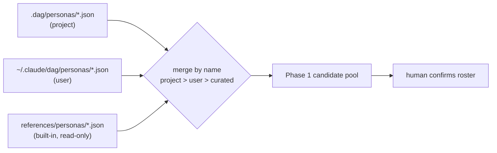
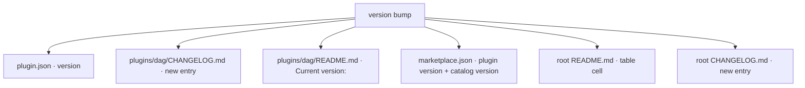

# Personas & the marketplace

**Audience:** users installing the `dag` plugin, and maintainers who curate personas or cut releases.

**TL;DR.** Two loosely-coupled things live here. (1) `dag:personas` is a small standalone skill that curates the reusable persona JSON files the pipeline's **Phase 1** discovers — from three sources (a project library, your user library, and the plugin's built-in catalog), all sharing one file schema, with the override order *project > user > curated*. (2) The **marketplace/install model** is how the plugin gets onto your machine (`/plugin marketplace add wtp128pro/dag` → `/plugin install dag@dag` → `/dag:dag …`), plus the maintainer discipline that a version bump has to touch **six** files at once.

---

## Part A — the `dag:personas` skill

### The one-sentence mental model

A *persona* is a named lens the pipeline reasons through (an "Architect", a "Verifier"). Phase 1 of `dag:dag` picks a roster of them for your task. The `dag:personas` skill is just a **file manager** for the ones you want to keep around: it reads and writes small JSON files so a persona survives across runs instead of being synthesized fresh each time (`plugins/dag/README.md:36-42`). You never *need* it — the pipeline runs fine off its curated library alone (`plugins/dag/README.md:39-42`).

Invoke it with `/dag:personas`; run it with no argument and it asks what you want to do (`plugins/dag/skills/personas/SKILL.md:81-86`).

### Three sources, one schema

Personas come from three places (`plugins/dag/skills/personas/SKILL.md:19-29`):

| Source | Location | Writable? |
|---|---|---|
| **Project** — checked into the current repo | `.dag/personas/*.json` (CWD-relative) | yes |
| **User / "global"** — cross-project, personal | `~/.claude/dag/personas/*.json` | yes |
| **Built-in curated catalog** — ships with the plugin | `plugins/dag/skills/dag/references/personas/` (per-file JSON + an `index.json` selection index) | **read-only** |

The important design choice: **all three use the same file shape.** The skill writes "one schema-valid persona per file so Dag Phase 1 can discover it" (`SKILL.md:9-10`), and that written shape is "byte-for-byte interchangeable with a curated one downstream" (`SKILL.md:67-69`). So a persona you author sits in the same candidate pool as a shipped one with no conversion step.

You can't edit or delete a built-in — but you can **shadow** one: write a project/user JSON with the same `name`, and the override order below decides which wins (`SKILL.md:24-29`).

### The schema (one persona per file)

The authoritative contract is `plugins/dag/skills/dag/schemas/persona.schema.json`, modeled on `plugins/dag/skills/dag/templates/persona.json` (`SKILL.md:48-52`). The field set is **fixed** — `additionalProperties: false`, so unknown fields are *rejected, not silently dropped* (`SKILL.md:52`, `SKILL.md:73-74`).

- **Required (non-empty):** `name`, `role`, `description`.
- **Optional:** `mandate`, `optimizes_for`, `skeptical_of`, `phase`, `pair_with`, `qualifications` (array), `tags` (array).

(Field table: `SKILL.md:54-65`.)

Two mechanical rules worth remembering:
- **One persona per file** — a single JSON object, never an array (`SKILL.md:75`).
- **Filename = kebab-case of `name`** — e.g. "Java Backend Architect" → `java-backend-architect.json` (lowercase; spaces/underscores/punctuation collapse to single hyphens; trim the ends) (`SKILL.md:76-78`).

### The four operations

The skill does the smallest thing that satisfies the request and runs its Socratic dialogue *selectively* — it asks only where a choice is genuinely open, and never re-interrogates a field you chose to skip (`SKILL.md:31-34`). Stage 1 elicits the operation; Stage 2 elicits the location (skipped entirely for `list`) (`SKILL.md:81-97`).

| Operation | What it does |
|---|---|
| **list** | Aggregates all three sources into one view grouped **Project → User → Built-in**, states the override order, and flags any name that shadows another source; then lets you pick an entry to edit or delete (`SKILL.md:101-139`, `plugins/dag/README.md:60`). |
| **add** | Elicits the three required fields one lens at a time, offers the optional fields with an easy skip, builds the JSON from only the fields provided, derives the filename, does a collision check, writes, then verifies parseability with `python3 -m json.tool` (`SKILL.md:141-161`). |
| **remove** | Lists personas at a location, you pick one, it confirms with the path + summary, then `rm`s the file (destructive) (`SKILL.md:163-172`). |
| **modify** | List-and-pick a file, guides an edit of just the fields you name, re-validates the whole object against the schema, confirms, then overwrites (destructive) (`SKILL.md:174-189`). |

Note on shadowing built-ins: on `list`, if you pick a built-in and choose **Edit**, the skill explains it's read-only and offers to create an *override* via the Add flow with `name` pre-filled; **Delete** likewise offers a redefining override rather than a real deletion, because built-ins can't be removed (`SKILL.md:134-139`).

The `add`/`modify` write is *schema-enforced inline* — there's no external validator; the skill checks required-non-empty, rejects unknown fields, and confirms JSON parseability (parseability ≠ schema, so the schema check is the skill's own job) (`SKILL.md:46`, `SKILL.md:159-160`).

### How Phase 1 discovers and merges them (the override order)

Phase 1 of the pipeline does "Socratic selection of a task-fit persona roster (curated + synthesized + your project/user JSON personas), you confirm" (`plugins/dag/README.md:26`). So discovery happens **behind the human gate**: the pipeline gathers candidates automatically, but *you* confirm the roster — it is not silently applied.

The merge rule when two sources define the same `name` is a fixed precedence:

```
project  >  user  >  curated
```

That is: a project-level file overrides a user-level file, which overrides the built-in catalog (`SKILL.md:29`, `SKILL.md:124`, `SKILL.md:197`; `plugins/dag/README.md:52-54`). Names are normalized before comparison — lowercase, whitespace/punctuation collapsed to single hyphens, ends trimmed — so `Planner-Architect` and a built-in `Planner / Architect` are recognized as the same name (`SKILL.md:124-129`).



A saved persona needs **no separate registration** — the next `/dag:dag` run picks it up automatically (`plugins/dag/README.md:69-71`).

> **Proof-status note.** Everything above is *code-behavior / provenance-quote* about the SKILL.md prose and the READMEs — it describes what the skill instructs an agent to do. It is **not** a machine-checked guarantee. The persona schema itself is enforced *inline by the skill* ("no external validator" — `SKILL.md:46`), so treat "the schema is enforced" as *asserted (consistent with the documented rules)*, not *machine-checked*.

---

## Part B — the marketplace & install model

### What kind of thing this repo is

The repo is a **Claude Code plugin marketplace** — a catalog you add once, then install plugins from (`README.md:1-6`). The marketplace is named **`dag`** and lives at repo `wtp128pro/dag` (`README.md:6`). It currently hosts one plugin, also named `dag` (`.claude-plugin/marketplace.json:1-32`). Yes — the marketplace and the plugin share the name; that's why the install target reads `dag@dag` (see below).

### Install in three steps

From inside Claude Code (`README.md:28-63`):

```
/plugin marketplace add wtp128pro/dag     # 1. add the marketplace
/plugin install dag@dag                    # 2. install the plugin
/dag:dag Build me a rate limiter with tests   # 3. use it
```

The install syntax is **`plugin-name@marketplace-name`** — here both are `dag` (`README.md:50-52`). Other accepted marketplace sources: a full git URL, SSH, or a local path for testing (`README.md:42-44`). Non-interactively you can add the marketplace from the shell (`claude plugin marketplace add wtp128pro/dag`, `README.md:36-40`) or wire it up declaratively in `settings.json` via `extraKnownMarketplaces` + `enabledPlugins` (`README.md:65-78`).

### Namespaced invocation

Plugin skills are namespaced **`/<plugin>:<skill>`** (`README.md:56-57`). The `dag` plugin ships two skills, so:

- `/dag:dag <task>` — the gated multi-phase pipeline (`README.md:19-20`, `plugins/dag/README.md:8-9`).
- `/dag:personas` — the persona file manager described in Part A (`README.md:21-24`, `plugins/dag/skills/personas/SKILL.md:11`).

To update later, refresh the catalog and reload: `/plugin marketplace update dag` then `/reload-plugins` — there is no `/plugin update` command (`README.md:82-90`).

### The six-place version mirror (maintainers)

This is the one that bites. The plugin version is mirrored in **six** places, and a bump must update **all of them together** (`CLAUDE.md`, "Versioning / releases" section):

1. `plugins/dag/.claude-plugin/plugin.json` — plugin `version`
2. `plugins/dag/CHANGELOG.md` — a new plugin entry
3. `plugins/dag/README.md` — the `Current version:` line (currently `1.10.1` at `plugins/dag/README.md:209`)
4. `.claude-plugin/marketplace.json` — the plugin entry `version` **and** the top-level catalog `version` (two edits in one file: `marketplace.json:13` and `marketplace.json:7`)
5. `README.md` (root) — the plugin-table version cell (currently `1.10.1` at `README.md:12`)
6. `CHANGELOG.md` (root) — a new catalog entry

Convention (`CLAUDE.md`): a new skill/feature is a **minor** plugin bump; each catalog release is a **patch** bump of the marketplace top-level version. That is why the two version fields differ today — the **plugin** is at `1.10.1` (`plugin.json:4`, `marketplace.json:13`, `README.md:12`, `plugins/dag/README.md:209`) while the **catalog/marketplace top-level** is at `1.0.13` (`marketplace.json:7`). They are two independent counters that happen to live in the same manifest.



**Changelog guardrail** (`CLAUDE.md`, "Changelog guardrail"): both CHANGELOGs are append-only — *add a new top entry, never relabel the existing top header* to the new version. Relabeling destroys history and mis-attributes the old body to the new version; an entry must describe only what that version actually shipped.

> **Proof-status note.** The six-place list, the minor/patch convention, and the changelog guardrail are **maintainer discipline documented in `CLAUDE.md`** — *asserted (consistent)* process rules, not a machine-checked invariant. Nothing in the repo mechanically fails a build if one of the six mirrors is missed; the mirror is kept in sync by hand (precedent commit `4b19c47`, per `CLAUDE.md`).

---

## Where to look next

- The persona schema and template: `plugins/dag/skills/dag/schemas/persona.schema.json`, `.../templates/persona.json`.
- The curated catalog itself (per-file JSON + `index.json` + `GUIDE.md`): `plugins/dag/skills/dag/references/personas/`.
- The Socratic move-set both skills lean on: `plugins/dag/skills/dag/references/socratic-protocol.md`.
- Phase-by-phase context for where Phase 1 sits: the pipeline overview in `plugins/dag/README.md:22-33`.
