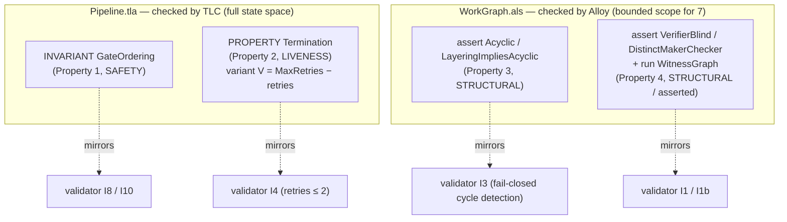

# Proof Appendix — reproducing the TLA+ / Alloy checks

**Audience:** a reproducer — someone who wants to re-run the formal checks themselves and confirm the recorded results, byte for byte.

**TL;DR.** dag ships two design-time formal models — `formal/Pipeline.tla` (checked by TLC) and `formal/WorkGraph.als` (checked by Alloy) — that prove the *rules* of the pipeline can't be violated by any run in scope: gate ordering can't be bypassed, the correction loop always terminates, the work-graph is acyclic under a wave layering, and verifier independence is a structural invariant. This page gives the **exact commands** to reproduce them and the **recorded transcripts**. Every transcript below is **reproduced from `plugins/dag/skills/dag/references/formal-models.md` (recorded 2026-07-03, TLC 2.19, JDK 25.0.3)** — it is *not* freshly executed now. If you run the commands yourself, small search-order-dependent details (state ordering, the `<n>` in the counterexample) may differ; the load-bearing signals are called out.

---

## First, the honest proof-status legend

This page never says "proved for all inputs." It mirrors the three-level legend from `references/formal-models.md` (§ "Proof-status legend") exactly:

- **machine-checked (in scope)** — a model checker explored the state space *within a finite scope* and reported no error. For TLC here the scope is the full reachable state space of the model (queue empty); for Alloy it is a bounded scope (`for 7 …`), so the guarantee is "no counterexample **up to that scope**."
- **hand-proved** — a rigorous, checkable argument, not run by a tool here.
- **asserted (consistent)** — imposed structurally / by fiat and *shown consistent* (a witness instance exists), not derived as a theorem.

The four properties and their status (`references/formal-models.md` § property table):

| # | Property | Layer | Artifact | Proof-status |
|---|----------|-------|----------|--------------|
| 1 | Gate ordering | SAFETY | `Pipeline.tla` | machine-checked (TLC) + hand-proved |
| 2 | Bounded-loop termination | LIVENESS | `Pipeline.tla` | machine-checked (TLC) + hand-proved (variant) |
| 3 | DAG acyclicity | STRUCTURAL | `WorkGraph.als` | machine-checked (Alloy, no counterexample) + hand-proved |
| 4 | Verifier independence | STRUCTURAL | `WorkGraph.als` | machine-checked (Alloy, no counterexample) + asserted (structural, shown consistent) |

Property 4 stays labeled **asserted** on purpose: the Alloy `fact Independence { no reasoningSeen }` (`formal/WorkGraph.als:46`) imposes independence by fiat and the `run WitnessGraph` shows it is *consistent* — it is not derived. And note Residual A below: even a green check does **not** prove the *running* system obeys it.

---

## Tool versions (stated honestly)

From `references/formal-models.md` § Tool-status:

| Tool | Version | Status |
|------|---------|--------|
| JDK (Oracle Java SE) | **25.0.3**, via `/usr/libexec/java_home` | present, used |
| TLC (`tla2tools.jar`) | **2.19** | fetched to `/tmp`; TLA+ properties machine-checked |
| Alloy (`org.alloytools.alloy.dist.jar`) | **6.2** | fetched to `/tmp`; Alloy properties machine-checked (Kodkod / bundled SAT4J, headless) |

`tla2tools.jar` and the Alloy jar are **build tools, not skill files** — both are fetched to `/tmp`, never vendored under the skill (`references/formal-models.md` § Tool-status note; `formal/Pipeline.cfg:5-6`).

---

## Setup — fetch the tools and point at a real JDK

```sh
# One-time downloads (build tools → /tmp, never vendored)
curl -L -o /tmp/tla2tools.jar \
  https://github.com/tlaplus/tlaplus/releases/latest/download/tla2tools.jar
curl -L -o /tmp/alloy.jar \
  https://github.com/AlloyTools/org.alloytools.alloy/releases/download/v6.2.0/org.alloytools.alloy.dist.jar

# Reach the real JDK. On a fresh macOS, /usr/bin/java may be a stub that prints
# "Unable to locate a Java Runtime"; this export routes around it. Harmless even
# when /usr/bin/java already resolves to a real JDK.
export JAVA_HOME=$(/usr/libexec/java_home)
```

These are the exact commands from `references/formal-models.md` § Tool-status note (lines 37–39, 32–34).

---

## Property 1 & 2 — the one TLC command

TLC checks *both* TLA+ properties in a single run: the safety invariants **and** the liveness `PROPERTY`. The fairness the liveness check needs (`WF_vars(LoopNext)`) rides in via `SPECIFICATION Spec` in the `.cfg` (`formal/Pipeline.cfg:10-11`, `formal/Pipeline.tla:196`). Run **from the run directory** (the one containing `formal/`):

```sh
export JAVA_HOME=$(/usr/libexec/java_home)
"$JAVA_HOME/bin/java" -cp /tmp/tla2tools.jar tlc2.TLC \
    -config formal/Pipeline.cfg formal/Pipeline.tla
```

The `.cfg` (`formal/Pipeline.cfg`) fixes `CONSTANT MaxRetries = 2`, declares five `INVARIANT`s (`TypeOK`, `GateOrdering`, `LoopBound`, `VariantOK`, `BackEdgeGuarded`) and one temporal `PROPERTY Termination`.

### TLC transcript

> **Reproduced from `references/formal-models.md` (recorded 2026-07-03, TLC 2.19, JDK 25.0.3) — NOT freshly run now.**

```
TLC2 Version 2.19 of 08 August 2024 (rev: 5a47802)
Implied-temporal checking--satisfiability problem has 1 branches.
Finished computing initial states: 1 distinct state generated ...
Progress(28): 712 states generated, 327 distinct states found, 0 states left on queue.
Checking temporal properties for the complete state space with 327 total distinct states
Finished checking temporal properties in 00s
Model checking completed. No error has been found.
712 states generated, 327 distinct states found, 0 states left on queue.
The depth of the complete state graph search is 28.
```

**How to read it.** `Model checking completed. No error has been found.` with `0 states left on queue` means TLC explored the **complete** reachable state space — **712 states generated, 327 distinct**, search depth 28 — and in every one of those 327 states each `INVARIANT` held, and the temporal `PROPERTY Termination` held on every fair behavior (`references/formal-models.md` § "The TLC run", lines 84–87).

- **Property 1 — Gate ordering** is the `INVARIANT GateOrdering` (`formal/Pipeline.tla:204-212`): in every reachable state, being at a phase implies every strictly-earlier spine gate holds — e.g. no P3 before `gate["P2"]` (I8), no P8 before `gate["P6"]` (I10). Machine-checked across all 327 states; also hand-proved as an inductive invariant in `references/formal-models.md` § 1.
- **Property 2 — Bounded-loop termination** is the `PROPERTY Termination` (`formal/Pipeline.tla:222`): `(lstate = "EXECUTE") ~> (lstate ∈ {"DONE","ESCALATE"})`. The well-founded variant is `V = MaxRetries − retries` (`formal/Pipeline.tla:60`); the sole back-edge `LRetry` (LT7, `formal/Pipeline.tla:173-178`) increments `retries`, so `V` strictly descends and the back-edge is disabled at the floor (`BackEdgeGuarded`, `formal/Pipeline.tla:217`). Hand-proof: `references/formal-models.md` § 2, four claims A–D.

### Non-vacuity check — the `Broken.tla` counterexample (did the liveness test have teeth?)

A green liveness check is worthless if the property is *vacuously* true. To show `Termination` has teeth, the model author broke the variant in a throwaway copy `Broken.tla`: made `LRetry` write `retries' = retries` (no increment), so `V = 2 − retries` no longer decreases on the back-edge. TLC then **reported a liveness counterexample** — a lasso (the infinite `EXECUTE→VERIFY→ADJUDICATE→RETRY→EXECUTE` spin):

> **Reproduced from `references/formal-models.md` (recorded 2026-07-03, TLC 2.19, JDK 25.0.3) — NOT freshly run now.**

```
Error: Temporal properties were violated.
Error: The following behavior constitutes a counter-example:
Back to state <n>: <L… of module Broken>   (the RETRY→EXECUTE back-edge closes the lasso)
```

The exact `<n>` and the action name TLC prints for the back-edge are **search-order dependent**; the load-bearing signal is `Temporal properties were violated` (`references/formal-models.md` lines 99–102). This proves two things: `Termination` is a *genuine* liveness check (not vacuously true), **and** the counter-increment on the sole back-edge is load-bearing for termination. The shipped `Pipeline.tla` (which keeps the increment) passes; the mutant fails.

> Note: `Broken.tla` is a *throwaway mutant* described in `references/formal-models.md`; it is not a vendored file in the repo. Reproduce it by copying `Pipeline.tla` and deleting the `retries' = retries + 1` increment in `LRetry`.

---

## Properties 3 & 4 — the Alloy commands

### GUI-vs-headless caveat (read before running)

Alloy's default invocation `java -jar /tmp/alloy.jar` **launches the GUI** — it does not run checks on the command line. To reproduce headlessly you have two options (`references/formal-models.md` § Tool-status note, lines 41–42; `formal/WorkGraph.als:17-21`):

1. **Open `formal/WorkGraph.als` in the Alloy Analyzer → Execute All.**
2. **Drive the Alloy Java API headlessly:** `CompUtil.parseEverything_fromFile` → `TranslateAlloyToKodkod.execute_command`, default SAT4J solver, with `-Djava.awt.headless=true`.

The commands below are the *Analyzer commands* as written in `formal/WorkGraph.als` (lines 86–99); run them via either route above.

### Property 3 — DAG acyclicity

```
check Acyclic                for 7 but 5 Int
check LayeringImpliesAcyclic for 7 but 5 Int
```

**The `for 7 but 5 Int` scope is a requirement, not a convenience.** It bounds *every* sig to 7 with Int bitwidth 5 (range −16..15, ample for ≥7 waves). A bare `7 Unit, 5 Int` does **not** work: `Unit.executor : one Persona` (`formal/WorkGraph.als:29`) makes `Persona` reachable, so a partial scope list leaves `Persona`/`Verifier` unbounded and the command will not run (`references/formal-models.md` lines 232–235; `formal/WorkGraph.als:21`).

**Expected:** *No counterexample found. Assertion may be valid.*

Why `check Acyclic` passes *earns* rather than *assumes* the result: `fact WaveLayered { WaveLayering and PositiveWaves }` (`formal/WorkGraph.als:64`) imposes the Phase-4 wave discipline, and the theorem `LayeringImpliesAcyclic` (`formal/WorkGraph.als:73-75`) shows a valid layering *forces* a DAG. Remove that fact and `depends` is unconstrained → a self-loop `u in u.depends` is a counterexample and the check would *fail*. So the fact is load-bearing (`references/formal-models.md` § 3 "Why check Acyclic passes"). Hand-proof of the theorem: `references/formal-models.md` § 3.

### Property 4 — verifier independence + maker≠checker

```
check VerifierBlind        for 7 Unit, 5 Verifier, 5 Persona, 5 Int
check DistinctMakerChecker for 7 Unit, 5 Verifier, 5 Persona, 5 Int
run   WitnessGraph         for exactly 4 Unit, exactly 2 Verifier, exactly 3 Persona, 5 Int
```

**Expected:** the two `check`s → *No counterexample found*; the `run` → *Instance found* (`references/formal-models.md` line 277).

- `VerifierBlind` (`formal/WorkGraph.als:82`) mirrors `verify.schema.json` `executor_reasoning_seen : {const:false}` and validator I1 — no verifier read any executor's chain-of-thought.
- `DistinctMakerChecker` (`formal/WorkGraph.als:83`) mirrors maker≠checker (validator I1b) — a unit is never verified by its own maker.
- `run WitnessGraph` (`formal/WorkGraph.als:94-99`) exhibits a **non-vacuous** instance (a real dependency edge, a real verification, acyclic, independence respected). Its job is to guard against an over-constrained model that "proves" everything vacuously — the constraints are *satisfiable together* (`references/formal-models.md` § 4).

These are honestly labeled **asserted (consistent)**: given the facts, both asserts hold trivially; the model *encodes* the invariant the schema requires and shows it consistent, rather than deriving it.

---

## How this composes (one picture)



The design-time proofs (this page) and the runtime validator (`scripts/validate_run.py`) guard the *same* invariants at two levels: the models prove the **rules** can't be bypassed by any run; the validator checks a **specific run's** artifacts (`references/formal-models.md` § "Consistency with the runtime validator").

---

## What is NOT proved here (never overstate)

Two boundaries, stated honestly and inherited from `references/formal-models.md`:

- **Scope, not universality.** TLC's result is over the model's full reachable state space with `MaxRetries = 2`; the termination hand-proof is *parametric in any finite N* (`references/formal-models.md` line 187). Alloy's result is "no counterexample **up to scope `for 7`**" — not "for all sizes." This is bounded verification.
- **Plumbing, not content (Residual A, the load-bearing one for Property 4).** `executor_reasoning_seen = false` and the Alloy `Independence` fact are **self-attestations**; no platform hook intercepts subagent I/O. The model proves the invariant is *well-formed and consistent* — **not** that the running system obeys it (`references/formal-models.md` § Residual A). Correctness-of-content (is a `PASS` correct? is a persona genuinely different?) remains the independent verifier's semantic judgment, an external signal — never the model re-reading itself (`references/formal-models.md` § Residual B–E).

Model simplifications (the loop actions are not per-action phase-gated; `Resolve` doesn't re-arm the loop; `gate["P0"]`/`gate["P5"]` have no runtime flag) are intentional and safety-preserving — each *removes* behaviors, so it can only make `GateOrdering` easier to hold, not harder (`references/formal-models.md` § "Model simplifications"). The shipped model passes as-is: 712 states / 327 distinct / depth 28 / no error.
