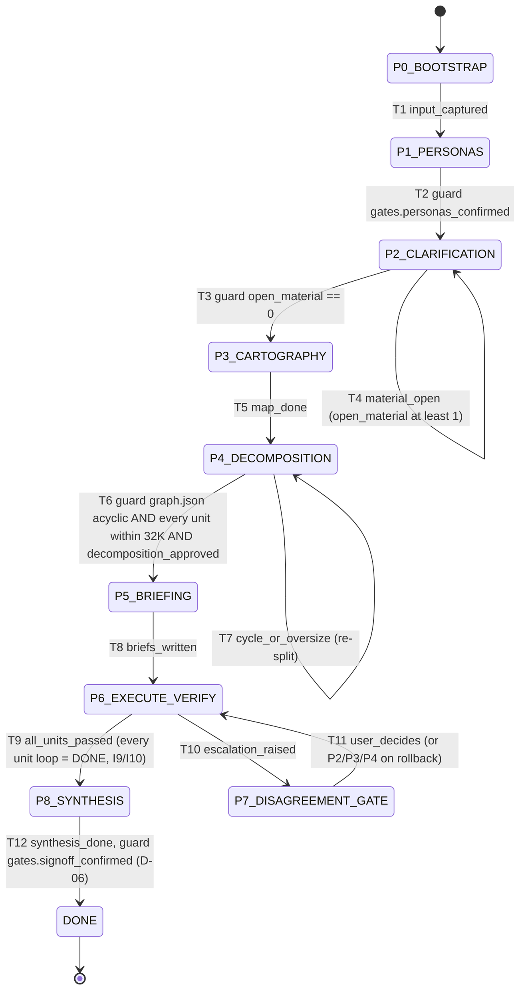
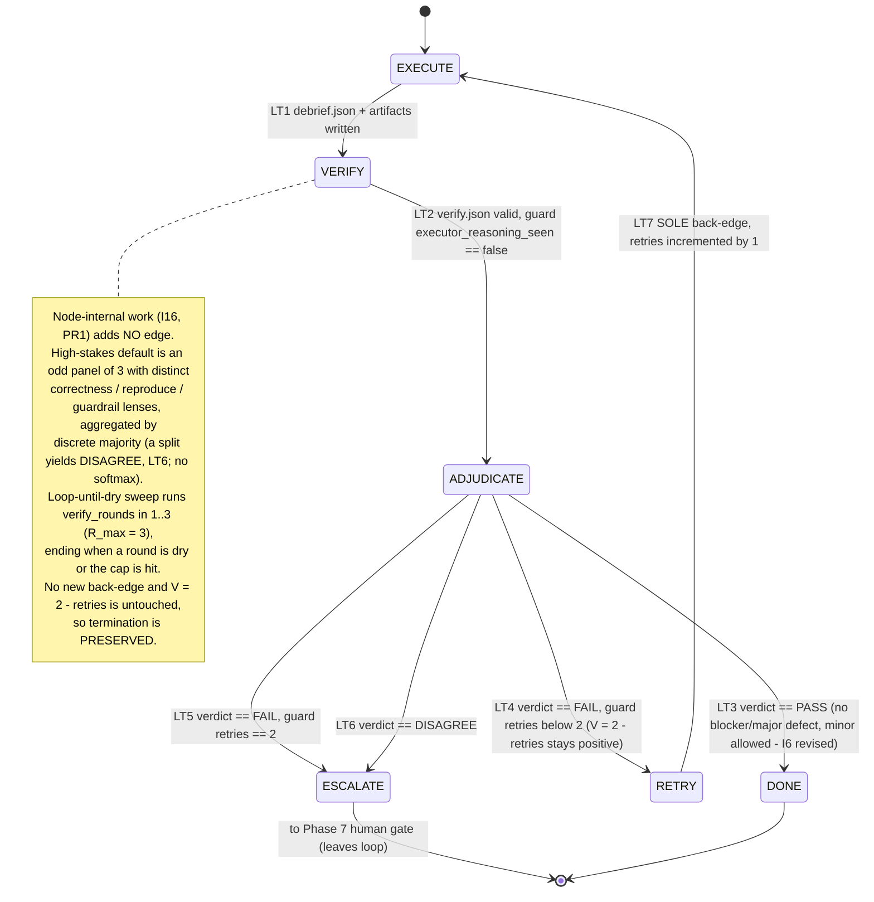
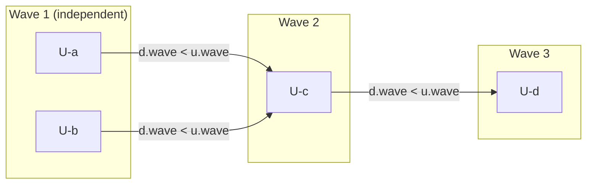
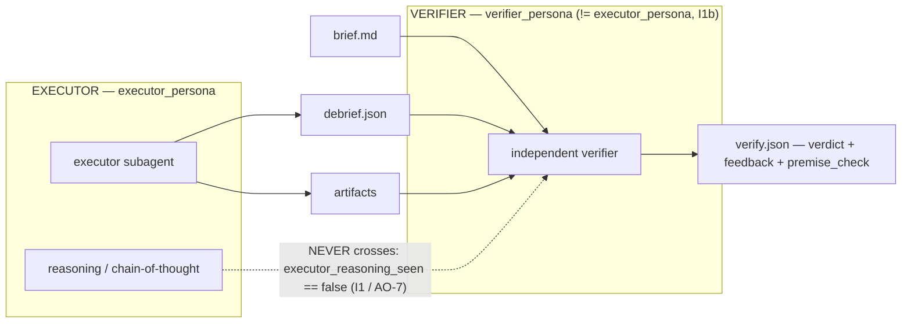

# Diagrams & Formulas — the canonical reference

**Audience:** every other wiki page. When another page needs *the* picture of the pipeline, the
correction loop, the wave graph, or the maker≠checker seam — or the exact form of the termination
variant, the transition bound, or the learnings-propagation predicate — it links here so notation
stays consistent across the wiki.

**TL;DR.** Four mermaid diagrams and one formula sheet, each traceable to a single repo file and
section. Nothing here is invented: every state, edge, guard, and formula is copied from
`state-machine.md`, `self-learning-loops.md`, or `formal-models.md` and cites its source inline.
Where a guarantee is machine-checked vs. hand-proved vs. merely asserted, this page mirrors that
status exactly and never rounds it up.

> **Proof-status legend** (from `references/formal-models.md` §Proof-status legend):
> *machine-checked (in scope)* = a model checker explored the state space and found no error, over
> the bounded scope stated · *hand-proved* = a rigorous checkable argument, not run by a tool here ·
> *asserted (consistent)* = imposed structurally / by fiat and shown satisfiable, not derived.
> This page never says "proved for all inputs."

Sibling pages that lean on these figures: `03-formal-methods.md`, `04-self-learning-loops.md`,
`06-verification.md`, `10-proof-appendix.md`.

---

## 1. Pipeline FSM — the nine phases + the Phase-7 excursion

**Intuition first.** The whole run is one finite-state machine whose *states are the nine SKILL.md
phases* (P0…P8) plus a terminal `DONE`. You can only move forward through a phase when that phase's
**gate** holds; two phases (P2 clarification, P4 decomposition) can loop back on themselves until
their gate is satisfied, and Phase 7 is an *as-needed* human excursion reached only when a unit
escalates. There is no way to reach synthesis while a unit is still un-passed — that is the whole
point of the gate ordering.

**Source of truth:** `references/state-machine.md` §1 (states table), §2 (transition table T1–T12),
§3 (guards). Machine-checked complement: the `GateOrdering` safety invariant in
`formal/Pipeline.tla` — *machine-checked (in scope)* by TLC over 408 reachable states
(`formal-models.md` § "The TLC run" transcript, 2026-07-10: 853 generated / 408 distinct / depth 36,
across two temporal branches — `Termination` and the Bounded-Graph-Amendments `Quiesce` — with the
`FuelBound` invariant alongside the five safety invariants).



Notes tied to source: `P6_EXECUTE_VERIFY` is a **composite** state — its internals are Diagram 2
(`state-machine.md` §1a). T10's escalation has two origins (a DISAGREE or a retries-exhausted FAIL),
both routed to the same Phase-7 human gate (`state-machine.md` §1a note, T10). T11's rollback
targets (P2/P3/P4) are listed in the transition table but are **out of the TLA+ model's scope**
(`formal-models.md` §Model simplifications (b)). **T12 now carries a guard:** `synthesis_done`
additionally requires the human sign-off flag `gates.signoff_confirmed` (G-signoff), which the
validator lists in `REQUIRED_GATES` for `DONE` — a run reaching `DONE` without it is INVALID
(D-06; `state-machine.md` §2 T12 / §3 G-signoff). It is a **post-hoc** gate-ordering predicate over
`fsm-state.json`: it gates no live transition and never guards LT7, and the flag's *presence* — not
its genuineness — is what is checked (validity ≠ correctness).

---

## 2. Correction-loop FSM — LT1–LT7 and the sole back-edge

**Intuition first.** Inside Phase 6, each unit runs a small six-state loop. An executor produces a
debrief; an *independent* verifier judges it; an adjudication step branches on the verdict. A FAIL
with retries left goes back to re-execute — and that single edge, `RETRY → EXECUTE` (**LT7**), is
the *only* edge in the whole graph that points backward. Because it also increments `retries`, the
loop cannot spin forever (the formula sheet, §5, makes this precise).

**Source of truth:** `references/self-learning-loops.md` §1.1–§1.4 (states, variables, the 7-row
transition table, the ASCII diagram), mirrored in `state-machine.md` §1a/§2a. Termination is
*machine-checked (in scope)* by TLC (`Termination` property, `formal-models.md` §2) **and**
hand-proved (§2 four claims).



Notes tied to source: `ADJUDICATE`'s guards LT3–LT6 **partition** the reachable input space
`{PASS} ∪ {FAIL}×{retries<2, retries==2} ∪ {DISAGREE}`, so exactly one edge is always enabled — no
deadlock, no non-determinism (`self-learning-loops.md` §1.3). `EXECUTE`, `VERIFY`, `RETRY` each have
a single unconditional out-edge. `ESCALATE` and `DONE` are absorbing terminals (§1.1). The note on
`VERIFY` records the **PR1 verifier hardening** (panel-of-3 default on `high-stakes` + loop-until-dry):
it is **node-internal work** that adds no transition row, no second back-edge, and does not touch the
variant `V = 2 − retries` — which is exactly why it **PRESERVES** the termination proof (Claims A–D
hold verbatim; `self-learning-loops.md` §2 FLAG, §3 panel contract; `state-machine.md` §4 I16). See
§5.3 for the formula.

---

## 3. DAG / wave layering — edges point to strictly-later waves

**Intuition first.** Decomposition (Phase 4) splits the task into units and assigns each a **wave**.
A unit may only depend on units in **strictly earlier** waves; equivalently, every dependency edge
points from an earlier wave into a later one. That single discipline is what forces the work graph
to be acyclic: you can never form a cycle if every edge strictly increases the wave number.

**Source of truth:** `formal/WorkGraph.als` via `references/formal-models.md` §3 —
`WaveLayering ≡ all u | all d : u.depends | d.wave < u.wave`, and the theorem
`LayeringImpliesAcyclic`. Runtime backstop: validator invariant **I3** (fail-closed cycle detection
on `edges ∪ unit.deps`, `state-machine.md` §4). Acyclicity is *hand-proved* **and**
*machine-checked (in scope)* by Alloy (no counterexample, scope `7 but 5 Int`).



Notes tied to source: an arrow `X --> Y` here means "X must complete before Y" — in `graph.json`
terms, `X ∈ Y.depends` with `X.wave < Y.wave`. A valid wave layering is *sufficient* for a DAG (the
`LayeringImpliesAcyclic` hand-proof, `formal-models.md` §3); this is exactly why the validator's
layering check certifies acyclicity. (The illustrative units above are schematic, not from any
specific run.)

---

## 4. Maker≠checker data flow — what crosses to the verifier, and what never does

**Intuition first.** The verifier judges a unit from its **brief + debrief + artifacts** — the
*products* of execution — never from the executor's private reasoning or identity. Decoupling the
maker from the checker is the reason a PASS is grounded in an external signal instead of the model
re-reading (and re-endorsing) its own chain of thought. The one flow that is *forbidden* is the
executor's reasoning reaching the verifier.

**Source of truth:** `references/self-learning-loops.md` §1.1 (`VERIFY`: "sees brief + debrief +
artifacts, **not** the executor's reasoning or identity"); invariants **I1** (verifier
independence, `executor_reasoning_seen == false`) and **I1b** (maker≠checker: `executor_persona !=
verifier_persona`) in `state-machine.md` §4; the Alloy `Independence` / `DistinctMakerChecker`
facts in `formal-models.md` §4. Independence is an *asserted (consistent)* structural invariant that
is also *machine-checked (in scope)* by Alloy — and, honestly, neither proves the *running* system
obeys it: `executor_reasoning_seen == false` is a **self-attestation**, not a platform hook
(`formal-models.md` §Residual A; `state-machine.md` §5 Limitation A).



Notes tied to source: the dotted edge is the **prohibited** flow — it is drawn only to name the
constraint, not to assert a channel; the invariant is that this edge is *empty* (Alloy `fact
Independence { no reasoningSeen }`, `formal-models.md` §4). AO-7 ("verifier independence per
iteration") makes this hold on *every* retry, not just the first (`self-learning-loops.md` §5).

---

## 5. Formula sheet

Every formula below is transcribed from its cited source. Symbols are consistent with the diagrams
above (`retries`, `V`, `E` = a learnings entry, `U` = a unit).

### 5.1 Termination variant and the bounded loop

| Formula | Meaning | Source |
|---|---|---|
| `V = 2 − retries`,  `V ∈ {0,1,2}` | the well-founded variant (default `MAX_RETRIES = 2`; `V = N − retries` for any finite N) | `self-learning-loops.md` §2 Claim B; §6.4 |
| `V' = V − 1` on LT7 | strict descent: the sole back-edge increments `retries`, so `V` drops by exactly 1; no other edge changes `retries` (AO-1) | `self-learning-loops.md` §2 Claim B; §5 AO-1 |
| back-edge guard: `V > 0`  (i.e. `retries < 2`, LT4) | LT7 is reachable only via LT4; at `V = 0` the back-edge is disabled and only terminals (LT3/LT5/LT6) remain | `self-learning-loops.md` §2 Claim C |
| `fuel ∈ 0..MaxFuel`, `fuel' = fuel − 1` per `Amend` (default `MaxFuel = 2`, runtime ceiling 32) | the **second** well-founded variant added by Bounded Graph Amendments: bounds pipeline-level re-arming (`DONE → EXECUTE` via `Amend`) so the graph grows at most `MaxFuel` times; `Amend` is disabled at `fuel = 0` (invariant `FuelBound`, property `Quiesce`) | `formal-models.md` § 5; `state-machine.md` §4 I18 |

**Transition bound** (`self-learning-loops.md` §2 "Bound"):

```
(MAX_RETRIES + 1)·|EXECUTE→VERIFY→ADJUDICATE| + MAX_RETRIES·|RETRY|
  = 3·3 + 2·1 = 11 loop transitions
  ⇒ ≤ 3 executions, ≤ 3 verifications, ≤ 2 retries, then exactly one terminal.
  Counting the single entry edge into EXECUTE, the round figure ≤ 12 (SKILL Phase 6) holds
  as a valid, non-tight bound.
```

Status: the guarantee is **not** "we cap retries" — it is that the only cycle strictly descends a
floor-bounded variant whose back-edge is disabled at the floor, `ADJUDICATE`'s guards are exhaustive
(no deadlock), and both terminals are reachable (§2 Claims A–D). *Hand-proved* (§2) and
*machine-checked (in scope)* by TLC, with an adversarial non-vacuity mutant (`Broken.tla`) that TLC
does flag (`formal-models.md` §2).

**Bounded Graph Amendments — the fuel variant (Property 5).** Amendment re-arming is bounded by the
*second* well-founded variant `fuel ∈ 0..MaxFuel` (invariant `FuelBound`): `Amend` spends one unit of
fuel and is disabled at `fuel = 0`, so the pipeline eventually *stays* terminal — property `Quiesce`
(`<>[](lstate ∈ {DONE,ESCALATE})`), the second temporal branch TLC checks. Total transitions
≤ 12·(N0 + fuel₀) + fuel₀ — finite. TLC pins `MaxFuel = 2` (853 / 408 / depth 36); re-running the
identical model at the runtime ceiling `MaxFuel = 32` only lengthens the same terminating behaviours —
**2,923 / 1,608 / depth 156, still no error** (`formal-models.md` § 5 and §"`MaxFuel` scope (F1)").
`Quiesce` is non-vacuous vs a keep-fuel mutant — the fuel analogue of `Broken.tla`
(`formal-models.md` § 5).

### 5.2 Learnings propagation

**The `applies` predicate** — when a learnings entry `E` binds a unit `U`
(`self-learning-loops.md` §4.3):

```
applies(E.scope, U) ≡
      (   "all"      ∈ E.scope.applies_to                     // all-selector
        ∨  U.id      ∈ E.scope.applies_to                     // unit-id selector "U0X" (single target)
        ∨  ∃ "tag:T" ∈ E.scope.applies_to :  T ∈ U.tags )     // pattern/tag selector — set membership over V_tag
   ∧ ¬( U.id ∈ E.scope.excludes )
```

There are exactly **three** disjuncts — `all`, unit-id (`U0X`), and `tag:T`; the validator enforces
all three and treats any other `applies_to` element as a hard `I12 selector` FAIL. **There is no
`phase` disjunct: the `"phaseN"` selector was removed (BRK-09)**, since no unit carries a `phase`
field in `graph.schema.json`/`brief.schema.json` to match, so it was mechanically unevaluable
(`self-learning-loops.md` §4.3, lines 439–441).

**The I12 REQUIRE quantifier** — the propagation rule the validator enforces
(`self-learning-loops.md` §4.3; invariant **I12**, `state-machine.md` §4):

```
REQUIRE  ∀ E ∈ LEARNINGS,  ∀ U ∈ briefs with U.wave ≥ E.since_wave :
             applies(E.scope, U)  ⇒  E.id ∈ U.brief.learnings_applied
```

The `U.wave ≥ E.since_wave` guard is the temporal safety catch: a learning binds only briefs from a
wave no earlier than its own, never retroactively (`self-learning-loops.md` §4.3 property 1).

**The generalizability gate** — admission into `LEARNINGS.md` (`self-learning-loops.md` §4.2;
**I12** admission gate). It is **selector-kind ASYMMETRIC** — not one uniform "≥2 units" rule:

```
E.scope.applies_to element → admissible when:
   • "all"    → the graph has ≥ 2 units (an "all" scope on a 1-unit graph is not a pattern)
   • "tag:T"  → ≥ 2 GRAPH.md units carry tag T (a single-carrier tag fails the gate)
   • "U0X"    → ALWAYS admissible — a DELIBERATE single-target binding, not a generalization
                claim, so it needs no ≥2-carrier re-proof (it cannot force-inject beyond its one unit)
A "tag:T" or "all" lesson that would match only a single unit is REJECTED → it belongs in that
unit's debrief.json. A "U0X" selector is the explicit single-unit exception; a lesson meant to bind
two units names them as two "U0X" selectors (or a "tag:T").
```

`"phaseN"` is **not** an admissible kind — it was removed from the vocabulary (BRK-09,
`self-learning-loops.md` §4.2, lines 402–416 / §SelectorSet lines 353–360).

Carve-out (honest boundary): imported / already-generalized entries (a `G#` global id or a
store-loaded id) are **exempt** from the ≥2-carrier *re-proof* but are still governed by the I12
propagation predicate — a deliberate provenance-trust boundary, not a cryptographic proof
(`self-learning-loops.md` §4.2, 04/G1; `state-machine.md` §5 Limitation G). The gate checks scope
*breadth* mechanically; whether a lesson is *truly* generalizable stays a verifier/human call
(`self-learning-loops.md` §6.5).

### 5.3 Panel discipline (I16) and loop-until-dry — node-internal to `VERIFY`

The PR1 verifier hardening (Diagram 2's `VERIFY` note) adds **no** FSM edge: the panel and the
loop-until-dry sweep are *node-internal work inside* `VERIFY`, which is exactly why they **PRESERVE**
the termination proof — Claims A–D hold verbatim and only LT7 ever writes `retries`
(`self-learning-loops.md` §2 FLAG). It is enforced *post-hoc / offline* by validator invariant **I16**,
which gates no transition and never guards LT7 (`state-machine.md` §4 I16).

| Formula | Meaning | Source |
|---|---|---|
| `high-stakes(U) ⇒ panel has ≥ 3 members`, lenses ⊇ {correctness, reproduce, guardrail} | a `high-stakes` unit's `verify.json` MUST carry an odd panel of ≥3 verifiers with the three distinct lenses (the default) | `self-learning-loops.md` §3 (panel contract, lines 267–276); `state-machine.md` §4 I16 |
| `verdict = discrete-majority(panel.verdict)`;  no strict majority ⇒ `verdict = DISAGREE`  (**no softmax**) | the top-level verdict is the discrete mode (2-of-3); a genuine split routes to LT6 → ESCALATE (AO-5). Softmaxing the discrete guard partition would REVISE (break) the §2 proof and is forbidden | `self-learning-loops.md` §2 FLAG (lines 169–172), §3; `state-machine.md` §4 I16 |
| `1 ≤ verify_rounds ≤ R_max`,  `R_max = 3` | loop-until-dry: sweep rounds accumulate defects until a round is dry (`converged = true`) or the cap is hit (`converged = false`); bounded ⇒ finite | `self-learning-loops.md` §3 (loop-until-dry, lines 277–280); §2 Bound |

Honest boundary: I16 checks the panel's **presence and shape**, not whether the three lenses are
*genuinely* diverse or the sweep achieved *real* recall — those stay verifier/human judgment
(`state-machine.md` §5 Limitation H).

---

## 6. What these diagrams do and don't prove (honest boundary)

The diagrams and formulas capture the **rules and plumbing**: gate ordering, loop termination, DAG
acyclicity, and the shape of the maker≠checker seam. They do **not** establish that a PASS is
*correct*, that a cited evidence locator resolves, that the executor and verifier are genuinely a
different model behind their persona labels, or that the verifier was *truly* blind to executor
reasoning — those are the semantic residuals (`state-machine.md` §5 Limitations A–H;
`formal-models.md` §Residual A–E). This page mirrors the source proof-status verbatim and stops
there.
