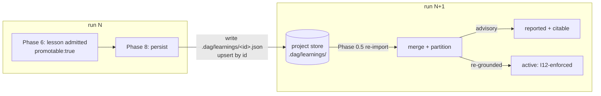

# Cross-run persistence — how a lesson outlives the run that learned it

**Audience:** technical — anyone who wants to understand how a lesson admitted in one `dag` run is carried into *later* runs of the same project (or the same user), and why the carry-over is deliberately **weaker** than an in-run learning: loaded and citable, but not *forced* on a brief until it is re-confirmed against a fresh signal.

**TL;DR.** A run's learnings normally live and die inside that run. Rings 03/04 add two on-disk **stores** — a **project** store `.dag/learnings/` and a **user/global** store `~/.claude/dag/learnings/` — so a project stops re-deriving the same wall every run. Phase-8 *persists* a `promotable` lesson into the project store; the next run's Phase-0.5 *re-imports* it. But an import is not automatically an external signal: `validate_run.py` **partitions** the merged set into **active** (run-local authored ∪ imports you re-grounded this run) and **advisory** (un-re-grounded imports), and the **I12** force-injection predicate iterates **active only**. An advisory import is reported and voluntarily citable — its omission from a brief **never fails**. Lifecycle filters (`expiry`, idle-decay, `scope.model`, `supersedes`) prune the set on load. The single most important honesty note, stated by the source itself: **every mechanism on this page is additive + post-hoc + offline — none of it gates the FSM, so the §2 termination proof is untouched** ([`self-learning-loops.md:466-468`](../plugins/dag/skills/dag/references/self-learning-loops.md)).

This page is the **deep dive** on the across-run store. The in-run learning loop — capture → the ≥ 2-unit generalizability gate → `applies()`/**I12** propagation — is [`05-learnings.md`](05-learnings.md), which introduces §4.4 in summary; this page traces its mechanics. The offline predicates that enforce all of it are [`14-validator-and-invariants.md`](14-validator-and-invariants.md). It traces [`self-learning-loops.md §4.4`](../plugins/dag/skills/dag/references/self-learning-loops.md) (lines 433–493), Phase-0.5 intake and Phase-8 persist in [`SKILL.md`](../plugins/dag/skills/dag/SKILL.md) (`:150-208`, `:809-816`), [`learnings.schema.json`](../plugins/dag/skills/dag/schemas/learnings.schema.json), and the store loaders in [`validate_run.py`](../plugins/dag/skills/dag/scripts/validate_run.py) (`:771-1078`, `:4039-4211`).

---

## The problem: reuse a lesson without importing noise

The in-run loop ([`05-learnings.md`](05-learnings.md)) is built around one discipline: *a lesson is only real if an external signal produced it and it applies to more than one unit.* Across runs the same two failure modes reappear, one wave up.

- **Learn too little across runs** and every run of a project re-discovers the same lesson from scratch — the run-local ledger is thrown away at the end of the run.
- **Learn too much across runs** and you force a lesson mined in one project (or under one model) onto an unrelated future run, where it is wasted budget or actively misleading — the same over-fitting hazard the ≥ 2-unit gate fights *within* a run, now leaking *between* runs, where the fresh run has no way to check whether the imported lesson still holds.

`dag`'s answer keeps the in-run discipline intact and adds one new stance for imports: **trust the import to be *loaded*, never to be *binding*, until this run re-confirms it.** An imported lesson is *advisory* — present, reported, and citable — and only becomes force-injecting once you re-ground it to a THIS-run signal. That single asymmetry is what makes the store safe. Everything below is the machinery that makes it mechanically checkable rather than a good intention.

> **Read this banner before anything else.** All of §4.4 is **additive + post-hoc + offline**. Store discovery, merge, and promotion *at runtime* are **prose Dag executes at Phase-0.5** — there is no loader script and the validator never performs the intake ([`SKILL.md:153-157`](../plugins/dag/skills/dag/SKILL.md)). `validate_run.py` independently *re-discovers* the stores and checks the *result* **post-hoc**, so the I12 predicate ranges over the merged set — but it **gates no phase transition and sits on no FSM edge** ([`self-learning-loops.md:466-468`](../plugins/dag/skills/dag/references/self-learning-loops.md); loader comment [`validate_run.py:771-785`](../plugins/dag/skills/dag/scripts/validate_run.py)). This is *why* the termination proof survives: none of it touches the sole correction-loop back-edge `LT7`, so there is no live guard that could deadlock `RETRY` (the standing hazard flagged in [`CLAUDE.md`](../CLAUDE.md) and in [`04-self-learning-loops.md`](04-self-learning-loops.md)).

---

## 1. Two stores, override order **project > user**

The store discovery mirrors the persona precedent (project overrides user). Two on-disk locations, each file **one** `$defs/entry` object schema-validated against the *same* [`learnings.schema.json`](../plugins/dag/skills/dag/schemas/learnings.schema.json) the run-local sidecar uses ([`self-learning-loops.md:470-475`](../plugins/dag/skills/dag/references/self-learning-loops.md); [`SKILL.md:159-162`](../plugins/dag/skills/dag/SKILL.md)):

| Store | Path | Ring | Precedence |
|-------|------|------|------------|
| **project** | `.dag/learnings/*.json` | 03/P1 | **high** (wins collisions) |
| **user / global** | `~/.claude/dag/learnings/*.json` | 04/G2 | **low** (shadowed on collision) |

The validator's project-store discovery probes three candidate roots — the run dir, its parent, and two levels up — dedup'd by `realpath` ([`validate_run.py:798-811`](../plugins/dag/skills/dag/scripts/validate_run.py)); the user store is a fixed `~/.claude/dag/learnings/` ([`:871`](../plugins/dag/skills/dag/scripts/validate_run.py)). Each accepts one entry object, `{entries:[…]}`, or a bare `[…]` array, reusing the run-local loader's tolerance.

Two properties make the store safe to leave lying around:

- **Absent stores ⇒ zero change.** No files found ⇒ `learnings` is exactly the run-local set and every existing fixture is byte-for-byte identical ([`validate_run.py:775-777`](../plugins/dag/skills/dag/scripts/validate_run.py); [`SKILL.md:162`](../plugins/dag/skills/dag/SKILL.md)).
- **A malformed entry is REPORTED and DROPPED, never a crash and never a FAIL.** A store is *imported context*, not this run's emitted artifact; a corrupt store file must not brick every future run of the project. It prints a non-gating `NOTE … MALFORMED (dropped …)` and the datum never reaches I12 ([`validate_run.py:789-791,836-844,896-904`](../plugins/dag/skills/dag/scripts/validate_run.py)). (Contrast: the run-local `learnings.json` *is* this run's artifact, so its malformation stays a `rep.fail`.)

**Override on either `id` or `scope.applies_to`.** On an `id` collision *or* a `scope.applies_to`-selector-set collision the higher-precedence entry wins and the shadowed one is dropped from propagation — reported, never silent, as `learnings user-store override (G2)` ([`self-learning-loops.md:472-474`](../plugins/dag/skills/dag/references/self-learning-loops.md); [`validate_run.py:907-916`](../plugins/dag/skills/dag/scripts/validate_run.py)). Precedence is *project/run-local > user*, and within the user store the first sorted file wins a user-vs-user scope collision ([`:918-923`](../plugins/dag/skills/dag/scripts/validate_run.py)). Imported ids join a `store_ids` set so the downstream carve-outs treat them as imported (§2, §5).

---

## 2. Advisory until re-grounded — the AO-4 tie

This is the load-bearing idea of the whole page, and the one thing a summary of §4.4 tends to flatten. **Loading an imported lesson does not make it binding.** Where the I12 propagation loop consumes the finalized learning set, the validator **partitions** it into two tiers ([`self-learning-loops.md:476-483`](../plugins/dag/skills/dag/references/self-learning-loops.md); [`validate_run.py:4045-4104`](../plugins/dag/skills/dag/scripts/validate_run.py)):

- **active** = run-local authored entries **∪** imported entries carrying `grounding == "re-grounded"`;
- **advisory** = imported entries (`eid ∈ store_ids`, or a global-scoped `G#` id) **without** that marker.

The I12 required-propagation predicate **and** the §4.2 admission gate iterate the **active** set *only* — so the §4.3 `REQUIRE` quantifier ranges over `active`, not the full merged set ([`validate_run.py:4053,4207-4209`](../plugins/dag/skills/dag/scripts/validate_run.py)). An advisory entry is still **loaded and reported** — it prints `advisory import (not force-injected): <id>` and a brief author may cite it *voluntarily* — but **its omission from any brief's `learnings_applied` never `rep.fail`s** ([`validate_run.py:4100-4104`](../plugins/dag/skills/dag/scripts/validate_run.py)), and the I12 summary gains an `… M advisory import(s) not force-injected (03/P4)` suffix ([`:4207-4209`](../plugins/dag/skills/dag/scripts/validate_run.py)).

This is the **AO-4** tie ([`self-learning-loops.md:484-485`](../plugins/dag/skills/dag/references/self-learning-loops.md)): a retry — and, here, a *forced injection* — is authorized only by an **external signal**, never by the model re-reading a lesson it carried in from elsewhere. An un-re-grounded import is *not* an external signal that binds briefs. Only a run-local authored entry — or an import you have **re-grounded to a THIS-run signal** — is.

`grounding` is an **optional** top-level `$defs/entry` field; its load-bearing value is the exact string `"re-grounded"` ([`learnings.schema.json:100-103`](../plugins/dag/skills/dag/schemas/learnings.schema.json); the validator's `_is_regrounded` matches `g.strip() == "re-grounded"`, [`validate_run.py:4063-4065`](../plugins/dag/skills/dag/scripts/validate_run.py)). Marking an import re-grounded moves it back into `active`, where it is governed by I12 **exactly like a run-local entry** — including the ≥ 2-carrier carve-out of §5 ([`self-learning-loops.md:485-487`](../plugins/dag/skills/dag/references/self-learning-loops.md); [`SKILL.md:189-191`](../plugins/dag/skills/dag/SKILL.md)). **Re-grounding `since_wave` (1.7.0, A3):** because re-grounding happens *mid-run*, activation also pins the entry's `since_wave` to the **current brief frontier** — the earliest wave whose briefs are not yet generated — **not** the imported intake default of `1` (§3). I12 binds a unit iff `unit.wave ≥ since_wave`, so a re-grounded import left at `since_wave = 1` would retroactively demand propagation into already-executed wave-1 briefs, and re-briefing an executed unit is forbidden (the 02/P4 has-no-debrief guard — it re-opens executed work, breaking AO-1 / forward-only). Pinning to the frontier keeps a re-grounded import forward-only, exactly like a mid-run authored learning ([`self-learning-loops.md:487-494`](../plugins/dag/skills/dag/references/self-learning-loops.md); [`SKILL.md:176-182`](../plugins/dag/skills/dag/SKILL.md)). The field is **inert on run-local authored entries** — they are active regardless. And absent stores ⇒ empty `store_ids`, no `G#` ids ⇒ advisory empty ⇒ `active` is today's set ⇒ zero behavior change ([`validate_run.py:4060-4062`](../plugins/dag/skills/dag/scripts/validate_run.py)).

> **Honest boundary — re-grounding is a trust marker, not a proof.** Re-grounding is keyed on a *same-project* `grounding` marker that the operator asserts. It is a **local trust signal, not cryptographic provenance** — nothing here verifies that the import came from a trustworthy party or was genuinely re-confirmed. A verifiable cross-party trust model is deferred **ring-05** work, explicitly out of scope ([`self-learning-loops.md:497-500`](../plugins/dag/skills/dag/references/self-learning-loops.md); [`SKILL.md:191-193`](../plugins/dag/skills/dag/SKILL.md)). Do not read `grounding: "re-grounded"` as a signature; read it as "a human on this project vouched that the lesson still holds here."

---

## 3. The promotion → persist → re-import cycle

The store is only useful if lessons *get into* it. That is a closed loop across two phases:



**Phase-8 persist (write end, 03/P2).** For every run-local entry marked `promotable: true` with a non-expired `scope.expiry`, Dag writes a schema-valid file into the project store `.dag/learnings/<id>.json`, **upsert by `id`**; a `run`-scoped entry is **never** persisted (it was valid only inside its originating run) ([`SKILL.md:809-813`](../plugins/dag/skills/dag/SKILL.md); [`self-learning-loops.md:501-502`](../plugins/dag/skills/dag/references/self-learning-loops.md)). `promotable` is **opt-in** — an unflagged one-off never persists, matching the §4.2 generalizability intent — and it is a **prose step Dag executes**: the validator does **not** auto-write. Its 04/G3 hook is advisory only, surfacing each `promotable` entry as a non-gating `NOTE  G3 promotion (advisory)` line eligible for **human** promotion to `~/.claude/dag/principles.md` (or a `CLAUDE.md`/skill) — never auto-written, never gated ([`SKILL.md:814-816`](../plugins/dag/skills/dag/SKILL.md); [`validate_run.py:1065-1078`](../plugins/dag/skills/dag/scripts/validate_run.py)).

**Phase-0.5 re-import (read end, req 12).** Before Phase 1, Dag discovers the stores, merges them (override project > user), applies the §2 advisory partition and the §4 lifecycle filters, and **folds the surviving imports into the run's `learnings.json`/`LEARNINGS.md`** so Phase-5 briefs can carry them ([`SKILL.md:150-208`](../plugins/dag/skills/dag/SKILL.md)). This is the *one* legitimate pre-Phase-1 `learnings.json` write; the validator treats `learnings.json` as ledger bookkeeping — **not** a post-Phase-1 work-graph artifact — so it does not trip the G-personas gate (BRK-06, [`SKILL.md:200-202`](../plugins/dag/skills/dag/SKILL.md)). At intake there is no DAG yet, so every import is assigned `since_wave = 1` (binds all waves, never retroactively) and marked advisory-until-re-grounded; the real scope check against this run's units happens post-hoc via I12 once the DAG exists at Phase 4+ ([`SKILL.md:169-172`](../plugins/dag/skills/dag/SKILL.md)).

---

## 4. Lifecycle filters — pruning the set on load

Between discovery and the active/advisory partition, the loader runs four exclusion filters in one traversal ([`validate_run.py:1011-1063`](../plugins/dag/skills/dag/scripts/validate_run.py)). Every one of them **excludes-and-reports** rather than crashing; the safe failure mode is always "revert to today's re-derive-from-scratch behavior."

### 4a. `expiry` — a loader-side grammar, not a schema enum (03/P3)

`scope.expiry` parses as the grammar

```
run | project | runs:N | date:<iso>
```

The schema *pins* that grammar with a regex so any other value is a visible schema failure rather than a silent no-op ([`learnings.schema.json:53-57`](../plugins/dag/skills/dag/schemas/learnings.schema.json)), but the **semantics** live in the loader's `_expiry_expired` parser ([`validate_run.py:942-973`](../plugins/dag/skills/dag/scripts/validate_run.py)):

| Value | Expired when | Failure mode |
|-------|-------------|--------------|
| `project` | never | persists indefinitely within the project |
| `run` | loaded **from a store** (its originating run has ended); a run-local `run`-scoped entry is the current run ⇒ still valid | excluded + reported |
| `runs:N` | a `runs:N` budget exhausted via `applied_count ≥ N` | excluded + reported; unparsed `N` ⇒ inert |
| `date:<iso>` | `date.today() > date` | excluded + reported; **unparseable date ⇒ inert (fail OPEN)** |

An expired entry is **EXCLUDED from propagation and REPORTED** (`learnings expiry (03/P3): <id> EXCLUDED …`), never a hard-fail ([`validate_run.py:1016-1018`](../plugins/dag/skills/dag/scripts/validate_run.py)). Crucially, an **unparseable / unrecognized `expiry` fails OPEN** — inert, treated as no expiry — never a crash and never a silent exclusion ([`:969,973`](../plugins/dag/skills/dag/scripts/validate_run.py); [`self-learning-loops.md:509-512`](../plugins/dag/skills/dag/references/self-learning-loops.md)). Fail-open is the deliberate choice: a garbled expiry should not *silently delete* a lesson.

### 4b. Decay / GC — decidable only for `max_idle_runs == 0` (04/G5)

The optional decay fields `max_idle_runs` / `last_applied_run` / `last_confirmed` / `applied_count` ([`learnings.schema.json:78-94`](../plugins/dag/skills/dag/schemas/learnings.schema.json)) drive idle-decay, **extending** the P3 traversal (one loop, not a duplicate). The honest limit: a single-run validator can only decide the **zero-tolerance** case. `_idle_decayed` excludes an entry **only** when it is store-loaded, has `max_idle_runs == 0`, and was neither applied nor confirmed this run — `learnings decay/GC (04/G5): <id> EXCLUDED … ARCHIVE-not-delete` ([`validate_run.py:989-1009,1019-1022`](../plugins/dag/skills/dag/scripts/validate_run.py); [`self-learning-loops.md:513-518`](../plugins/dag/skills/dag/references/self-learning-loops.md)). `max_idle_runs ≥ 1` needs a **cross-run idle counter** a single-run validator cannot derive, so it is left **inert / fail-safe (kept)** — a documented limitation, not a bug. **ARCHIVE-not-delete**: the validator only *reads* and *excludes*; it never mutates or removes the source file ([`validate_run.py:977-980`](../plugins/dag/skills/dag/scripts/validate_run.py); [`self-learning-loops.md:518`](../plugins/dag/skills/dag/references/self-learning-loops.md)).

### 4c. `scope.model` narrowing (04/G4)

An optional `scope.model` makes an entry bind **only** when the run's `fsm-state.model` matches — by `fnmatch` glob (e.g. `claude-opus-*`) **OR** prefix (e.g. `claude-opus`) ([`learnings.schema.json:58-61`](../plugins/dag/skills/dag/schemas/learnings.schema.json); `_model_scope_applies`, [`validate_run.py:521-533`](../plugins/dag/skills/dag/scripts/validate_run.py)). A model-agnostic entry (no `scope.model`) = all models, unchanged behavior. It can **only narrow** — before G4, `scope.model` was ignored and applied to all. And an **absent run model with `scope.model` set ⇒ fail-closed (not injected)** ([`:530-531`](../plugins/dag/skills/dag/scripts/validate_run.py)). A model-mismatched entry is excluded from *both* the admission gate and the propagation predicate this run, reported as `I12 model narrowing (04/G4): <id> … EXCLUDED …` ([`:4126-4130`](../plugins/dag/skills/dag/scripts/validate_run.py)).

### 4d. `supersedes` — a single id, a **string** not an array (03/P5)

An entry with `supersedes: "<id>"` **excludes** the superseded entry from propagation (`learnings contradiction (03/P5): <id> superseded …`) ([`validate_run.py:1030-1039`](../plugins/dag/skills/dag/scripts/validate_run.py)). The field is a **single id — a string, not an array** ([`learnings.schema.json:96-98`](../plugins/dag/skills/dag/schemas/learnings.schema.json); [`self-learning-loops.md:523-524`](../plugins/dag/skills/dag/references/self-learning-loops.md)); to supersede several entries you emit several superseding entries or consolidate them. Two live entries competing for the **same** `scope.applies_to` with **no** `supersedes` ordering are surfaced as a **non-failing human-escalation** `NOTE  contradiction (03/P5): … NOT auto-picked` — never auto-picked, never a `rep.fail`, because complementary-vs-contradictory cannot be decided without NLP ([`validate_run.py:1040-1063`](../plugins/dag/skills/dag/scripts/validate_run.py)). This is the **AO-5** stance: a genuine split escalates to a human, it does not loop ([`self-learning-loops.md:527-530`](../plugins/dag/skills/dag/references/self-learning-loops.md)).

---

## 5. The authored-vs-imported carve-out (and the tag-domain parallel)

The in-run admission gate rejects a `tag:T` or `all` scope that matches fewer than 2 units — a *re-generalization* test that keeps run-local one-offs from masquerading as patterns ([`05-learnings.md`](05-learnings.md) §2). Re-imposing that ≥ 2-carrier re-proof on an **imported** lesson would be wrong: the import *already* survived a prior run's gate and was persisted. So the **04/G1 carve-out** exempts imported / already-generalized entries:

> **Mnemonic from the source:** `L#` = **re-proved each run**; `G#` / store-loaded = **imported, exempt from re-proof only** ([`self-learning-loops.md:398-399`](../plugins/dag/skills/dag/references/self-learning-loops.md); carve-out [`validate_run.py:4131-4192`](../plugins/dag/skills/dag/scripts/validate_run.py)).

An entry is imported iff `eid ∈ store_ids` **or** it bears a global-scoped `G#` id ([`self-learning-loops.md:393-400`](../plugins/dag/skills/dag/references/self-learning-loops.md); [`validate_run.py:4143`](../plugins/dag/skills/dag/scripts/validate_run.py)). When such an entry's scope would fail the ≥ 2-carrier gate, the validator **does not fail** — it prints an explicit `I12 admission carve-out (G1): … exempt from the generalizability re-proof …` and the entry is **still fully governed by the propagation predicate** (force-inject only where the tag actually appears) ([`:4182-4188`](../plugins/dag/skills/dag/scripts/validate_run.py)). The exemption is **explicit, never silent** — and it is a *provenance-trust boundary*: it **trusts** the `G#`-id/store origin as the "already-generalized" signal, not a cryptographic proof (the same honesty boundary as §2's re-grounding; [`self-learning-loops.md:399-400`](../plugins/dag/skills/dag/references/self-learning-loops.md)). **1.7.0 hardens the "imported" test itself (WP-C/B2).** Bearing an `origin.store` stamp is no longer taken on faith: the stamp is trusted **only when corroborated by actual store membership** (the loader records even a folded id, so a genuine import is corroborated by the store it was copied from). An `origin.store` stamp whose id is in **no** store is treated as **forged** provenance and FAILs `I12 import provenance` — closing the sibling of the `G#`-id-spelling hole, so a run-local entry can no longer self-stamp its way into the exempt/advisory tier ([`validate_run.py:4082-4094`](../plugins/dag/skills/dag/scripts/validate_run.py); [`SKILL.md:202-207`](../plugins/dag/skills/dag/SKILL.md)).

**The same widening applies to the tag domain.** Ring 04/G1 also widened the I11/I12 tag domain from the run-local `V_tag` to

```
V_tag_eff = global ∪ project ∪ run_local
```

The global tier is the registry `~/.claude/dag/tags.json`, UNIONed in when present; an absent or invalid file ⇒ fall back to run-local `V_tag` — the backward-compatible anchor ([`self-learning-loops.md:383-393`](../plugins/dag/skills/dag/references/self-learning-loops.md)). Today no project tag store exists, so the shipped code computes `v_tag_eff = v_tag | global_tags` with the project tier written to drop in trivially ([`validate_run.py:4000-4018`](../plugins/dag/skills/dag/scripts/validate_run.py)). This is a **domain revision** (the admissible-tag set grows) but *not* a change of test kind — it stays exact Python set-membership over a finite enumerated string set, **no NLP**. Page [`05-learnings.md`](05-learnings.md) §3 carries the full treatment; it is mirrored here only because it is the tag-domain analogue of store precedence: both are *union-with-fallback* widenings that never weaken the underlying predicate.

---

## 6. What is mechanical vs. what is judgment (do not round up)

This page describes a system built to fight hallucination, so it states its own limits at their true strength.

**The proof tier for everything here is `asserted (consistent)` design property, made mechanically checkable *post-hoc*.** The store loaders, the active/advisory partition, the expiry/decay/model/supersedes filters, and the G1 carve-out are all `validate_run.py` predicates over emitted artifacts — **not** `hand-proved` theorems and **not** `machine-checked` over a bounded model. The one thing that *is* proved — the §2 termination result — is untouched precisely *because* none of §4.4 gates the FSM or sits on the `LT7` back-edge (the standing "post-hoc, never a live LT7 guard" requirement; [`04-self-learning-loops.md`](04-self-learning-loops.md)).

What the validator **cannot** decide, and honestly leaves to a verifier or human:

- **Is the imported lesson still true here?** Re-grounding checks a *marker*, not the world. `grounding: "re-grounded"` means a human on this project asserted the lesson still holds — a **local trust signal, not cryptographic provenance**. A verifiable cross-party trust model is deferred **ring-05** ([`self-learning-loops.md:497-500`](../plugins/dag/skills/dag/references/self-learning-loops.md)).
- **Is the import a real pattern or an over-fit?** The G1 carve-out *trusts* store/`G#` provenance as the "already-generalized" signal; whether the lesson genuinely generalizes stays a verifier/human call — a **provenance-trust boundary**, not a guarantee ([`self-learning-loops.md:399-400`](../plugins/dag/skills/dag/references/self-learning-loops.md), pointing to `state-machine.md §5` Limitation G; full treatment in [`05-learnings.md`](05-learnings.md) §6).
- **Do two same-scope lessons conflict or complement?** Undecidable without NLP; surfaced as a non-failing NOTE for a human (AO-5, §4d).
- **Runtime intake is prose.** If the model skips the Phase-0.5 step, the validator's independent post-hoc re-discovery is the backstop — but the *runtime injection into briefs* is model discipline, not a platform hook ([`SKILL.md:153-157`](../plugins/dag/skills/dag/SKILL.md)).

Mirror the legend exactly: never say "cross-run persistence is proved." Say the store handling is **validator-checked post-hoc** over the merged learning set × briefs, with the semantic questions — *is the import trustworthy? is it still true? do these lessons conflict?* — left, by design, to a verifier or a human.

---

## See also

- [`05-learnings.md`](05-learnings.md) — the in-run capture → ≥ 2-unit gate → `applies()`/**I12** propagation loop this page extends; §5 introduces §4.4 in summary, §3 owns `V_tag`/`V_tag_eff`.
- [`14-validator-and-invariants.md`](14-validator-and-invariants.md) — the offline predicates (`I11`, `I12`, the store loaders) that enforce all of the above, and the `run_tests.sh` fixture harness.
- [`04-self-learning-loops.md`](04-self-learning-loops.md) — AO-1…AO-7 (incl. the **AO-4** external-signal gate and **AO-5** genuine-split-⇒-human) and the "post-hoc, never a live `LT7` guard" thesis that keeps termination intact.
- [`03-formal-methods.md`](03-formal-methods.md) — what "post-hoc predicate" and the three proof tiers mean here.
</content>
</invoke>
