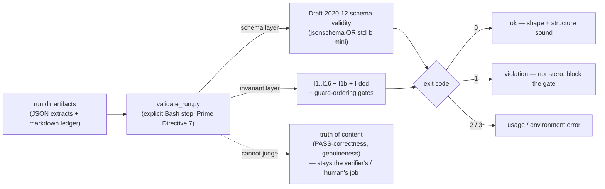

# The validator and the invariant catalog

**Audience:** technical readers who want to know *exactly* what the runtime enforcement layer
mechanically guarantees — and, just as important, what it deliberately does **not**. Every claim
here carries a `path:line` locator into the 1.3.0 tree that a verifier can open; the wiki's own
rule is that an unresolved locator is a defect.

**TL;DR.** `scripts/validate_run.py` is `dag`'s **external correctness signal** — the one part of
the pipeline whose verdict does not come from a model's judgment. It reads a run directory,
schema-validates every artifact, then checks the FSM invariants that schemas alone cannot express,
and **exits non-zero on any violation**. It is invoked as an **explicit Bash step** the skill must
call (Prime Directive 7), *not* a passive platform hook. What it enforces is **shape and structure**
— the invariant catalog **I1..I16 + I1b + I-dod** and the guard-ordering gates. What it cannot
enforce is **truth of content**: whether a PASS is *correct*, whether evidence resolves, whether a
lens was *genuinely* applied. The single sentence to carry away, repeated verbatim across the repo:
**validity ≠ correctness**
([`state-machine.md` §5](../plugins/dag/skills/dag/references/state-machine.md);
[`DESIGN.md` §6.4](../plugins/dag/skills/dag/DESIGN.md)).

---

## 1. What the validator *is* — the intuition

Every other check in `dag` is performed by a language model: the executor self-audits, the
independent verifier adjudicates, the human signs off. Those are the *practical-accuracy*
disciplines, and they reduce error without ever eliminating it
(see [`07-accuracy.md`](07-accuracy.md)). The validator is different in kind. It is a **~1,750-line
Python program** ([`validate_run.py`](../plugins/dag/skills/dag/scripts/validate_run.py)) whose
verdict is deterministic and model-independent: given the same run directory it returns the same
answer, and that answer does not depend on how clever the reader is. It is the pipeline's
**mechanical backstop** — the layer that makes "the run obeyed the rules" a checkable fact rather
than a claim.

Three properties define its role, and each is easy to overstate, so state them precisely.

**(1) It is an *explicit Bash step*, not a passive hook.** Enforcement depends on the skill
faithfully running `bash scripts/validate_run.sh <RUN_DIR>` **after each artifact and before each
gate** — this is Prime Directive 7. The design deliberately does **not** rely on a Claude Code
`Stop`/`SubagentStop`/`PostToolUse` hook to auto-run the validator, because that capability was
never verified against official docs; so enforcement rests on an un-enforced instruction that Dag
must honor. The repo names this its *single biggest residual gap*
([`DESIGN.md` §6.3](../plugins/dag/skills/dag/DESIGN.md), limitation 3). If hooks are later
confirmed, a `SubagentStop` hook would be belt-and-suspenders — but today it is a call the skill
makes, nothing intercepts subagent I/O.

**(2) It checks *shape + structural invariants*, not semantic truth.** It validates that artifacts
parse and conform, that the DAG is acyclic, that no unit advanced unverified — never that a PASS
is *right* ([`DESIGN.md` §6.4](../plugins/dag/skills/dag/DESIGN.md), limitation 4). §7 below is the
exhaustive, honest list of what stays out of reach.

**(3) It is *offline / post-hoc* — it gates no live transition.** Every 1.2.0/1.3.0 invariant is a
predicate over *already-emitted* artifacts. Crucially, **none of them is a live guard on the
correction loop's sole back-edge `LT7 (RETRY→EXECUTE)`** — a live guard there could leave `RETRY`
with no enabled out-edge and deadlock the loop, breaking the termination proof. Keeping enforcement
post-hoc is *why* every invariant added since 1.1.1 **PRESERVES** termination
([`state-machine.md` I16](../plugins/dag/skills/dag/references/state-machine.md); the CLAUDE.md
deadlock lesson).

---

## 2. Exit codes and the schema backend

The program's contract is four exit codes
([`validate_run.py:32`](../plugins/dag/skills/dag/scripts/validate_run.py), docstring;
`main` at [`:381`](../plugins/dag/skills/dag/scripts/validate_run.py), summary/return at
[`:1743-1749`](../plugins/dag/skills/dag/scripts/validate_run.py)):

| Exit | Meaning |
|---|---|
| **0** | ok — schema-valid and every invariant held |
| **1** | validation / invariant **violation** — at least one problem was recorded (blocks the gate) |
| **2** | **usage** error — a missing or non-directory `run_dir` argument ([`:424`, `:427`](../plugins/dag/skills/dag/scripts/validate_run.py)) |
| **3** | **environment** error |

**Backend: jsonschema-or-stdlib.** `make_validator()` prefers the real `jsonschema` library
(`Draft202012Validator`) when it is importable, and otherwise falls back to a **built-in minimal
Draft-2020-12 validator implemented in pure stdlib** — *real* rejection, not a stub
([`:237-250`](../plugins/dag/skills/dag/scripts/validate_run.py)). The chosen backend is announced
on the first output line, `validate_run.py — backend: …`
([`:398`](../plugins/dag/skills/dag/scripts/validate_run.py)), so a green run tells you *which*
engine produced it. The stdlib backend implements a fixed set of assertion keywords
([`:63-68`](../plugins/dag/skills/dag/scripts/validate_run.py)); the schema self-check emits a
non-gating **NOTE** for any keyword a schema relies on that only the `jsonschema` backend would
enforce, and **FAILs** on an unresolvable `$ref`
([`:208-235`](../plugins/dag/skills/dag/scripts/validate_run.py)). One deliberate non-gating case:
a malformed **cross-run learnings store** is reported as a NOTE, never a FAIL (fixture
`store_malformed_nongating`, [`expectations.tsv:15`](../plugins/dag/skills/dag/scripts/tests/expectations.tsv)),
so a corrupt *global* store can never break a *local* run.

The validator runs the same regardless of backend — that dual-backend equivalence is exactly what
the test harness (§6) sweeps.

---

## 3. The guard set — the conditions gating each transition

The whole-pipeline FSM advances only when a **guard** holds. The guards are specified in
[`state-machine.md` §3](../plugins/dag/skills/dag/references/state-machine.md) (`:117-142`); the
validator realizes the *offline, checkable* subset of them as gate-ordering and presence
predicates. The distinction that must never be blurred: a guard that a **human** satisfies
(`G-resolve`) is not validator-checkable at all, and `G-signoff`'s **presence** is checkable while
its **genuineness** is not.

| Guard | Transition | Condition | Validator status |
|---|---|---|---|
| **G-personas** | T2 | User confirmed the roster; `gates.personas_confirmed==true` backed by a **VALID** `personas.json` | **Fail-closed, non-skippable** — required from P2 onward; a flag unbacked by a valid roster is rejected ([`:1646-1712`](../plugins/dag/skills/dag/scripts/validate_run.py)) |
| **G-clarify** | T3/T4 | `open_material == 0` (no unresolved *material* ambiguity) | Checked (I8) ([`:1590-1599`](../plugins/dag/skills/dag/scripts/validate_run.py)) |
| **G-dag** | T6/T7 | Authoritative `graph.json` exists and its DAG (`edges ∪ unit-deps`) is acyclic; every unit ≤ 32K est. | **Fail-closed** (I3) — missing/unparseable graph past decomposition is a violation ([`:935-978`](../plugins/dag/skills/dag/scripts/validate_run.py)) |
| **G-brief** | T8 | Each dispatched unit's `brief.json` is schema-valid with a `socratic_protocol` reference, `tags ⊆ V_tag`, and `learnings_applied` | Offline presence counterpart checked ([`:1298-1327`](../plugins/dag/skills/dag/scripts/validate_run.py)) |
| **G-independent** | LT2 | `verify.json` attests `executor_reasoning_seen == false` | Checked (I1) ([`:1044-1051`](../plugins/dag/skills/dag/scripts/validate_run.py)) |
| **G-defect** | LT4 | A FAIL carries ≥1 concrete defect whose `criterion ∈ brief.acceptance_criteria`, plus non-empty `feedback.actionable_changes` | Checked (I6 FAIL) ([`:1054-1064`](../plugins/dag/skills/dag/scripts/validate_run.py)) |
| **G-retry** | LT4/LT5 | Branch on `retries < 2` vs `retries == 2` | Bound checked (I4) ([`:981-998`](../plugins/dag/skills/dag/scripts/validate_run.py)) |
| **G-verified** | T9 | Every unit with a debrief has a `verify.json` with `verdict=PASS` | Checked (I9/I10) ([`:1272-1285`](../plugins/dag/skills/dag/scripts/validate_run.py), [`:1341-1371`](../plugins/dag/skills/dag/scripts/validate_run.py)) |
| **G-resolve** | T11 | The human picks an option at the disagreement gate (`DECISIONS.md` appended) | **Human gate — NOT validator-checkable** (the validator cannot verify a human decided) |
| **G-signoff** | T12 | The human accepts the deliverable at Phase-8 sign-off, recorded as `gates.signoff_confirmed` | **Fail-closed, non-skippable (D-06)** — `signoff_confirmed` is in `REQUIRED_GATES` for `DONE`; a `DONE` run without it is INVALID. **Presence, not genuineness**, is checked ([`:1722-1739`](../plugins/dag/skills/dag/scripts/validate_run.py)) |

**The D-06 sign-off gate (new at 1.3.0).** Before D-06 the validator *could not tell whether
sign-off happened* — Phase 8 was a human gate with no mechanical trace, so a run could reach `DONE`
having skipped the human. D-06/BRK-13 adds `gates.signoff_confirmed` to the `DONE` row of
`REQUIRED_GATES`, closing that hole ([`:1722-1731`](../plugins/dag/skills/dag/scripts/validate_run.py);
fixture `signoff_missing` → `requires gates ['signoff_confirmed']`,
[`expectations.tsv:32`](../plugins/dag/skills/dag/scripts/tests/expectations.tsv)). Like
`personas_confirmed` it is a **post-hoc gate-ordering predicate over the emitted `fsm-state.json`**
that gates no live transition and never guards LT7; it **REVISES** the gate contract while
**preserving** termination. The flag is a human attestation whose *presence* is checked — whether
the human *genuinely* reviewed the deliverable stays semantic judgment (validity ≠ correctness).

---

## 4. The invariant catalog — I1..I16 + I1b + I-dod

This is the catalog of record, [`state-machine.md` §4](../plugins/dag/skills/dag/references/state-machine.md)
(`:144-164`), mapped to its enforcement site in the validator and to the honest **A–H** limitation
(§7) where one applies. Read the "Limit." column as *"this check is shape/structure; the named
limitation is the correctness question it does not touch."* Every row is a **mechanical check of
form** — none of them certifies that the content is *true*.

| Inv | What it requires | Enforcement mechanism | `validate_run.py` | Limit. |
|---|---|---|---|---|
| **I1** Verifier independence | `verify.executor_reasoning_seen == false` | schema `const:false` + validator (defense-in-depth) | [`:1044-1051`](../plugins/dag/skills/dag/scripts/validate_run.py) | **A** |
| **I1b** maker ≠ checker | `executor_persona != verifier_persona` for every `graph.json` unit | validator cross-check over graph units | [`:960-966`](../plugins/dag/skills/dag/scripts/validate_run.py) | **D** |
| **I2** Ledger-is-truth | an absent `fsm-state.json` alongside other run artifacts is a violation | validator presence/parse check | [`:1682-1694`](../plugins/dag/skills/dag/scripts/validate_run.py) | — |
| **I3** DAG acyclic (fail-closed) | no cycle on `edges ∪ unit-deps`; authoritative `graph.json` **required** past decomposition | validator `find_cycle` (iterative DFS, N-12) + fail-closed absence check | [`:935-978`](../plugins/dag/skills/dag/scripts/validate_run.py) | (closes E) |
| **I4** Loop bound | `retries ≤ 2`; `iteration ≤ retries+1`; **plus (D-02)** every `fsm-state.units[]` item that records its own `retries` is bounded too; and any `verify.iteration > 3` FAILs | schema `maximum:2` + validator cross-check (top-level **and** per-unit) | [`:981-998`](../plugins/dag/skills/dag/scripts/validate_run.py), [`:1009-1028`](../plugins/dag/skills/dag/scripts/validate_run.py) (units[]), [`:1034-1039`](../plugins/dag/skills/dag/scripts/validate_run.py) (ceiling) | — |
| **I5** Budget cap | declared `budget_tokens` / `est_footprint_tokens ≤ 32000` (plan-side); report-side `tokens_consumed` has **no** max but `>32000 ⇒ within_budget:false` | schema `maximum:32000` + `if/then` | (schema; see [`07-accuracy.md`](07-accuracy.md) §3.1) | **C** |
| **I6** FAIL criterion | every FAIL `defects[].criterion ∈ brief.acceptance_criteria` | validator criterion-∈-brief cross-check | [`:1054-1064`](../plugins/dag/skills/dag/scripts/validate_run.py) | — |
| **I6** PASS coverage-first **(REVISED, PR1)** | a PASS carries **no blocker/major defect** — but **MAY carry `minor` observations** (was `defects == []`) | schema `allOf` + validator defense-in-depth check | [`:1071-1081`](../plugins/dag/skills/dag/scripts/validate_run.py) | **B** |
| **I7** Single recommended | a disagreement dossier has exactly one `recommended:true` option | validator count | [`:1579-1587`](../plugins/dag/skills/dag/scripts/validate_run.py) | — |
| **I8** No open material ambiguity | no `material ∧ resolved==false` item past P2 | validator (clarifications extract) | [`:1590-1599`](../plugins/dag/skills/dag/scripts/validate_run.py) | — |
| **I9** Every debriefed unit verified | a unit dir with a debrief MUST have a `verify.json` with a verdict; a verify **without** a debrief is incoherent | validator presence check (both directions) | [`:1272-1285`](../plugins/dag/skills/dag/scripts/validate_run.py), [`:1290-1295`](../plugins/dag/skills/dag/scripts/validate_run.py) | (closes D) |
| **I10** Synthesis completeness | at **P8/DONE** every `graph.json` unit has a dir + debrief + `verify.verdict == PASS` | validator phase-gated presence+verdict check (iterates graph units — BRK-02) | [`:1341-1371`](../plugins/dag/skills/dag/scripts/validate_run.py) | (closes D) |
| **I11** Tag vocabulary | every unit/brief `tag ∈ V_tag_eff` (`graph.v_tag` ∪ global `~/.claude/dag/tags.json`) | validator membership check; invalid registry ⇒ FAIL + run-local fallback | [`:1392-1409`](../plugins/dag/skills/dag/scripts/validate_run.py), [`:1412-1429`](../plugins/dag/skills/dag/scripts/validate_run.py) | **G** |
| **I12** Learnings propagation | admission-gated (`all`⇒≥2 units, `tag:T`⇒≥2 carriers, `U0X`⇒always; unknown kind ⇒ hard FAIL) + every matched unit lists the entry in `learnings_applied` | validator decidable predicate + admission gate | [`:1509-1557`](../plugins/dag/skills/dag/scripts/validate_run.py), [`:1558-1574`](../plugins/dag/skills/dag/scripts/validate_run.py) | **E**, **G** |
| **I13** Socratic outcome | `debrief`/`verify` `socratic.counter` records an *outcome*, not a blank/"n/a" (mechanical sentinel allowed) | schema (4 keys) + validator counter-outcome check | [`:1110-1136`](../plugins/dag/skills/dag/scripts/validate_run.py) | **B** |
| **I14** AO-2 do_not_touch disjointness **(post-hoc)** | on a retry (`debrief.iteration>1`): `verify.defects[].criterion ∩ prior_feedback.do_not_touch == ∅` | validator **offline** predicate; gates no transition | [`:1090-1108`](../plugins/dag/skills/dag/scripts/validate_run.py) | **F** |
| **I15** AO-6 responsive change **(post-hoc)** | on a retry carrying a `prior_feedback` echo: `changes_made` present + non-empty | validator **offline** predicate; gates no transition | [`:1255-1269`](../plugins/dag/skills/dag/scripts/validate_run.py) | **F** |
| **I16** Panel discipline **(post-hoc, PR1)** | a `high-stakes` unit's `verify.json` carries a `panel[]` (≥3 members, distinct **correctness/reproduce/guardrail** lenses); the top-level `verdict` equals the **DISCRETE majority** (a split ⇒ `DISAGREE` — **no softmax**); `verify_rounds ∈ [1,3]` | validator **offline** predicate; node-internal ⇒ gates no transition | [`:1154-1244`](../plugins/dag/skills/dag/scripts/validate_run.py) | **H** |
| **I-dod** DoD/non-goals present | any post-clarification structural artifact (cartography / graph / units / synthesis) requires a valid `clarifications.json` with **non-empty** `definition_of_done` **and** `non_goals` — **fail-closed even if the file is absent** | validator artifact-driven presence check | [`:1601-1644`](../plugins/dag/skills/dag/scripts/validate_run.py) | — |

Two seams the catalog above threads but that deserve their own line:

- **The `premise_check` attestation.** Beyond `socratic`, a verifier emits `premise_check`; the
  validator requires `counter_reran_independently == true` and **rejects a PASS whose
  `premise_check.is_load_bearing == false`** (the premise-deflection guard)
  ([`:1139-1152`](../plugins/dag/skills/dag/scripts/validate_run.py)). Shape only — see Limitation B.
- **Per-panelist audit (D-04).** A panel MAY persist individual `verify_p<N>.json` files. These are
  **validate-if-present**: each must be schema-valid, attest blindness, and match its `unit_id`;
  they never override the aggregated `verify.json`
  ([`:514-551`](../plugins/dag/skills/dag/scripts/validate_run.py); fixture `panelist_files_ok`,
  [`expectations.tsv:18`](../plugins/dag/skills/dag/scripts/tests/expectations.tsv)).

### 4.1 Three revisions the older wiki predates

- **I6 PASS is revised (coverage-first, PR1).** A PASS used to require `defects == []`. It now
  requires only **no blocker/major** defect and **explicitly permits `minor` observations** — the
  "report every finding + severity, filter downstream" stance. The validator's PASS check FAILs
  only on a `blocker`/`major` severity ([`:1071-1081`](../plugins/dag/skills/dag/scripts/validate_run.py);
  fixtures `pass_with_minor` → exit 0 vs `pass_with_major_rejected` → `severity: 'major'`,
  [`expectations.tsv:11,45`](../plugins/dag/skills/dag/scripts/tests/expectations.tsv)). This
  **REVISES** a content rule only — the verdict enum and the loop partition are unchanged, so
  termination is **preserved** ([`self-learning-loops.md:547-554`](../plugins/dag/skills/dag/references/self-learning-loops.md)).
- **I14/I15 mechanize AO-2/AO-6 — post-hoc, never a live LT7 guard.** AO-2 ("never re-verify a
  PASSED claim") and AO-6 ("each retry must carry a responsive change") were discipline-only rules;
  they are now checked *offline* by I14/I15 over the retry `debrief` echo. Both fail **closed** but
  gate **no transition** — mechanizing them as a *live* guard on LT7 would have deadlocked `RETRY`,
  so the offline form is load-bearing to the termination proof
  ([`self-learning-loops.md:503-541`](../plugins/dag/skills/dag/references/self-learning-loops.md)).
- **I16 is entirely new (panel-of-3 default on high-stakes, 1.2.0).** A high-stakes unit is verified
  by an odd panel of ≥3 with distinct lenses; the aggregate is a **discrete mode, never a softmaxed
  or averaged score** — a genuine split routes to `DISAGREE` (AO-5). The validator's
  `_discrete_majority` returns `None` on a tie/no-majority and requires the top-level verdict to
  match ([`:1173-1233`](../plugins/dag/skills/dag/scripts/validate_run.py); fixtures
  `panel_high_stakes_pass` → 0, `panel_missing` and `panel_majority_mismatch` → 1,
  [`expectations.tsv:10,43-44`](../plugins/dag/skills/dag/scripts/tests/expectations.tsv)). I16 is
  **post-hoc/offline** and node-internal, so it **PRESERVES** termination.

---

## 5. Fail-closed philosophy — absence is an attack surface

Three invariants take the stance that a **missing** artifact is not a "nothing to check, pass by
default" — it is a **violation**. The reasoning is adversarial: if `dag`'s own machinery could hide
work by *deleting* an artifact, the strongest attack on the pipeline would be omission, not
falsification. So these checks fail *closed*.

- **I3 — the DAG.** Past decomposition (or whenever a `GRAPH.md` exists), a **VALID authoritative
  `graph.json` is REQUIRED**; an absent or unparseable graph is a non-zero exit, and a `GRAPH.md`
  that declares dependencies *outside a code fence* with no `graph.json` backing them FAILs (0 edges
  parsed) ([`:935-978`](../plugins/dag/skills/dag/scripts/validate_run.py); fixture `unfenced_cycle`
  → `I3 DAG fail-closed (E)`, [`expectations.tsv:54`](../plugins/dag/skills/dag/scripts/tests/expectations.tsv)).
- **I9 — verification presence.** Any unit dir carrying a debrief **must** have a `verify.json` with
  a verdict; deleting the verify does not make the unit pass — it FAILs
  ([`:1272-1285`](../plugins/dag/skills/dag/scripts/validate_run.py); fixture `missing_verify`).
- **I10 — synthesis completeness.** At P8/DONE the check **iterates the `graph.json` units**
  (BRK-02), so a unit cannot be hidden from the completeness sweep by deleting its debrief — every
  graph unit must have a dir + debrief + `verdict==PASS`
  ([`:1341-1371`](../plugins/dag/skills/dag/scripts/validate_run.py)).

**I-dod** and **G-personas**/**G-signoff** share this posture: I-dod requires a non-empty
Definition-of-Done + Non-Goals the moment any structural artifact exists — *even if
`clarifications.json` is absent* ([`:1617-1644`](../plugins/dag/skills/dag/scripts/validate_run.py);
fixtures `missing_dod`, `postdecomp_no_dod`, `synthesis_no_dod`) — and the two human gates are
non-skippable presence predicates (§3). The unifying idea: **a required artifact's absence is
treated as a failed check, not an empty one.**

---

## 6. The test harness — `run_tests.sh`, the repo's only CI

The validator is itself verified by an executable fixture suite,
[`run_tests.sh`](../plugins/dag/skills/dag/scripts/run_tests.sh) — described in its own header as
**"the CI (the repo has no other)"** ([`run_tests.sh:1-10`](../plugins/dag/skills/dag/scripts/run_tests.sh)).
It is **test infrastructure only** (PRESERVES — no enforcement change).

- **HOME-isolated (IMP-16).** Fixture verdicts formerly depended on the operator's *real* `$HOME`
  (a personal `~/.claude/dag/learnings/` or `tags.json` could change an outcome). The harness now
  **stubs `$HOME` to a fresh `mktemp -d`** so `~/.claude/dag/{learnings,tags.json}` are
  deterministically absent, and cleans it on exit
  ([`run_tests.sh:38-46`](../plugins/dag/skills/dag/scripts/run_tests.sh)). A `--real-home` escape
  hatch exists only for manually exercising the global-store (G1/G2) paths.
- **What it sweeps.** A schema self-check (13 schemas well-formed), then **every fixture row** in
  [`tests/expectations.tsv`](../plugins/dag/skills/dag/scripts/tests/expectations.tsv) — 54 fixtures
  at 1.3.0 (48→54 across the release) — on **each available backend** (system `python3`, plus a
  `jsonschema`-capable interpreter if `DAG_TEST_VENV` points at one; it **never pip-installs**),
  plus the `manifest.schema.json` instance pair (N-09)
  ([`run_tests.sh:50-134`](../plugins/dag/skills/dag/scripts/run_tests.sh)).
- **The pinning contract.** Each `expectations.tsv` row is
  `fixture-path ⟨TAB⟩ expected-exit ⟨TAB⟩ required-FAIL-substring`. The harness fails if a fixture's
  exit code **or** its pinned FAIL-line substring does not match
  ([`run_tests.sh:74-99`](../plugins/dag/skills/dag/scripts/run_tests.sh);
  [`expectations.tsv:1-3`](../plugins/dag/skills/dag/scripts/tests/expectations.tsv)). This is why
  the fixtures are cited throughout this page — each one is an executable proof that a specific check
  fires (17 rows expect exit 0, 37 expect exit 1 with a pinned message). It exits non-zero if **any**
  fixture, the manifest pair, or the self-check mismatches
  ([`run_tests.sh:136-144`](../plugins/dag/skills/dag/scripts/run_tests.sh)).

---

## 7. What the validator CANNOT enforce — the honest A–H list

This is the load-bearing seam, enumerated verbatim from
[`state-machine.md` §5](../plugins/dag/skills/dag/references/state-machine.md) (`:200-244`) and
mirrored in [`DESIGN.md` §6.4](../plugins/dag/skills/dag/DESIGN.md). Everything in §3–§6 is a check
of **shape or structure**; none of the following is mechanically decidable, and each stays a
human/verifier judgment. **Validity ≠ correctness.** (The older wiki listed **A–G**; **H** was added
with I16.)

- **A — verifier true-blindness.** Whether the verifier was *truly* blind to executor reasoning.
  `const:false` / `premise_check` are **self-attestations, not platform guarantees** — no passive
  hook intercepts subagent I/O. This is the load-bearing residual under the Alloy independence
  property.
- **B — PASS-correctness.** Whether a PASS is *correct*, whether evidence locators actually
  resolve/reproduce, or whether the `socratic`/`defects`/`premise_check` text is *genuine* rather
  than theater. I13 checks the counter's *shape*; the independent COUNTER re-run is the real
  backstop.
- **C — token truthfulness.** Whether reported `budget_tokens`/`tokens_consumed` are truthful. The
  schema hard-checks the *declared* number ≤ 32000; real consumption stays disciplinary.
- **D — genuine model-distinctness.** Whether executor and verifier are genuinely a *different
  model/agent* at runtime. The persona-**label** distinctness IS graph-checked (**I1b**), but a
  genuinely distinct *model* behind the label stays unobservable.
- **E — tag-genuineness.** Whether a `tag` genuinely denotes a *reusable* pattern. I12 enforces
  ≥2 carriers + presence; whether the lesson is *truly* generalizable stays a judgment.
- **F — I14/I15 presence, not genuineness.** Presence is now schema-required on retries (PR-6), so a
  retry can no longer EVADE the checks by omitting the block. What remains self-reported: I14
  compares the executor's **self-reported** `do_not_touch` echo (the validator retains only the
  *latest* `verify.json`, so there is no per-iteration history to reconstruct against), and I15's
  `changes_made` **content** is executor-attested. The checks enforce *presence/plumbing*, not
  *genuineness*.
- **G — tag-domain trust.** The I11/I12 domain is *widened* to
  `V_tag_eff = global ∪ project ∪ run_local`, and its authored-vs-imported carve-out **trusts** the
  `G#`-id / store provenance as the "already-generalized" signal — a deliberate provenance-trust
  boundary, not a cryptographic proof (an absent/invalid registry falls back to run-local, so the
  domain is never widened silently or on bad data).
- **H — I16 panel presence/shape, not genuine lens diversity.** I16 mechanically checks a
  ≥3-member `panel[]` covering the correctness/reproduce/guardrail trio, a **discrete majority**
  equal to the top-level verdict (no softmax), and `verify_rounds ∈ [1,3]`. It **cannot** enforce
  that the three lenses were *genuinely* applied by *genuinely* independent verifiers, that a
  `converged` (dry) sweep truly exhausted the defects, or that a panelist's verdict is *correct* —
  those stay verifier/human judgment. Being post-hoc it gates no transition, so it can never
  deadlock the loop. Note too that `verify_rounds` is **optional**: I16 bounds it *only when present*,
  so an omitted field leaves the internal loop-until-dry round count unaudited (VERIFY is a single
  LT2 transition regardless, so termination is unaffected)
  ([`state-machine.md:233-244`](../plugins/dag/skills/dag/references/state-machine.md)).

**Reading the seam correctly.** A green `validate_run.py` exit tells you the artifacts are
*well-shaped and the run obeyed the rules* — schema-valid, acyclic DAG, no unverified unit, gates in
order. It does **not** tell you the deliverable is *right*. The mechanical layer secures the
plumbing; the *only* thing pushing on truth is the practical layer — the adaptive evidence standards
and the independent adversarial verifier (see [`06-verification.md`](06-verification.md) and
[`07-accuracy.md`](07-accuracy.md)) — and that layer reduces error without ever eliminating it.

---

## 8. See also

- [`07-accuracy.md`](07-accuracy.md) — practical vs provable accuracy; the machine-checked invariant
  subset in the wider "validity ≠ correctness" frame.
- [`06-verification.md`](06-verification.md) — the independent adversarial verifier that carries the
  correctness load the validator cannot (limitations A, B, F, H).
- [`03-formal-methods.md`](03-formal-methods.md) — the *design-time* proof layer (TLA+/Alloy) whose
  guarantees complement the *runtime* validator; the FSM/invariant vocabulary this page uses.
- [`04-self-learning-loops.md`](04-self-learning-loops.md) — the bounded correction loop and the
  AO-2/AO-6 discipline behind I14/I15; the "post-hoc, never a live LT7 guard" thesis.
- [`13-cross-run-persistence.md`](13-cross-run-persistence.md) — the global learnings/tags stores
  whose malformation the validator treats as a non-gating NOTE.
