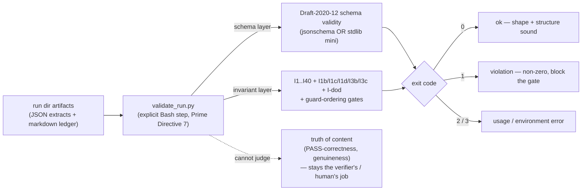

# The validator and the invariant catalog

**Audience:** technical readers who want to know *exactly* what the runtime enforcement layer
mechanically guarantees — and, just as important, what it deliberately does **not**. Every claim
here carries a `path:line` locator into the 1.10.1 tree that a verifier can open; the wiki's own
rule is that an unresolved locator is a defect.

**TL;DR.** `scripts/validate_run.py` is `dag`'s **external correctness signal** — the one part of
the pipeline whose verdict does not come from a model's judgment. It reads a run directory,
schema-validates every artifact, then checks the FSM invariants that schemas alone cannot express,
and **exits non-zero on any violation**. It is invoked as an **explicit Bash step** the skill must
call (Prime Directive 7), *not* a passive platform hook. What it enforces is **shape and structure**
— the full invariant catalog **I1..I40 + I1b/I1c/I1d/I3b/I3c + I-dod** and the guard-ordering gates. What it cannot
enforce is **truth of content**: whether a PASS is *correct*, whether evidence resolves, whether a
lens was *genuinely* applied. The single sentence to carry away, repeated verbatim across the repo:
**validity ≠ correctness**
([`state-machine.md` §5](../plugins/dag/skills/dag/references/state-machine.md);
[`DESIGN.md` §6.4](../plugins/dag/skills/dag/DESIGN.md)).

---

## 1. What the validator *is* — the intuition

Every other check in `dag` is performed by a language model: the executor self-audits, the
independent verifier adjudicates, the human signs off. Those are the *practical-accuracy*
disciplines, and they reduce error without ever eliminating it
(see [`07-accuracy.md`](07-accuracy.md)). The validator is different in kind. It is a **~4,500-line
Python program** ([`validate_run.py`](../plugins/dag/skills/dag/scripts/validate_run.py)) whose
verdict is deterministic and model-independent: given the same run directory it returns the same
answer, and that answer does not depend on how clever the reader is. It is the pipeline's
**mechanical backstop** — the layer that makes "the run obeyed the rules" a checkable fact rather
than a claim.

Three properties define its role, and each is easy to overstate, so state them precisely.

**(1) It is an *explicit Bash step*, not a passive hook.** Enforcement depends on the skill
faithfully running `bash scripts/validate_run.sh <RUN_DIR>` **after each artifact and before each
gate** — this is Prime Directive 7. The design deliberately does **not** rely on a Claude Code
`Stop`/`SubagentStop`/`PostToolUse` hook to auto-run the validator, because that capability was
never verified against official docs; so enforcement rests on an un-enforced instruction that Dag
must honor. The repo names this its *single biggest residual gap*
([`DESIGN.md` §6.3](../plugins/dag/skills/dag/DESIGN.md), limitation 3). If hooks are later
confirmed, a `SubagentStop` hook would be belt-and-suspenders — but today it is a call the skill
makes, nothing intercepts subagent I/O.

**(2) It checks *shape + structural invariants*, not semantic truth.** It validates that artifacts
parse and conform, that the DAG is acyclic, that no unit advanced unverified — never that a PASS
is *right* ([`DESIGN.md` §6.4](../plugins/dag/skills/dag/DESIGN.md), limitation 4). §7 below is the
exhaustive, honest list of what stays out of reach.

**(3) It is *offline / post-hoc* — it gates no live transition.** Every invariant in the catalog —
through the 1.8.0 guardrail-enforcement and 1.9.0 depth-&-retrieval additions — is a
predicate over *already-emitted* artifacts. Crucially, **none of them is a live guard on the
correction loop's sole back-edge `LT7 (RETRY→EXECUTE)`** — a live guard there could leave `RETRY`
with no enabled out-edge and deadlock the loop, breaking the termination proof. Keeping enforcement
post-hoc is *why* every invariant added since 1.1.1 **PRESERVES** termination
([`state-machine.md` I16](../plugins/dag/skills/dag/references/state-machine.md); the CLAUDE.md
deadlock lesson).

---

## 2. Exit codes and the schema backend

The program's contract is four exit codes
([`validate_run.py:42`](../plugins/dag/skills/dag/scripts/validate_run.py), docstring;
`main` at [`:536`](../plugins/dag/skills/dag/scripts/validate_run.py), summary/return at
[`:4513-4521`](../plugins/dag/skills/dag/scripts/validate_run.py)):

| Exit | Meaning |
|---|---|
| **0** | ok — schema-valid and every invariant held |
| **1** | validation / invariant **violation** — at least one problem was recorded (blocks the gate) |
| **2** | **usage** error — a missing or non-directory `run_dir` argument ([`:578`, `:580`](../plugins/dag/skills/dag/scripts/validate_run.py)) |
| **3** | **environment** error |

**Backend: jsonschema-or-stdlib.** `make_validator()` prefers the real `jsonschema` library
(`Draft202012Validator`) when it is importable, and otherwise falls back to a **built-in minimal
Draft-2020-12 validator implemented in pure stdlib** — *real* rejection, not a stub
([`:248-266`](../plugins/dag/skills/dag/scripts/validate_run.py)). The chosen backend is announced
on the first output line, `validate_run.py — backend: …`
([`:553`](../plugins/dag/skills/dag/scripts/validate_run.py)), so a green run tells you *which*
engine produced it. The stdlib backend implements a fixed set of assertion keywords
([`:74-79`](../plugins/dag/skills/dag/scripts/validate_run.py)); the schema self-check emits a
non-gating **NOTE** for any keyword a schema relies on that only the `jsonschema` backend would
enforce, and **FAILs** on an unresolvable `$ref`
([`:219-245`](../plugins/dag/skills/dag/scripts/validate_run.py)). One deliberate non-gating case:
a malformed **cross-run learnings store** is reported as a NOTE, never a FAIL (fixture
`store_malformed_nongating`, [`expectations.tsv:15`](../plugins/dag/skills/dag/scripts/tests/expectations.tsv)),
so a corrupt *global* store can never break a *local* run.

The validator runs the same regardless of backend — that dual-backend equivalence is exactly what
the test harness (§6) sweeps.

---

## 3. The guard set — the conditions gating each transition

The whole-pipeline FSM advances only when a **guard** holds. The guards are specified in
[`state-machine.md` §3](../plugins/dag/skills/dag/references/state-machine.md) (`:150-183`); the
validator realizes the *offline, checkable* subset of them as gate-ordering and presence
predicates. The distinction that must never be blurred: a guard that a **human** satisfies
(`G-resolve`) is not validator-checkable at all, and `G-signoff`'s **presence** is checkable while
its **genuineness** is not.

| Guard | Transition | Condition | Validator status |
|---|---|---|---|
| **G-personas** | T2 | User confirmed the roster; `gates.personas_confirmed==true` backed by a **VALID** `personas.json` | **Fail-closed, non-skippable** — required from P2 onward; a flag unbacked by a valid roster is rejected ([`:4474-4485`](../plugins/dag/skills/dag/scripts/validate_run.py)) |
| **G-clarify** | T3/T4 | `open_material == 0` (no unresolved *material* ambiguity) | Checked (I8) ([`:4224-4234`](../plugins/dag/skills/dag/scripts/validate_run.py)) |
| **G-dag** | T6/T7 | Authoritative `graph.json` exists and its DAG (`edges ∪ unit-deps`) is acyclic; every unit ≤ 32K est. | **Fail-closed** (I3) — missing/unparseable graph past decomposition is a violation ([`:1090-1134`](../plugins/dag/skills/dag/scripts/validate_run.py)) |
| **G-brief** | T8 | Each dispatched unit's `brief.json` is schema-valid with a `socratic_protocol` reference, `tags ⊆ V_tag`, and `learnings_applied` | Offline presence counterpart checked ([`:3905-3933`](../plugins/dag/skills/dag/scripts/validate_run.py)) |
| **G-independent** | LT2 | `verify.json` attests `executor_reasoning_seen == false` | Checked (I1) ([`:1392-1402`](../plugins/dag/skills/dag/scripts/validate_run.py)) |
| **G-defect** | LT4 | A FAIL carries ≥1 concrete defect whose `criterion ∈ brief.acceptance_criteria`, plus non-empty `feedback.actionable_changes` | Checked (I6 FAIL) ([`:1404-1415`](../plugins/dag/skills/dag/scripts/validate_run.py)) |
| **G-retry** | LT4/LT5 | Branch on `retries < 2` vs `retries == 2` | Bound checked (I4) ([`:1331-1349`](../plugins/dag/skills/dag/scripts/validate_run.py)) |
| **G-verified** | T9 | Every unit with a debrief has a `verify.json` with `verdict=PASS` | Checked (I9/I10) ([`:3859-3893`](../plugins/dag/skills/dag/scripts/validate_run.py), [`:3937-3971`](../plugins/dag/skills/dag/scripts/validate_run.py)) |
| **G-resolve** | T11 | The human picks an option at the disagreement gate (`DECISIONS.md` appended) | **Human gate — NOT validator-checkable** (the validator cannot verify a human decided) |
| **G-signoff** | T12 | The human accepts the deliverable at Phase-8 sign-off, recorded as `gates.signoff_confirmed` | **Fail-closed, non-skippable (D-06)** — `signoff_confirmed` is in `REQUIRED_GATES` for `DONE`; a `DONE` run without it is INVALID. **Presence, not genuineness**, is checked ([`:4487-4510`](../plugins/dag/skills/dag/scripts/validate_run.py)) |

**The D-06 sign-off gate (new at 1.3.0).** Before D-06 the validator *could not tell whether
sign-off happened* — Phase 8 was a human gate with no mechanical trace, so a run could reach `DONE`
having skipped the human. D-06/BRK-13 adds `gates.signoff_confirmed` to the `DONE` row of
`REQUIRED_GATES`, closing that hole ([`:4487-4501`](../plugins/dag/skills/dag/scripts/validate_run.py);
fixture `signoff_missing` → `requires gates ['signoff_confirmed']`,
[`expectations.tsv:32`](../plugins/dag/skills/dag/scripts/tests/expectations.tsv)). Like
`personas_confirmed` it is a **post-hoc gate-ordering predicate over the emitted `fsm-state.json`**
that gates no live transition and never guards LT7; it **REVISES** the gate contract while
**preserving** termination. The flag is a human attestation whose *presence* is checked — whether
the human *genuinely* reviewed the deliverable stays semantic judgment (validity ≠ correctness).

---

## 4. The invariant catalog — I1..I40 + I1b/I1c/I1d/I3b/I3c + I-dod

The primary table (§4 below) is the catalog of record, [`state-machine.md` §4](../plugins/dag/skills/dag/references/state-machine.md)
(`:187-211`), mapped to its enforcement site in the validator and to the honest **A–K** limitation
(§7) where one applies. Read the "Limit." column as *"this check is shape/structure; the named
limitation is the correctness question it does not touch."* Every row is a **mechanical check of
form** — none of them certifies that the content is *true*.

| Inv | What it requires | Enforcement mechanism | `validate_run.py` | Limit. |
|---|---|---|---|---|
| **I1** Verifier independence | `verify.executor_reasoning_seen == false` | schema `const:false` + validator (defense-in-depth) | [`:1392-1402`](../plugins/dag/skills/dag/scripts/validate_run.py) | **A** |
| **I1b** maker ≠ checker | `executor_persona != verifier_persona` for every `graph.json` unit | validator cross-check over graph units | [`:1149-1159`](../plugins/dag/skills/dag/scripts/validate_run.py) | **D** |
| **I1c** artifact/declaration persona reconciliation | for a unit with **both** a `debrief.json` and a `verify.json`: `debrief.persona == graph.executor_persona`, `verify.verifier_persona == graph.verifier_persona`, **and** the two artifact personas distinct (I1b compared only the *declared* graph personas) | validator post-hoc cross-check | [`:1161-1189`](../plugins/dag/skills/dag/scripts/validate_run.py) | **D** |
| **I1d** roster membership | every *working* persona — graph `executor`/`verifier`, `debrief.persona`, `verify.verifier_persona`, every panel member — is a member of the confirmed `personas.json` roster | validator post-hoc membership check; runs only when a roster is present | [`:1191-1226`](../plugins/dag/skills/dag/scripts/validate_run.py) | **D** |
| **I2** Ledger-is-truth | an absent `fsm-state.json` alongside other run artifacts is a violation | validator presence/parse check | [`:4317-4329`](../plugins/dag/skills/dag/scripts/validate_run.py) | — |
| **I3** DAG acyclic (fail-closed) | no cycle on `edges ∪ unit-deps`; authoritative `graph.json` **required** past decomposition | validator `find_cycle` (iterative DFS, N-12) + fail-closed absence check | [`:1090-1134`](../plugins/dag/skills/dag/scripts/validate_run.py) | (closes E) |
| **I4** Loop bound | `retries ≤ 2`; `iteration ≤ retries+1`; **plus (D-02)** every `fsm-state.units[]` item that records its own `retries` is bounded too; and any `verify.iteration > 3` FAILs | schema `maximum:2` + validator cross-check (top-level **and** per-unit) | [`:1331-1349`](../plugins/dag/skills/dag/scripts/validate_run.py), [`:1351-1379`](../plugins/dag/skills/dag/scripts/validate_run.py) (units[]), [`:1381-1389`](../plugins/dag/skills/dag/scripts/validate_run.py) (ceiling) | — |
| **I5** Budget cap | declared `budget_tokens` / `est_footprint_tokens ≤ 32000` (plan-side); report-side `tokens_consumed` has **no** max but `>32000 ⇒ within_budget:false` | schema `maximum:32000` + `if/then` | (schema; see [`07-accuracy.md`](07-accuracy.md) §3.1) | **C** |
| **I6** FAIL criterion | every FAIL `defects[].criterion ∈ brief.acceptance_criteria` | validator criterion-∈-brief cross-check | [`:1404-1415`](../plugins/dag/skills/dag/scripts/validate_run.py) | — |
| **I6** PASS coverage-first **(REVISED, PR1)** | a PASS carries **no blocker/major defect** — but **MAY carry `minor` observations** (was `defects == []`) | schema `allOf` + validator defense-in-depth check | [`:1450-1465`](../plugins/dag/skills/dag/scripts/validate_run.py) | **B** |
| **I7** Single recommended | a disagreement dossier has exactly one `recommended:true` option | validator count | [`:4213-4222`](../plugins/dag/skills/dag/scripts/validate_run.py) | — |
| **I8** No open material ambiguity | no `material ∧ resolved==false` item past P2 | validator (clarifications extract) | [`:4224-4234`](../plugins/dag/skills/dag/scripts/validate_run.py) | — |
| **I9** Every debriefed unit verified | a unit dir with a debrief MUST have a `verify.json` with a verdict; a verify **without** a debrief is incoherent | validator presence check (both directions) | [`:3859-3893`](../plugins/dag/skills/dag/scripts/validate_run.py), [`:3895-3902`](../plugins/dag/skills/dag/scripts/validate_run.py) | (closes D) |
| **I10** Synthesis completeness | at **P8/DONE** every `graph.json` unit has a dir + debrief + `verify.verdict == PASS` | validator phase-gated presence+verdict check (iterates graph units — BRK-02) | [`:3937-3971`](../plugins/dag/skills/dag/scripts/validate_run.py) | (closes D) |
| **I11** Tag vocabulary | every unit/brief `tag ∈ V_tag_eff` (`graph.v_tag` ∪ global `~/.claude/dag/tags.json`) | validator membership check; invalid registry ⇒ FAIL + run-local fallback | [`:4001-4018`](../plugins/dag/skills/dag/scripts/validate_run.py), [`:4020-4036`](../plugins/dag/skills/dag/scripts/validate_run.py) | **G** |
| **I12** Learnings propagation | admission-gated (`all`⇒≥2 units, `tag:T`⇒≥2 carriers, `U0X`⇒always; unknown kind ⇒ hard FAIL) + every matched unit lists the entry in `learnings_applied` | validator decidable predicate + admission gate | [`:4162-4191`](../plugins/dag/skills/dag/scripts/validate_run.py), [`:4193-4208`](../plugins/dag/skills/dag/scripts/validate_run.py) | **E**, **G** |
| **I13** Socratic outcome | `debrief`/`verify` `socratic.counter` records an *outcome*, not a blank/"n/a" (mechanical sentinel allowed) | schema (4 keys) + validator counter-outcome check | [`:1511-1553`](../plugins/dag/skills/dag/scripts/validate_run.py) | **B** |
| **I14** AO-2 do_not_touch disjointness **(post-hoc)** | on a retry (`debrief.iteration>1`): `verify.defects[].criterion ∩ prior_feedback.do_not_touch == ∅` | validator **offline** predicate; gates no transition | [`:1467-1509`](../plugins/dag/skills/dag/scripts/validate_run.py) | **F** |
| **I15** AO-6 responsive change **(post-hoc)** | on a retry carrying a `prior_feedback` echo: `changes_made` present + non-empty | validator **offline** predicate; gates no transition | [`:1666-1687`](../plugins/dag/skills/dag/scripts/validate_run.py) | **F** |
| **I16** Panel discipline **(post-hoc, PR1)** | a `high-stakes` unit's `verify.json` carries a `panel[]` (≥3 members, distinct **correctness/reproduce/guardrail** lenses); the top-level `verdict` equals the **DISCRETE majority** (a split ⇒ `DISAGREE` — **no softmax**); `verify_rounds ∈ [1,3]` | validator **offline** predicate; node-internal ⇒ gates no transition | [`:1555-1664`](../plugins/dag/skills/dag/scripts/validate_run.py) | **H** |
| **I-dod** DoD/non-goals present | any post-clarification structural artifact (cartography / graph / units / synthesis) requires a valid `clarifications.json` with **non-empty** `definition_of_done` **and** `non_goals` — **fail-closed even if the file is absent** | validator artifact-driven presence check | [`:4236-4264`](../plugins/dag/skills/dag/scripts/validate_run.py) | — |
| **I3b** wave layering **(BGA)** | when `graph.json.waves` is present, every unit sits in exactly one wave and every edge rises strictly in wave (`wave(from) < wave(to)`); `waves` is REQUIRED once amendments exist | validator post-hoc, run whenever a graph is present (STRENGTHENS I3) | [`:1263-1306`](../plugins/dag/skills/dag/scripts/validate_run.py) | — |
| **I3c** dependency closure **(BGA)** | every `deps`/`edges` endpoint names a **current** `units[].id`; a dangling (or retired-but-still-referenced) endpoint FAILs | validator post-hoc, run whenever a graph is present (STRENGTHENS I3) | [`:1228-1246`](../plugins/dag/skills/dag/scripts/validate_run.py) | — |
| **I17** frozen executed prefix + reconciliation **(BGA)** | no amendment touches a unit with a `debrief`/`verify`; against the immutable `graph.json.baseline_units`, `set(units[]) ∪ retired == set(baseline) ∪ ⋃ units_added`; every executed unit's current graph entry still matches its immutable `brief.json` (title / wave / deps / persona / tags / criteria) | validator post-hoc; gates no transition | [`:1829-1924`](../plugins/dag/skills/dag/scripts/validate_run.py) | **J** |
| **I18** fuel bound + records-required **(BGA)** | `expansion.fuel_remaining == fuel_initial − Σ fuel_cost ≥ 0`; each record's `fuel_cost == max(1, \|added\| − \|retired\|)`; `revision == 1 + \|records\|`; the append-only `amendments/A<NN>.json` records must be present and chained (`fuel_before`/`fuel_after`) whenever amendment evidence exists | validator post-hoc; gates no transition; machine-checked by the TLC `Quiesce` property | [`:1759-2019`](../plugins/dag/skills/dag/scripts/validate_run.py) | — |
| **I19** amendment scope + kind closure **(BGA)** | schema kind-closure per `kind` (`add_units` / `split_unit` / `add_edges` / `cancel_unit`); `dod_refs` verbatim ∈ `definition_of_done`; `scope_change ⇒ human_gate`; `cancel_unit ⇒ human_gate`; split children cover the retired snapshot | validator post-hoc; gates no transition | [`:2069-2170`](../plugins/dag/skills/dag/scripts/validate_run.py) | **I**, **K** |

Two seams the catalog above threads but that deserve their own line:

- **The `premise_check` attestation.** Beyond `socratic`, a verifier emits `premise_check`; the
  validator requires `counter_reran_independently == true` and **rejects a PASS whose
  `premise_check.is_load_bearing == false`** (the premise-deflection guard)
  ([`:1544-1553`](../plugins/dag/skills/dag/scripts/validate_run.py)). Shape only — see Limitation B.
- **Per-panelist audit (D-04).** A panel MAY persist individual `verify_p<N>.json` files. These are
  **validate-if-present**: each must be schema-valid, attest blindness, and match its `unit_id`;
  they never override the aggregated `verify.json`
  ([`:669-706`](../plugins/dag/skills/dag/scripts/validate_run.py); fixture `panelist_files_ok`,
  [`expectations.tsv:18`](../plugins/dag/skills/dag/scripts/tests/expectations.tsv)).

### 4.1 Three revisions the older wiki predates

- **I6 PASS is revised (coverage-first, PR1).** A PASS used to require `defects == []`. It now
  requires only **no blocker/major** defect and **explicitly permits `minor` observations** — the
  "report every finding + severity, filter downstream" stance. The validator's PASS check FAILs
  only on a `blocker`/`major` severity ([`:1450-1465`](../plugins/dag/skills/dag/scripts/validate_run.py);
  fixtures `pass_with_minor` → exit 0 vs `pass_with_major_rejected` → `severity: 'major'`,
  [`expectations.tsv:11,45`](../plugins/dag/skills/dag/scripts/tests/expectations.tsv)). This
  **REVISES** a content rule only — the verdict enum and the loop partition are unchanged, so
  termination is **preserved** ([`self-learning-loops.md:592-605`](../plugins/dag/skills/dag/references/self-learning-loops.md)).
- **I14/I15 mechanize AO-2/AO-6 — post-hoc, never a live LT7 guard.** AO-2 ("never re-verify a
  PASSED claim") and AO-6 ("each retry must carry a responsive change") were discipline-only rules;
  they are now checked *offline* by I14/I15 over the retry `debrief` echo. Both fail **closed** but
  gate **no transition** — mechanizing them as a *live* guard on LT7 would have deadlocked `RETRY`,
  so the offline form is load-bearing to the termination proof
  ([`self-learning-loops.md:541-577`](../plugins/dag/skills/dag/references/self-learning-loops.md)).
- **I16 is entirely new (panel-of-3 default on high-stakes, 1.2.0).** A high-stakes unit is verified
  by an odd panel of ≥3 with distinct lenses; the aggregate is a **discrete mode, never a softmaxed
  or averaged score** — a genuine split routes to `DISAGREE` (AO-5). The validator's
  `_discrete_majority` returns `None` on a tie/no-majority and requires the top-level verdict to
  match ([`:1576-1664`](../plugins/dag/skills/dag/scripts/validate_run.py); fixtures
  `panel_high_stakes_pass` → 0, `panel_missing` and `panel_majority_mismatch` → 1,
  [`expectations.tsv:10,43-44`](../plugins/dag/skills/dag/scripts/tests/expectations.tsv)). I16 is
  **post-hoc/offline** and node-internal, so it **PRESERVES** termination.

### 4.2 The Bounded Graph Amendments block and the 1.7.0 audit-round-2 hardening

Everything added since 1.3.0 keeps the offline discipline — **no new check is a live guard on
`LT7`**, so the correction-loop termination proof still holds *verbatim*
([`state-machine.md` §4](../plugins/dag/skills/dag/references/state-machine.md); the CLAUDE.md
deadlock lesson).

- **Bounded Graph Amendments — I3b/I3c/I17/I18/I19.** The Phase-6 work graph may grow mid-run
  (`add_units` / `split_unit` / `add_edges`; `cancel_unit` is human-gated) through append-only
  `amendments/A<NN>.json` records (schema `amendment.schema.json`; see
  [page 15](15-artifacts-and-schemas.md)). Five offline invariants police it: wave-layering (**I3b**),
  dependency-closure (**I3c**), the frozen executed prefix + baseline reconciliation + content anchor
  (**I17**), the monotone **fuel** budget + tamper-evident `fuel_before`/`fuel_after` chain (**I18**),
  and amendment scope + kind closure (**I19**). Termination is preserved by the fuel bound — total
  units `≤ N₀ + fuel₀`, exactly as `retries ≤ 2` bounds the correction loop — and fuel exhaustion
  routes to `ESCALATE`, never a stuck state.
- **Persona reconciliation (I1c/I1d) + panel independence.** I1b compared only the *declared* graph
  personas; **I1c** ties the *actual* artifact personas (`debrief.persona`, `verify.verifier_persona`)
  to the graph and to each other, and **I1d** requires every working persona to be a confirmed-roster
  member. **I16** gained a panel-**independence** check — the panel's verifier personas must be
  pairwise distinct and none may be the executor
  ([`:1616-1637`](../plugins/dag/skills/dag/scripts/validate_run.py); fixture `panel_clone_verifiers`).
- **`origin.store` corroboration (I12).** An `origin.store` import stamp is trusted only when a real
  learnings-store entry corroborates it; an uncorroborated self-stamp is forged provenance and FAILs
  ([`:4082-4094`](../plugins/dag/skills/dag/scripts/validate_run.py); fixture `origin_store_forgery`).
- **Fail-closed terminal ledger (C5).** A unit at a terminal ledger status with no valid `verify.json`
  fails **closed** ([`:4346-4356`](../plugins/dag/skills/dag/scripts/validate_run.py)).
- **Structural ESCALATE fuel-origin (C3).** The amendment-fuel-exhaustion `ESCALATE` origin is proven
  by **structural** evidence — `expansion.fuel_remaining == 0` — not by dossier prose
  ([`:4449-4465`](../plugins/dag/skills/dag/scripts/validate_run.py)).
- **I14 severity scoping + per-unit budget + `units[]` uniqueness.** I14's `do_not_touch` disjointness
  is now scoped to `blocker`/`major` defects (a `minor` coverage-first note on a sealed criterion is a
  reportable NOTE, not a FAIL); I5's within-budget honesty is tied to each unit's *own*
  `brief.budget_tokens` ([`:1432-1448`](../plugins/dag/skills/dag/scripts/validate_run.py)); and a
  duplicate `fsm-state.units[]` id now FAILs under I2
  ([`:4370-4381`](../plugins/dag/skills/dag/scripts/validate_run.py)).
- **Optional `validator_version` stamp.** `init_run.sh` stamps `fsm-state.json.validator_version`. The
  validator stays **single-truth** (it always applies the current invariant set and never downgrades a
  check by a run's recorded version); the stamp only *labels* provenance, so findings on an archived
  run stamped with an older version read as *expected skew*, not defects — the version-skew policy
  ([`state-machine.md` §5](../plugins/dag/skills/dag/references/state-machine.md)).

### 4.3 Guardrail enforcement (1.8.0, I20–I25) and depth & retrieval enforcement (1.9.0, I26–I34)

Two releases after audit-round-2 extend the catalog by **fifteen** invariants, all keeping the same
offline discipline — **none is a live guard on `LT7`**, so the correction-loop termination proof still
holds *verbatim*. Each one-liner below is a *summary*; the authoritative multi-clause definition is the
cited [`state-machine.md`](../plugins/dag/skills/dag/references/state-machine.md) §4 row (or, for
I31–I34, the §5 enforce-list entry). Every predicate is **PRESERVES** *except* **I25**, the **sole
REVISES** across the two releases: it strengthens the `clarifications.json` artifact contract (a
`material`+`resolved:true` item now *must* carry non-empty `resolution` text) and ships a migration
argument — archived offenders read as expected version-skew, never edited. Every field the two releases
add is **OPTIONAL** (a pre-feature-shape run trips nothing — fixture `legacy_prefeature_ok`). The full
LABELS registry for all fifteen is
[`validate_run.py:427-453`](../plugins/dag/skills/dag/scripts/validate_run.py).

**Guardrail enforcement (1.8.0) — I20–I25** binds a run's own declared guardrails (Definition-of-Done
items, non-goals, ambiguity resolutions) to mechanical checks. All six carry
[`state-machine.md` §4 rows](../plugins/dag/skills/dag/references/state-machine.md) (`:212-217`).

| Inv | What it requires (one line; full clauses in the cited §4 row) | Class | `validate_run.py` · `state-machine.md` §4 |
|---|---|---|---|
| **I20** per-unit `dod_refs` binding | adoption-closure + each ref verbatim ∈ `definition_of_done` + graph↔brief mirror (a bound unit needs ≥1 ref; a unit-level `[]` never reaches the validator) | **PRESERVES** | [`:2185`](../plugins/dag/skills/dag/scripts/validate_run.py) · [`§4 :212`](../plugins/dag/skills/dag/references/state-machine.md) |
| **I21** per-unit `non_goal_refs` binding | I20's shape over `non_goals`, with the one difference that `non_goal_refs: []` is the legal explicit "none applies" while an absent key under adoption is a closure FAIL | **PRESERVES** | [`:2257`](../plugins/dag/skills/dag/scripts/validate_run.py) · [`§4 :213`](../plugins/dag/skills/dag/references/state-machine.md) |
| **I22** `guardrail_compliance` block | closure over verdict-bearing verifies + each row's `non_goal` verbatim ∈ `non_goals` + `non_goal_refs` coverage + the decidable bite: a `violated` row on a `PASS` ⇒ FAIL | **PRESERVES** | [`:2355`](../plugins/dag/skills/dag/scripts/validate_run.py) · [`§4 :214`](../plugins/dag/skills/dag/references/state-machine.md) |
| **I23** P8 DoD/non-goal closure | at P8/DONE under adoption, every DoD item covered by some PASS unit's `dod_refs` and every non-goal attested `respected`/`not-applicable` by a PASS unit (under the I10 phase gate) | **PRESERVES** | [`:2407`](../plugins/dag/skills/dag/scripts/validate_run.py) · [`§4 :215`](../plugins/dag/skills/dag/references/state-machine.md) |
| **I24** ambiguity-register floor | once structural work exists and `clarifications.json` parses, an empty/non-list `ambiguity_register` ⇒ FAIL ("none found" is recorded as an ordinary register item) — validator-only floor, **NOT** archive-silent | **PRESERVES** | [`:2454`](../plugins/dag/skills/dag/scripts/validate_run.py) · [`§4 :216`](../plugins/dag/skills/dag/references/state-machine.md) |
| **I25** resolution required | a `material`+`resolved:true` register item MUST carry non-empty `resolution` text — a schema `allOf` conditional **plus** a raw-parse validator mirror whose `.strip()` bar also rejects whitespace-only text | **REVISES** *(sole)* | [`:2478`](../plugins/dag/skills/dag/scripts/validate_run.py) · [`§4 :217`](../plugins/dag/skills/dag/references/state-machine.md) |

**Depth & retrieval enforcement (1.9.0) — I26–I34** makes retrieval effort and clarification depth
mechanically checkable. **I26–I30 carry `state-machine.md` §4 rows**
([`:218-222`](../plugins/dag/skills/dag/references/state-machine.md)); **I31–I34 (= RL-1 / RL-2 / RL-3 /
CO-1) have NO §4 row — they are enumerated only in the §5 enforce-list**
([`:295-297`](../plugins/dag/skills/dag/references/state-machine.md); doctrine home
[`evidence-standards.md`](../plugins/dag/skills/dag/references/evidence-standards.md) §Source tiers). All
nine are **PRESERVES** (classified **46/46, zero REVISES** against the termination proof, AO-1..7,
I1–I25, the three-human-gates model, and the FSM edge set).

| Inv | What it requires (one line; full clauses in the cited §4 row) | `validate_run.py` · `state-machine.md` §4 |
|---|---|---|
| **I26** sources register | structural trigger, fail-closed presence (≥1 row, ≥1 consulted), per-row disposition completeness, venue K-A/K-B/K-C admissions, coverage-basis membership — **NOT** archive-silent | [`:2492`](../plugins/dag/skills/dag/scripts/validate_run.py) · [`§4 :218`](../plugins/dag/skills/dag/references/state-machine.md) |
| **I27** clarification sweep | nine-dimension exact-once coverage, per-entry disposition completeness, `cartography_round` record, `resolution_source` visibility, P8 `sweep_spot_check[]` presence (version-honest T1 trigger + shape-triggered T2) | [`:2645`](../plugins/dag/skills/dag/scripts/validate_run.py) · [`§4 :219`](../plugins/dag/skills/dag/references/state-machine.md) |
| **I28** depth-tier floors | adoption-gated on `fsm-state.depth`; unconditional Phase-2 touch; append-only upward-only ratchet with per-unit time-scoping; canonical `skipped_floors` completeness; probe/sweep/register/panel floors; external-surface consistency | [`:2885`](../plugins/dag/skills/dag/scripts/validate_run.py) · [`§4 :220`](../plugins/dag/skills/dag/references/state-machine.md) |
| **I29** execution-effort briefs | adoption-closure on `claims_owed`; owed-entry shape/no-straw (`trigger_ref` verbatim ∈ criteria ∪ `dod_refs`); register linkage; CB-1 bridge presence; explicit-none; queued-consumer closure | [`:3180`](../plugins/dag/skills/dag/scripts/validate_run.py) · [`§4 :221`](../plugins/dag/skills/dag/references/state-machine.md) |
| **I30** retrieval-coverage verify | adoption-closure + forced linkage; `owed_check` totality; re-computed coverage arithmetic; the headline PASS-with-uncovered contradiction FAIL; probe floor; target-list superset; consulted/unreachable joins | [`:3374`](../plugins/dag/skills/dag/scripts/validate_run.py) · [`§4 :222`](../plugins/dag/skills/dag/references/state-machine.md) |

**I31–I34 (§5-only — no §4 row).** These four retrieval-standard predicates are named only in the §5
enforce-list ([`state-machine.md` :295-297](../plugins/dag/skills/dag/references/state-machine.md); their
doctrine home is [`evidence-standards.md`](../plugins/dag/skills/dag/references/evidence-standards.md)
§Source tiers). All are offline/post-hoc (**PRESERVES**), enforced in one `validate_run.py` block
([`:3649`](../plugins/dag/skills/dag/scripts/validate_run.py)):

- **I31 = RL-1 rung presence** — an evidence row that adopts `source_tier`/`retrieval_rung` records which
  fallback rung it stands on ([`:3717`](../plugins/dag/skills/dag/scripts/validate_run.py)).
- **I32 = RL-2 parametric-downgrade consistency** — a parametric-only row carries the `ASSUMPTION` label,
  a `residual_risks[]` entry naming its claim, and a confidence capped below `high`
  ([`:3759`](../plugins/dag/skills/dag/scripts/validate_run.py)).
- **I33 = RL-3 premise-extraction presence** — scoped to DESIGN-JUDGMENT rows only, a non-empty
  extracted-premises array (or an explicit none-reason)
  ([`:3803`](../plugins/dag/skills/dag/scripts/validate_run.py)).
- **I34 = CO-1 per-entry owed coverage** — per owed claim, an existential min-tier satisfaction join (the
  same lattice I30 uses), verify-independent
  ([`:3836`](../plugins/dag/skills/dag/scripts/validate_run.py)).

None of I20–I34 adds an FSM state, transition, guard, or gate flag, and none is a live guard on the
correction loop's sole back-edge `LT7` — so all fifteen are **offline/post-hoc** and the termination
proof stands unchanged.

### 4.4 Socratic-guardrail enforcement (1.10.0 / 1.10.1, I35–I40)

The 1.10.0 release makes the pipeline's *front-of-run discipline* — Socratic questioning,
ask-before-assuming, non-goal solicitation, and anchor-stability — mechanically checkable through
**six** new invariants, **I35–I40**. All six read a **new run-root artifact `dialogues.json`** (the
bounded Socratic dialogue-series transcript; schema `dialogues.schema.json` — see
[page 15](15-artifacts-and-schemas.md)) plus the anchor records in `clarifications.json`/`fsm-state.json`.
Every predicate keeps the same discipline as everything since 1.1.1: **offline/post-hoc, gates no FSM
transition, and none is a live guard on `LT7`** — so the correction-loop termination proof (Claims A–D)
stands *verbatim*, and **I1–I34, AO-1..7, the three-human-gates model, and the FSM edge set are
unrelaxed**. Each one-liner is a *summary*; the authoritative multi-clause definition is the cited
[`state-machine.md` §4 row](../plugins/dag/skills/dag/references/state-machine.md). Every schema delta
the release adds is **OPTIONAL**; the `dialogues.json`/`item_confirmations`/`anchors_baseline` presence
floors are **version-gated at 1.10.0** (T1) and archive-silent below it, with a shape-triggered T2 that
fires whenever the artifact is present — the I27-T1/T2 pattern.

| Inv | What it requires (one line; full clauses in the cited §4 row) | Class | `validate_run.py` · `state-machine.md` §4 |
|---|---|---|---|
| **I35** dialogue transcript presence/shape/coverage | version-honest T1 (presence @1.10.0) + T2 (shape, any version) over `dialogues.json`; surface coverage (a DS-2 `p2` record before clarification resolves; DS-1/4/5/6 records when their gates/flags fire); `rounds_used ≤ 3` ∧ `len(rounds)==rounds_used`; per-**instance** mandatory kinds (R-FORBID+R-CONFIRM at `p2`, R-CONFIRM on a re-entry list-delta, R-GATE at gate surfaces); non-blank literal `a` on every answer + `recommended` on every question; every answer slot filled **or** a `halt-pending` termination with non-empty `pending_questions[]` | **PRESERVES** | [`:3956`](../plugins/dag/skills/dag/scripts/validate_run.py) · [`§4 :223`](../plugins/dag/skills/dag/references/state-machine.md) |
| **I36** dialogue disposition & presentation-bind | R-CONFIRM disposition ↔ final `definition_of_done`/`non_goals` bijection via the **three-arm union** (presented-verbatim in `items_presented[]` \| edit-of-a-presented item \| `origin:human-elicited` passing the DP-31 bind); `items_presented[] maxItems:4` **anti-stuffing FAIL**; per-disposition `q_ref` join; **presentation-bind dissent** (a disposition over an unpresented/unbound item ⇒ FAIL — orchestrator records can't self-cover); the **I36-1b recommended-echo counter-join** (an item verbatim in its question's `recommended` text can't claim `human-elicited`); forbid-round residue joins + never-re-ask + register-row coverage; advisory `N-I36` rubber-stamp NOTE | **PRESERVES** | [`:4077`](../plugins/dag/skills/dag/scripts/validate_run.py) · [`§4 :224`](../plugins/dag/skills/dag/references/state-machine.md) |
| **I37** dialogue termination & probe accounting | termination enum + conditional payloads (`capped_open[]`+`impasse_dossier` iff `capped-unconverged`; `pending_questions[]` iff `halt-pending`; non-blank `gate_answer` at DS-2 on `converged`/`human-early`); `probes_lapsed[]` totality + **rung-choice legality** (`cap-exhausted` vs `human-early` carve-outs); probe-obligation accounting both directions; **instance closure** (DP-49 vocabulary, per-key uniqueness + cardinalities, re-entry `rollback_ref` license join with **injectivity**) | **PRESERVES** | [`:4313`](../plugins/dag/skills/dag/scripts/validate_run.py) · [`§4 :225`](../plugins/dag/skills/dag/references/state-machine.md) |
| **I38** ask-first consequential-default legality | `CC(r) = AF-1 ∨ AF-33` (dimension-keying ∨ content-linkage), **materiality-BLIND by construction** — a **logged default is illegal for any Definition-of-Done / non-goal / scope / acceptance gap**; FAILs on an illegal consequential logged-default, missing dimension, unlinked/dangling human-gate, malformed provenance, open-consequential-past-P2, a failed verbatim spot-check, and halt shape/materiality-coherence/anti-forgery; `N-I38` halt/authorship NOTEs; **I27 stays byte-untouched and I8 stays LOUD** (a ≥1.10.0 material consequential logged-default draws BOTH the `N-I27` NOTE and the I38 AF-14 FAIL — intended) | **PRESERVES** | [`:4462`](../plugins/dag/skills/dag/scripts/validate_run.py) · [`§4 :226`](../plugins/dag/skills/dag/references/state-machine.md) |
| **I39** anchor confirmation, provenance & baseline integrity (incl. **I39-7**, 1.10.1) | reads `clarifications.json.item_confirmations[]`/`anchors_retired[]` + the transcript's **immutable `anchors_baseline`**; `human_confirmed` via the current non-superseded record; list↔record↔baseline reconciliation **replayed forward from the immutable baseline** (the I17 `baseline_units` pattern — a same-file coordinated rewrite can't move the baseline it is judged against); **fail-closed `item_confirmations` presence** on a ≥1.10.0 structural run; no unconfirmed anchor past the gate; baseline-anchored delta totality; unstamped runs disarm to `N-I39`. **I39-7 (1.10.1):** the OPTIONAL `fsm-state.anchors_baseline_hash` mirror, when present, MUST equal `dialogues.json.anchors_baseline.content_hash` (Limitation X hardening) | **REVISES** *(GV-29 only: required-once-stamped `item_confirmations` presence, new-runs-only; the rest PRESERVES)* | [`:4700`](../plugins/dag/skills/dag/scripts/validate_run.py) (I39-7 mirror [`:4919`](../plugins/dag/skills/dag/scripts/validate_run.py)) · [`§4 :227`](../plugins/dag/skills/dag/references/state-machine.md) |
| **I40** anchor mutation gating | adoption-armed on `revise_anchors`/`item_confirmations`; every `revise_anchors` record **human-gated** + `transcript_ref` (no autonomous branch); fuel cost `== 1` with **I18 carried VERBATIM** (at `fuel_remaining==0` no record is writable); in-transaction ref-reconciliation; **membership-union** — I20/I21/I22 accept `current ∪ anchors_retired[].prior_text`; added-item closure; a `violated`-NG op routes to ESCALATE; **`add_units` autonomy narrowed** (an ungated `add_units` whose every `dod_refs` element is un-`human_confirmed` ⇒ FAIL — downgrade-laundering guard) | **REVISES** *(three enumeration-level items)* | [`:4957`](../plugins/dag/skills/dag/scripts/validate_run.py) · [`§4 :228`](../plugins/dag/skills/dag/references/state-machine.md) |

**The I40 REVISES, spelled out.** I40 is the block's only substantive **REVISES**, and it is *narrow* —
three enumeration-level widenings, everything else preserved: (1) the new **`revise_anchors` amendment
kind** joins the BGA kind-whitelist (**GV-30**); (2) the **membership-union `current ∪ retired`** widens
I20/I21/I22's verbatim-membership sets so a legitimately retired anchor's prior text still resolves
(**GV-16**); (3) I19's `add_units` autonomy is **narrowed** so an ungated add cannot smuggle in
unconfirmed `dod_refs` (**GV-25**). Crucially I40 **carries I18 verbatim** (fuel cost ≥ 1, fuel-0
unwritable) — there is **no fuel REVISES** — so the pipeline-level termination budget `N ≤ N₀ + fuel₀`
and Claims A–D are untouched. **I39** carries the block's other flagged REVISES, **GV-29** only: on a
run stamped ≥ 1.10.0, `item_confirmations` becomes required-present (the I25/I27-T1 new-runs-only class,
with its migration argument — archived offenders read as expected version-skew, never edited). Every
other I35–I40 clause **PRESERVES**.

**The honest boundary (Limitations U–X).** As with every layer of the catalog, I35–I40 secure *shape*,
not *truth*. The 1.10.0/1.10.1 residuals are Limitations **U–X**
([`state-machine.md` §5](../plugins/dag/skills/dag/references/state-machine.md)): **U — dialogue
genuineness** (the transcript is shape/coverage/bijection/bookkeeping — never proof a human actually
spoke, that `q`/`a` are verbatim-faithful, that a `move`/`moves_used` is truthful, or that a DP-31
disjunct-2 `draft_edits` echo is a genuine edit rather than a one-click accept); **V — recompute
substrate honesty** (the deviation/rung-legality/origin-bind recomputes are only as honest as the literal
`a`/`recommended` fields and recorded round indices they read; an *unrecorded* trigger is invisible);
**W — ask-first semantic remainders R1–R8** (I38 proves consequential-default *legality* mechanically,
but dimension self-assignment, verbatim aptness, provenance completeness, materiality self-declaration,
and the R8 completion-evidence-withholding forged-halt window stay judgment); **X — anchor
transcript-file integrity** (the reconciliation is anchored to the immutable `anchors_baseline`, so a
hand-edit and even a same-file coordinated rewrite are caught, but a rewrite that ALSO rewrites the
baseline + its hash across two/three run-dir files is not — I39-7 raises that cost to three files but
**narrows, never "Closes"** it: git history remains the only mutation witness, and nothing mechanically
reads it). The backstop is the same one that carries every A–T residual: the independent adversarial
verifier and the human who lives the dialogue at the gate.

---

## 5. Fail-closed philosophy — absence is an attack surface

Three invariants take the stance that a **missing** artifact is not a "nothing to check, pass by
default" — it is a **violation**. The reasoning is adversarial: if `dag`'s own machinery could hide
work by *deleting* an artifact, the strongest attack on the pipeline would be omission, not
falsification. So these checks fail *closed*.

- **I3 — the DAG.** Past decomposition (or whenever a `GRAPH.md` exists), a **VALID authoritative
  `graph.json` is REQUIRED**; an absent or unparseable graph is a non-zero exit, and a `GRAPH.md`
  that declares dependencies *outside a code fence* with no `graph.json` backing them FAILs (0 edges
  parsed) ([`:1090-1134`](../plugins/dag/skills/dag/scripts/validate_run.py); fixture `unfenced_cycle`
  → `I3 DAG fail-closed (E)`, [`expectations.tsv:54`](../plugins/dag/skills/dag/scripts/tests/expectations.tsv)).
- **I9 — verification presence.** Any unit dir carrying a debrief **must** have a `verify.json` with
  a verdict; deleting the verify does not make the unit pass — it FAILs
  ([`:3859-3893`](../plugins/dag/skills/dag/scripts/validate_run.py); fixture `missing_verify`).
- **I10 — synthesis completeness.** At P8/DONE the check **iterates the `graph.json` units**
  (BRK-02), so a unit cannot be hidden from the completeness sweep by deleting its debrief — every
  graph unit must have a dir + debrief + `verdict==PASS`
  ([`:3937-3971`](../plugins/dag/skills/dag/scripts/validate_run.py)).

**I-dod** and **G-personas**/**G-signoff** share this posture: I-dod requires a non-empty
Definition-of-Done + Non-Goals the moment any structural artifact exists — *even if
`clarifications.json` is absent* ([`:4236-4264`](../plugins/dag/skills/dag/scripts/validate_run.py);
fixtures `missing_dod`, `postdecomp_no_dod`, `synthesis_no_dod`) — and the two human gates are
non-skippable presence predicates (§3). The unifying idea: **a required artifact's absence is
treated as a failed check, not an empty one.**

---

## 6. The test harness — `run_tests.sh`, the repo's only CI

The validator is itself verified by an executable fixture suite,
[`run_tests.sh`](../plugins/dag/skills/dag/scripts/run_tests.sh) — described in its own header as
**"the CI (the repo has no other)"** ([`run_tests.sh:1-10`](../plugins/dag/skills/dag/scripts/run_tests.sh)).
It is **test infrastructure only** (PRESERVES — no enforcement change).

- **HOME-isolated (IMP-16).** Fixture verdicts formerly depended on the operator's *real* `$HOME`
  (a personal `~/.claude/dag/learnings/` or `tags.json` could change an outcome). The harness now
  **stubs `$HOME` to a fresh `mktemp -d`** so `~/.claude/dag/{learnings,tags.json}` are
  deterministically absent, and cleans it on exit
  ([`run_tests.sh:38-46`](../plugins/dag/skills/dag/scripts/run_tests.sh)). A `--real-home` escape
  hatch exists only for manually exercising the global-store (G1/G2) paths.
- **What it sweeps.** A schema self-check (16 schemas well-formed — `dialogues.schema.json` joined at
  1.10.0), then **every fixture row** in
  [`tests/expectations.tsv`](../plugins/dag/skills/dag/scripts/tests/expectations.tsv) — **293 fixtures
  at 1.10.1** (54→293 across the BGA, audit-round-2, guardrail-enforcement, depth-&-retrieval, and
  socratic-guardrail releases) — on **BOTH backends, unconditionally**:
  the normal backend (`jsonschema` if importable, else the stdlib mini) **and** a forced
  `DAG_FORCE_MINI=1` pass, so the pure-stdlib fallback is exercised even on hosts (CI) where
  `jsonschema` is installed and would otherwise hide it (the harness **never pip-installs**; a
  `DAG_TEST_VENV` may add a second interpreter), plus the `manifest.schema.json` instance pair (N-09)
  ([`run_tests.sh:50-134`](../plugins/dag/skills/dag/scripts/run_tests.sh)).
- **The pinning contract.** Each `expectations.tsv` row is
  `fixture-path ⟨TAB⟩ expected-exit ⟨TAB⟩ required-FAIL-substring`. The harness fails if a fixture's
  exit code **or** its pinned FAIL-line substring does not match
  ([`run_tests.sh:74-99`](../plugins/dag/skills/dag/scripts/run_tests.sh);
  [`expectations.tsv:1-3`](../plugins/dag/skills/dag/scripts/tests/expectations.tsv)). This is why
  the fixtures are cited throughout this page — each one is an executable proof that a specific check
  fires (63 rows expect exit 0, 230 expect exit 1 with a pinned message). It exits non-zero if **any**
  fixture, the manifest pair, or the self-check mismatches
  ([`run_tests.sh:136-144`](../plugins/dag/skills/dag/scripts/run_tests.sh)).
- **The dev-time drift + formal layer (same CI, never at validation time).** Two tools sit **outside**
  `validate_run.py` and never run during run validation. (1) The **SSR spec-registry drift check**:
  `spec/fsm.json` + `spec/invariants.json` descriptively mirror the FSM transition tables and the
  invariant registry, and [`scripts/spec_check.py`](../plugins/dag/skills/dag/scripts/spec_check.py)
  diffs them against the prose tables and the validator's `LABELS` via **SC1–SC7** (SC1 label↔registry
  bidirectional, SC2 FSM-table row-diff, SC3 `REQUIRED_GATES`, SC4 constants, SC5 example validation,
  SC6 fixture-coverage, SC7 TLA-pragma presence) — run under `run_tests.sh`. **`spec/` is never read at
  runtime** (it stays off SKILL.md's lazy-load path), so the drift check PRESERVES every guarantee.
  (2) **One-command formal reproduction**:
  [`scripts/run_formal.sh`](../plugins/dag/skills/dag/scripts/run_formal.sh) fetches the TLC + Alloy
  jars (checksum-verified) and reproduces the machine-checked layer — TLC over `Pipeline.cfg` plus the
  Alloy driver over `WorkGraph.als` + `Amendment.als` (**8/8** commands as-expected) — **asserting** the
  advertised model-checker counts rather than echoing them.

---

## 7. What the validator CANNOT enforce — the honest A–K list

This is the load-bearing seam, enumerated verbatim from
[`state-machine.md` §5](../plugins/dag/skills/dag/references/state-machine.md) (`:294-352`) and
mirrored in [`DESIGN.md` §6.4](../plugins/dag/skills/dag/DESIGN.md). Everything in §3–§6 is a check
of **shape or structure**; none of the following is mechanically decidable, and each stays a
human/verifier judgment. **Validity ≠ correctness.** (The older wiki listed **A–G**; **H** was added
with I16, and **I/J/K** with Bounded Graph Amendments.)

- **A — verifier true-blindness.** Whether the verifier was *truly* blind to executor reasoning.
  `const:false` / `premise_check` are **self-attestations, not platform guarantees** — no passive
  hook intercepts subagent I/O. This is the load-bearing residual under the Alloy independence
  property.
- **B — PASS-correctness.** Whether a PASS is *correct*, whether evidence locators actually
  resolve/reproduce, or whether the `socratic`/`defects`/`premise_check` text is *genuine* rather
  than theater. I13 checks the counter's *shape*; the independent COUNTER re-run is the real
  backstop.
- **C — token truthfulness.** Whether reported `budget_tokens`/`tokens_consumed` are truthful. The
  schema hard-checks the *declared* number ≤ 32000; real consumption stays disciplinary.
- **D — genuine model-distinctness.** Whether executor and verifier are genuinely a *different
  model/agent* at runtime. The persona-**label** distinctness IS graph-checked (**I1b**), but a
  genuinely distinct *model* behind the label stays unobservable.
- **E — tag-genuineness.** Whether a `tag` genuinely denotes a *reusable* pattern. I12 enforces
  ≥2 carriers + presence; whether the lesson is *truly* generalizable stays a judgment.
- **F — I14/I15 presence, not genuineness.** Presence is now schema-required on retries (PR-6), so a
  retry can no longer EVADE the checks by omitting the block. What remains self-reported: I14
  compares the executor's **self-reported** `do_not_touch` echo (the validator retains only the
  *latest* `verify.json`, so there is no per-iteration history to reconstruct against), and I15's
  `changes_made` **content** is executor-attested. The checks enforce *presence/plumbing*, not
  *genuineness*.
- **G — tag-domain trust.** The I11/I12 domain is *widened* to
  `V_tag_eff = global ∪ project ∪ run_local`, and its authored-vs-imported carve-out **trusts** the
  `G#`-id / store provenance as the "already-generalized" signal — a deliberate provenance-trust
  boundary, not a cryptographic proof (an absent/invalid registry falls back to run-local, so the
  domain is never widened silently or on bad data).
- **H — I16 panel presence/shape, not genuine lens diversity.** I16 mechanically checks a
  ≥3-member `panel[]` covering the correctness/reproduce/guardrail trio, a **discrete majority**
  equal to the top-level verdict (no softmax), and `verify_rounds ∈ [1,3]`. It **cannot** enforce
  that the three lenses were *genuinely* applied by *genuinely* independent verifiers, that a
  `converged` (dry) sweep truly exhausted the defects, or that a panelist's verdict is *correct* —
  those stay verifier/human judgment. Being post-hoc it gates no transition, so it can never
  deadlock the loop. Note too that `verify_rounds` is **optional**: I16 bounds it *only when present*,
  so an omitted field leaves the internal loop-until-dry round count unaudited (VERIFY is a single
  LT2 transition regardless, so termination is unaffected)
  ([`state-machine.md:326-337`](../plugins/dag/skills/dag/references/state-machine.md)).
- **I — `human_gate` genuineness (BGA).** Whether a `human_gate` on a scope-change/cancel was a
  *genuine* human decision. `amendment.human_gate == true` (I19) is a **presence-checked attestation**
  — like `signoff_confirmed` / `personas_confirmed` — not proof a human approved (the A/D boundary).
- **J — `frontier_wave` dispatch timing (BGA).** Whether an amendment's `frontier_wave` reflects the
  *real* dispatch frontier. WP3 gives it internal-consistency teeth (every `units_added` lands at
  `wave ≥ frontier_wave`, I18) and I17's content anchor pins each executed unit's `wave`/`deps` to its
  immutable `brief.json`, but the validator cannot reconstruct dispatch *timing* from artifacts, so
  `frontier_wave` as a claim *about* that timing stays attested.
- **K — split serves its `dod_refs` (BGA).** Whether a new/split unit *genuinely serves* its cited
  `dod_refs`. I19 checks verbatim **string membership** in `definition_of_done` (decidable), not
  semantic traceability — the same shape as **E** for tags.

**Reading the seam correctly.** A green `validate_run.py` exit tells you the artifacts are
*well-shaped and the run obeyed the rules* — schema-valid, acyclic DAG, no unverified unit, gates in
order. It does **not** tell you the deliverable is *right*. The mechanical layer secures the
plumbing; the *only* thing pushing on truth is the practical layer — the adaptive evidence standards
and the independent adversarial verifier (see [`06-verification.md`](06-verification.md) and
[`07-accuracy.md`](07-accuracy.md)) — and that layer reduces error without ever eliminating it.

---

## 8. See also

- [`07-accuracy.md`](07-accuracy.md) — practical vs provable accuracy; the machine-checked invariant
  subset in the wider "validity ≠ correctness" frame.
- [`06-verification.md`](06-verification.md) — the independent adversarial verifier that carries the
  correctness load the validator cannot (limitations A, B, F, H).
- [`03-formal-methods.md`](03-formal-methods.md) — the *design-time* proof layer (TLA+/Alloy) whose
  guarantees complement the *runtime* validator; the FSM/invariant vocabulary this page uses.
- [`04-self-learning-loops.md`](04-self-learning-loops.md) — the bounded correction loop and the
  AO-2/AO-6 discipline behind I14/I15; the "post-hoc, never a live LT7 guard" thesis.
- [`13-cross-run-persistence.md`](13-cross-run-persistence.md) — the global learnings/tags stores
  whose malformation the validator treats as a non-gating NOTE.
