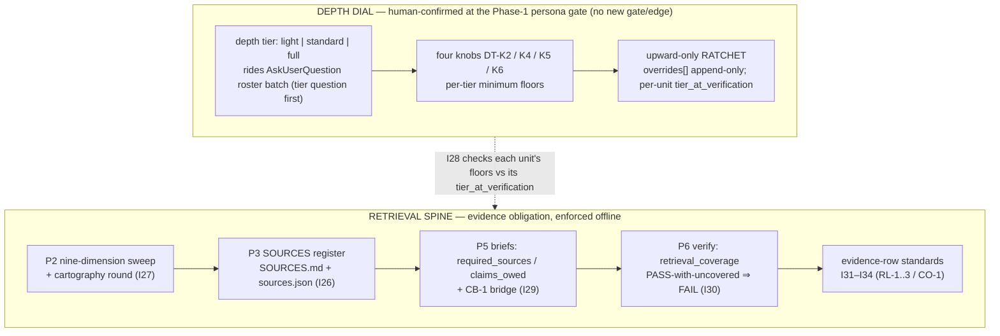

# Depth tiers and retrieval enforcement

**Audience:** technical readers who want to know *exactly* how `dag`'s 1.9.0 depth &
retrieval subsystem decides *how hard to try* and then *mechanically holds a run to that
decision* — how much source-chasing a run owes, how that obligation is written into briefs,
and how a verifier catches a claim that was answered from the model's memory instead of a
source. Every claim here carries a `path:line` locator into the current (1.10.1) tree that a
verifier can re-open; the wiki's own rule is that an unresolved locator is a defect.

**TL;DR.** 1.9.0 adds a *depth dial* and a *retrieval spine*, both enforced offline. The dial
is a human-confirmed **depth tier** (`light` | `standard` | `full`) that rides the existing
Phase-1 persona gate — **no fourth gate, no new FSM edge** — and scales four knobs
(**DT-K2/K4/K5/K6**); after confirmation it is an **upward-only ratchet**. The spine is a
**four-tier source taxonomy** (T-VENDOR/T-COMM/T-LOCAL/T-PARAM) walked down a **fallback
ladder** (live-fetch → vendored-docs → cached-copy → parametric-only), anchored by a
first-class **SOURCES register** (`SOURCES.md` + `sources.json`), a **nine-dimension
clarification sweep**, per-unit **`required_sources`/`claims_owed`** briefs bridged to the
FAIL machinery by **CB-1**, and a verifier-side **`retrieval_coverage`** block. Nine new
invariants **I26–I34** police all of it. Every one is **post-hoc / offline, gates no
transition, and PRESERVES the correction-loop termination proof** — zero REVISES
([`state-machine.md` §4/§5](../plugins/dag/skills/dag/references/state-machine.md)).

---

## 1. The subsystem in one picture

The dial sits at Phase 1; the spine threads Phases 2, 3, 5, 6, and 8. Read left-to-right: the
tier decision constrains *effort*, and the register→briefs→verify chain constrains *evidence*.

Every invariant named here is enforced by `validate_run.py` **after** the artifacts are
emitted; **none is a live guard on the correction loop's back-edge `LT7 (RETRY→EXECUTE)`** — the
same discipline that keeps every post-1.1.1 invariant termination-preserving
([`state-machine.md` §5](../plugins/dag/skills/dag/references/state-machine.md); the CLAUDE.md
deadlock lesson).

---

## 2. The depth tier — a human decision with mechanical floors

### 2.1 It rides the persona gate; it is not a new gate

The tier is proposed and confirmed **in the same `AskUserQuestion` batch as the persona
roster** — tier question *first*, since roster breadth is tier-downstream — with the
recommended option marked and `full` always on the option list. There is **no fourth gate and
no new FSM edge**; the persona gate simply carries one more decision
([`SKILL.md` Phase 1, "The depth tier rides this gate"](../plugins/dag/skills/dag/SKILL.md)).
The initial choice is the human's alone.

The proposal carries a `justification` with **four required, contentful fields**
([`fsm-state.schema.json` `depth.justification`](../plugins/dag/skills/dag/schemas/fsm-state.schema.json)):

- **`stakes`** — what breaks if this run is wrong (free text; the only check is the human
  reading it);
- **`reversibility`** — how cheaply a wrong result is undone (free text);
- **`external_surface`** — structured: `kind` ∈ `project-local | external-dependent | mixed`
  plus `detail`; the validator cross-checks `kind` against the run's own evidence rows (I28-P5);
- **`skipped_floors`** — the **canonical** per-knob delta list (`DT-K<n>@<tier>:` entries, one
  per knob below `full`, empty only for `full`) so the human confirms the tier while seeing the
  **complete** list of what will *not* be done.

The decision is recorded in `fsm-state.depth` (`tier`, `proposed_tier`, `confirmed_tier`,
`confirmed_at_gate`, `justification`, plus `phase2_touch` and `overrides[]`)
([`fsm-state.schema.json` `depth`](../plugins/dag/skills/dag/schemas/fsm-state.schema.json)). If
the human picks a different tier than proposed, `skipped_floors` is re-rendered for the
**confirmed** tier before writing, and the proposed disclosure is kept as prose in
`DECISIONS.md`
([`SKILL.md` Phase 1](../plugins/dag/skills/dag/SKILL.md)). At Phase 2 the tier is recorded as
an ordinary ambiguity-register item (the `stakes` dimension) **and** — unconditionally, once the
tier was confirmed — carried as one keep-or-raise line in the Phase-2 question batch, recorded
in `fsm-state.depth.phase2_touch` (`outcome` ∈ `kept | raised`).

### 2.2 The four knobs (DT-K2/K4/K5/K6)

Ceremony reduction — fewer units, fewer personas, lighter artifacts — is legal exactly down to
the confirmed tier's floors, **never below**, and **no tier waives a human gate** (persona
selection, material clarification, disagreement, sign-off), an existing validator invariant, or
the *universal* floors (the retrieval floor set; two independent sources for
contested/version-sensitive facts — unconditional at every tier; all nine sweep dimensions
dispositioned). The four tier-scaled knobs and their per-tier minimum settings, verbatim from
the [`SKILL.md` Scope-note knob table](../plugins/dag/skills/dag/SKILL.md) (the I28 predicate in
the plan is the normative spec; this rendering is informative):

| Knob | `light` | `standard` | `full` |
|---|---|---|---|
| **DT-K2** verifier retrieval-probe scope (reopen+chase) | owed-covering fallback rows | every fallback row + chase vendor-silent rows | + every URL-locator row + chase every T-COMM row |
| **DT-K4** sweep disposition depth — spot-check scope | nine dimensions dispositioned (explicit-none OK) + I27-10 base spot-check | same | + spot-check covers all nine dimensions |
| **DT-K5** source-tier consultation | T-LOCAL + explicit-none externals | + T-VENDOR when owed | + T-COMM corroboration |
| **DT-K6** panel scope | I16 as-is | I16 as-is | panel on design/schema/validator-tagged units |

### 2.3 The ratchet — upward-only, human-decided

After confirmation the tier is a **ratchet: it can only go up, never down**. Any change is
upward-only (`light < standard < full`), human-decided at a later touchpoint, appended to
`fsm-state.depth.overrides[]` with a `decision_ref` and a `pending_units` snapshot; a raised
floor binds only units **not yet PASS-verified**, and each unit's `verify.json` records its
`tier_at_verification`
([`SKILL.md` Phase 1](../plugins/dag/skills/dag/SKILL.md);
[`fsm-state.schema.json` `depth.overrides`](../plugins/dag/skills/dag/schemas/fsm-state.schema.json)).
Downward moves are **schema-unrepresentable** — `overrides[].from ∈ {light, standard}`,
`to ∈ {standard, full}`. Genuine mid-run de-scoping of *work* is a human-gated `cancel_unit`
amendment (see [`15-artifacts-and-schemas.md`](15-artifacts-and-schemas.md)); a genuinely
mis-tiered run's sanctioned exit is closing at a human gate and re-scoping a fresh run —
over-tiering burns tokens, never correctness.

**I28** checks the recorded tier's floors against the emitted artifacts **offline** — P0 shape/
contentfulness, P1 gate provenance, P1b the unconditional Phase-2 touch, P2 canonical
`skipped_floors` completeness, P3 ratchet monotonicity + per-unit time-scoping, P4 floor
conformance (probe/sweep/register/panel), P5 external-surface consistency — and **adds no gate
flag: `REQUIRED_GATES` is untouched, the three-human-gates model is immutable**
([`state-machine.md` I28 §4 row `:220`](../plugins/dag/skills/dag/references/state-machine.md);
[`validate_run.py` I28 `:2885`](../plugins/dag/skills/dag/scripts/validate_run.py)). Adoption is
gated on `fsm-state.depth` — absent ⇒ I28 is silent (archive-safe).

---

## 3. The four-tier source taxonomy and the fallback ladder

### 3.1 Four tiers

Every debrief evidence row may declare a **`source_tier`**, one of four values
([`debrief.schema.json:32`](../plugins/dag/skills/dag/schemas/debrief.schema.json)):

| Tier | Meaning |
|---|---|
| **T-VENDOR** | first-party / official vendor documentation |
| **T-COMM** | community / third-party — admitted **once** per venue via the K-A/K-B/K-C rationale block |
| **T-LOCAL** | repo / local ground-truth |
| **T-PARAM** | parametric / model-internal — the fallback **floor** |

The register itself registers only the **first three**: `sources.json` `tier` is a three-value
enum with **no `T-PARAM`** — "T-PARAM is not registrable"
([`sources.schema.json:21`](../plugins/dag/skills/dag/schemas/sources.schema.json)), and the
brief's `required_sources[].tier` mirrors that three-value enum
([`brief.schema.json:64`](../plugins/dag/skills/dag/schemas/brief.schema.json)). The doctrine
home for the tiers is `evidence-standards.md` §Source tiers
([`state-machine.md:296-297`](../plugins/dag/skills/dag/references/state-machine.md)).

### 3.2 The fallback ladder

When a source cannot be reached at the best rung, the executor **walks down, never skips
silently**. The rung is declared per evidence row via **`retrieval_rung`**, a four-value enum
top-to-bottom ([`debrief.schema.json:33`](../plugins/dag/skills/dag/schemas/debrief.schema.json)):

**live-fetch → vendored-docs → cached-copy → parametric-only.**

Silent skipping is *unrepresentable* — each rung is declared in the evidence rows, so it stays
verifier-visible and probe-able. If the executor finds web tools unavailable it does **not**
stall and does **not** skip silently — the ladder applies from `vendored-docs` down
([`SKILL.md` Phase 6 retrieval floor `:557-570`](../plugins/dag/skills/dag/SKILL.md)). The
retrieval floor obliges the orchestrator to dispatch executors of units owing URL-located
T-VENDOR/T-COMM sources with **both `WebSearch` and `WebFetch` reachable** (never break tool
inheritance for such units) — `WebSearch` returns titles+URLs only and must always be paired
with `WebFetch`.

---

## 4. The SOURCES register (I26)

The SOURCES register is a **new first-class artifact**: `SOURCES.md` plus its machine-checkable
sidecar `sources.json` (new schema `sources.schema.json`, new template `templates/sources.md`).
It is the **first cartography product**, produced in Phase 3's **source sweep** which runs
*before* the cartography-informed clarification round that reads it
([`SKILL.md` Phase 3 source sweep `:375-388`](../plugins/dag/skills/dag/SKILL.md)).

Each mapped source carries a **tier**, a **locator**, and a **disposition**
([`sources.schema.json` `sources[]`](../plugins/dag/skills/dag/schemas/sources.schema.json)):

- **`consulted`** — opened during the sweep: carries `accessed` (a real date, never invented)
  and a non-blank `yielded` (a negative/silent finding — "silent on X" — is a legal yield);
- **`queued`** — names its intended consumer in `queued_for` (a unit id `U<n>` or the literal
  `execution`);
- **`rejected`** — carries `why`.

Rows are **appended, never rewritten** (dispositions are sweep-time facts; execution-time
consultation is evidenced later in unit debriefs against register ids). T-COMM venues are
admitted **once** in the `venues[]` block, each carrying non-blank **K-A/K-B/K-C** rationale
text (recorded as rationale, *not* checkboxes) and an `admitted` boolean. The register closes
with **coverage claims** (`area`, `claim`, `based_on` register ids, explicit `gaps` — "none"
written out).

The register **feeds three consumers**: the cartography-informed clarification round (its
gaps/queued/rejected rows are the round's candidate questions), brief context pointers
(`S<id>: <locator>` — inline so the brief stays self-contained), and claims-owed derivation.

**I26 enforces the register offline**, fail-closed on absence: once post-clarification
structural work exists (the I-dod trigger family), a schema-valid `sources.json` with **≥1 row
and ≥1 CONSULTED row** must exist; every disposition is complete under a `.strip()` raw-parse
mirror; ids are unique; every venue carries non-blank K-A/K-B/K-C, admitted or refused; a
`consulted`/`queued` T-COMM row links to an `admitted:true` venue while a **rejected** T-COMM
row needs only a resolvable `venue_ref` (the honest failed-admission record); and every coverage
claim's `based_on` resolves to register ids and includes **≥1 consulted** row (an all-unopened
basis FAILs — membership, not relevance). Advisory NOTEs fire on dangling `queued_for` ids,
coverage monoculture (≥2 claims resting on one consulted row), and external tiers present but
none consulted. I26 is **NOT archive-silent** — like I-dod/I24 it fires on positive structural
evidence, because the failure it guards against is *silent* cartography-skipping
([`state-machine.md` I26 §4 row `:218`](../plugins/dag/skills/dag/references/state-machine.md);
[`validate_run.py` I26 `:2492`](../plugins/dag/skills/dag/scripts/validate_run.py)).

---

## 5. The nine-dimension clarification sweep + cartography round (I27)

Phase 2's Clarifier runs a **dimensional sweep** over **nine dimensions**, each dispositioned
exactly once ([`SKILL.md` Phase 2 `:293-304`](../plugins/dag/skills/dag/SKILL.md);
[`clarifications.schema.json` `dimension_sweep`](../plugins/dag/skills/dag/schemas/clarifications.schema.json)):

`terms` · `success-criteria` · `scope-boundaries` · `audience-format` · `constraints` ·
`assumptions` · `failure-modes` · `sources` · `stakes`.

For each dimension the sweep records a **disposition** — `ambiguity-found` (+ the
`register_ids` it produced), or `probed-clear` / `none-after-genuine-search` (+ a non-blank
`search_statement` naming the task-specific surfaces examined, the sanctioned "sought X; none
found" form). The sweep fixes **coverage of the search, never a question count**: zero user
questions is a legal outcome on every dimension. The `sources` dimension maps the task onto the
source tiers and seeds the SOURCES register; the `stakes` dimension feeds the depth-tier
proposal.

Every resolved row records a **`resolution_source`** ([`SKILL.md:308-313`](../plugins/dag/skills/dag/SKILL.md);
[`clarifications.schema.json:26-42`](../plugins/dag/skills/dag/schemas/clarifications.schema.json)):

- **`human-gate`** — traces to a logged gate answer in `DECISIONS.md`;
- **`prompt-verbatim`** — the user's own prompt settles it; the settling span is quoted into
  `prompt_span` (the receipt I27-8 checks);
- **`logged-default`** — your call, visibly yours; a `material` row resolved this way draws a
  validator NOTE.

The **cartography-informed round** is not discretionary conduct once the SOURCES register
exists: disposition every register-derived unknown as a `round: 2` register row or a recorded
no-new-ambiguity outcome, and record `dimension_sweep.cartography_round`
(`status` ∈ `performed | no-register-unknowns | register-absent`, with
`{unknown_ref, register_id}` pairs when `performed`)
([`SKILL.md` Phase 3 `:400-410`](../plugins/dag/skills/dag/SKILL.md);
[`clarifications.schema.json` `cartography_round`](../plugins/dag/skills/dag/schemas/clarifications.schema.json)).
A skipped round is an offline I27-4 FAIL at the next validation — **never a blocked
transition**; the loop-back edge itself stays discretionary orchestrator conduct, adding no
transition and no gate.

**I27** enforces the sweep offline with a **two-level version-honest trigger**: T1 (presence)
fires when structural work exists **and** the run is version-stamped ≥ the shipping release
(`fsm-state.json.validator_version` — **archive-SILENT**, the deliberate asymmetry with I26);
T2 (shape) fires whenever `dimension_sweep` is present. It checks I27-1..11: nine-dimension
exact-once coverage at every tier; per-entry completeness; the `cartography_round` record;
`resolution_source` on resolved rows; and — at P8 — a `sweep_spot_check[]`, with NOTEs at
-6/-7/-11 ([`state-machine.md` I27 §4 row `:219`](../plugins/dag/skills/dag/references/state-machine.md);
[`validate_run.py` I27 `:2645`](../plugins/dag/skills/dag/scripts/validate_run.py)). "Not swept"
is thereby mechanically distinguishable from "swept, nothing found."

---

## 6. Execution-effort briefs: `required_sources` / `claims_owed` + the CB-1 bridge (I29)

At Phase 5 the **orchestrator** — never the executor — derives each unit's retrieval obligations
from its acceptance criteria + the SOURCES register per the O1–O4 rules
([`SKILL.md` Phase 5 `:515-526`](../plugins/dag/skills/dag/SKILL.md);
[`brief.schema.json` `required_sources`/`claims_owed` `:54-105`](../plugins/dag/skills/dag/schemas/brief.schema.json)):

- **`required_sources[]`** — register S-ids the executor MUST consult, each with its **inline**
  locator (the executor never opens `sources.json`) and a three-value `tier`. A rejected
  register row cannot be required.
- **`claims_owed[]`** — obligations fixed *before* execution. Each entry carries a claim `type`
  (the seven-value evidence taxonomy) and a **`trigger_ref` that is verbatim one of this brief's
  `acceptance_criteria`/`dod_refs`** (I29-2 membership — no straw obligations). Source-native
  types (`empirical-world-fact`, `api-tool-contract`, `provenance-quote`) **require** a
  `min_tier`; observation-native types (`code-behavior`, `numeric-quantitative`, `causal`,
  `design-judgment`) carry **none** (schema `allOf` B1/B2). The executor may **ADD** owed
  entries, never shrink.
- **`claims_owed_none_reason`** — required (`.strip()` bar) exactly when `claims_owed` is present
  and empty, so "forgot" and "none owed" stay distinguishable (the I21 explicit-none pattern).

An owed set with **>8 external-tier entries** is a SPLIT signal: designate a research unit
emitting a fact pack and let consumers cite it at rung `cached-copy`.

### The CB-1 bridge

When either list is non-empty, the orchestrator appends the **verbatim CB-1 bridge criterion**
(sourced from [`templates/brief.md` §Required sources](../plugins/dag/skills/dag/templates/brief.md))
to the unit's `acceptance_criteria`. **That one line is what makes retrieval failure FAIL-able
under I6** — a criterion the verifier can fail against
([`SKILL.md:523-526`](../plugins/dag/skills/dag/SKILL.md)). Its **absence is an I29-4 FAIL**;
the comparison is whitespace-normalized.

**I29** enforces this offline via **adoption-closure** (the I20/I21 pattern): once any brief
carries `claims_owed`/`required_sources`, every graph unit's brief must carry `claims_owed`
(entries or `[]` + `claims_owed_none_reason`). Its clause 1 (queued-consumer closure — a
`queued_for` row naming a current unit must appear in that unit's brief) is
**adoption-independent**, riding I26's structurally-triggered register. Clauses 2–5 cover
owed-entry shape/no-straw, register linkage (S-ids resolve; rejected rows unrequirable), CB-1
presence, and explicit-none
([`state-machine.md` I29 §4 row `:221`](../plugins/dag/skills/dag/references/state-machine.md);
[`validate_run.py` I29 `:3180`](../plugins/dag/skills/dag/scripts/validate_run.py)).

---

## 7. The `retrieval_coverage` verify block (I30)

The independent verifier re-derives whether the executor actually discharged its owed claims,
in an optional **`retrieval_coverage`** block on `verify.json`
([`verify.schema.json:112-168`](../plugins/dag/skills/dag/schemas/verify.schema.json)). Its
three required arms are:

- **`owed_check[]`** — one row per owed id, `status` ∈ `covered | covered-downgraded |
  uncovered` with `row_refs` into the debrief evidence rows. A `covered`/`covered-downgraded`
  status **requires ≥1 counted row** (schema `RT-1` — the vacuous-pass hole is closed).
- **`retrieval_probes[]`** — the verifier's re-derivation probes, each `kind` ∈ `reopen | chase`
  with a `claim_echo` and an `outcome` (or `retrieval_probes_none_reason`).
- **`sources_check[]`** — S-id rows with `origin` ∈ `required_sources | context_pointer |
  owed_note | coverage_basis` and `outcome` ∈ `consulted-evidenced | unreachable-declared |
  not-consulted`.
- **`tier_at_verification`** ∈ `light | standard | full` — required by I30-0 whenever
  `fsm-state` carries the depth block (this is the per-unit ratchet anchor of §2.3).

**`covered-downgraded`** is the honest confidence downgrade for parametric-only / vendor-silent
coverage: legal on PASS, **never silently relabeled `covered`**.

**I30** enforces this offline via **adoption-closure (the I22 pattern) + forced linkage** — an
owing brief forces the block onto its verdict-bearing verify. Its headline clause 3 is the
contradiction check: **a PASS with an uncovered owed id (or a not-consulted required source) is
a FAIL**. Other clauses re-compute coverage arithmetic (clause 2), enforce the ≥1-reopen-probe
**probe floor** on external coverage (clause 4, tier-independent; DT-K2 scales *on top*), a
target-list superset (clause 5), and consulted/unreachable joins (clauses 6–7)
([`state-machine.md` I30 §4 row `:222`](../plugins/dag/skills/dag/references/state-machine.md);
[`validate_run.py` I30 `:3374`](../plugins/dag/skills/dag/scripts/validate_run.py)). Termination
is preserved — the verdict enum and the LT3–LT6 loop partition are untouched.

---

## 8. The invariant catalog — I26–I34

I26–I30 have full **§4 rows**; **I31–I34 have NO §4 row — they live only in the §5 enforce-list**
([`state-machine.md:295-297`](../plugins/dag/skills/dag/references/state-machine.md)), with their
doctrine home in `evidence-standards.md` §Source tiers. All nine are **post-hoc / offline, gate
no transition, and PRESERVE** the termination proof, AO-1..7, I1–I25, the three-human-gates
model, and the FSM edge set.

| Inv | What it requires | Class | Locators |
|---|---|---|---|
| **I26** sources register | Structural-trigger, fail-closed presence of a schema-valid `sources.json` (≥1 row, ≥1 consulted); disposition completeness; unique ids; per-venue K-A/K-B/K-C admissions; T-COMM consulted/queued ⇒ admitted venue; coverage `based_on` ⇒ register ids incl. ≥1 consulted. **NOT archive-silent.** | PRESERVES | [`state-machine.md:218`](../plugins/dag/skills/dag/references/state-machine.md); [`validate_run.py:2492`](../plugins/dag/skills/dag/scripts/validate_run.py); [`sources.schema.json`](../plugins/dag/skills/dag/schemas/sources.schema.json) |
| **I27** clarification sweep | Two-level trigger (T1 presence, version-stamped ≥ release, **archive-silent**; T2 shape whenever `dimension_sweep` present). I27-1..11: nine-dim exact-once coverage; per-entry completeness; `cartography_round` record; `resolution_source` on resolved rows; P8 `sweep_spot_check[]`. NOTEs at -6/-7/-11. | PRESERVES | [`state-machine.md:219`](../plugins/dag/skills/dag/references/state-machine.md); [`validate_run.py:2645`](../plugins/dag/skills/dag/scripts/validate_run.py); [`clarifications.schema.json` `dimension_sweep`](../plugins/dag/skills/dag/schemas/clarifications.schema.json) |
| **I28** depth-tier floors | Adoption-gated on `fsm-state.depth` (absent ⇒ silent). P0 shape; P1 gate provenance; P1b unconditional Phase-2 touch; P2 canonical `skipped_floors`=={DT-K2,K4,K5,K6}; P3 upward-only ratchet + per-unit `tier_at_verification`; P4 probe/sweep/register/panel floor conformance; P5 external-surface consistency. **Adds NO gate flag — `REQUIRED_GATES` untouched.** | PRESERVES | [`state-machine.md:220`](../plugins/dag/skills/dag/references/state-machine.md); [`validate_run.py:2885`](../plugins/dag/skills/dag/scripts/validate_run.py); [`fsm-state.schema.json` `depth`](../plugins/dag/skills/dag/schemas/fsm-state.schema.json) |
| **I29** execution-effort briefs | Adoption-closure (I20/I21): once any brief carries `claims_owed`/`required_sources`, every brief carries `claims_owed`. Owed-entry shape (`trigger_ref` verbatim ∈ criteria ∪ dod_refs); register linkage; **CB-1 bridge presence** (clause 4); explicit-none; queued-consumer closure (adoption-independent, rides I26). | PRESERVES | [`state-machine.md:221`](../plugins/dag/skills/dag/references/state-machine.md); [`validate_run.py:3180`](../plugins/dag/skills/dag/scripts/validate_run.py); [`brief.schema.json:54-105`](../plugins/dag/skills/dag/schemas/brief.schema.json) |
| **I30** retrieval-coverage verify | Adoption-closure (I22) + forced linkage. `owed_check` totality (set equality); recomputed coverage arithmetic; **PASS-with-uncovered ⇒ FAIL** (headline); probe floor; target-list superset; consulted/unreachable joins. | PRESERVES | [`state-machine.md:222`](../plugins/dag/skills/dag/references/state-machine.md); [`validate_run.py:3374`](../plugins/dag/skills/dag/scripts/validate_run.py); [`verify.schema.json:112-168`](../plugins/dag/skills/dag/schemas/verify.schema.json) |
| **I31** = RL-1 rung presence | Any evidence row carrying `source_tier`/`retrieval_rung` ⇒ the rung is declared (no silent skip). | PRESERVES | [`state-machine.md:295-297`](../plugins/dag/skills/dag/references/state-machine.md) (§5 only); [`validate_run.py:3717`](../plugins/dag/skills/dag/scripts/validate_run.py) |
| **I32** = RL-2 parametric-downgrade consistency | A parametric-only row needs (a) an `ASSUMPTION` label in its evidence text, (b) `residual_risks[]` naming that claim, and (c) confidence **capped below `high`** — parametric coverage can't be `high`. | PRESERVES | [`state-machine.md:295-297`](../plugins/dag/skills/dag/references/state-machine.md); [`validate_run.py:3759`](../plugins/dag/skills/dag/scripts/validate_run.py) |
| **I33** = RL-3 premise-extraction presence | `design-judgment` rows **only** ⇒ `extracted_premises` present. | PRESERVES | [`state-machine.md:295-297`](../plugins/dag/skills/dag/references/state-machine.md); [`validate_run.py:3803`](../plugins/dag/skills/dag/scripts/validate_run.py) |
| **I34** = CO-1 per-entry owed coverage | Any brief with a non-empty `claims_owed` ⇒ per-entry owed coverage. | PRESERVES | [`state-machine.md:295-297`](../plugins/dag/skills/dag/references/state-machine.md); [`validate_run.py:3836`](../plugins/dag/skills/dag/scripts/validate_run.py) |

These join the existing catalog (`I1..I25 + I1b/I1c/I1d/I3b/I3c + I-dod`) documented on
[`14-validator-and-invariants.md`](14-validator-and-invariants.md); their stem labels live in
the validator's `LABELS` block
([`validate_run.py:435-453`](../plugins/dag/skills/dag/scripts/validate_run.py)).

The catalog does not stop at I34: the later **socratic-guardrail invariants I35–I40**
(1.10.0/1.10.1 — bounded Socratic dialogue-series, consequential-gap ask-first, non-goal
solicitation, and anchor-stability, over the new `dialogues.json` transcript) share this same
offline/post-hoc, never-a-guard-on-`LT7` discipline; they are documented on
[`14-validator-and-invariants.md`](14-validator-and-invariants.md) §4.4.

---

## 9. What this subsystem does NOT enforce — the honest boundary (P–T)

Everything in §2–§8 is a check of **shape or structure**; none of it decides **truth of
content**. The 1.9.0 residuals are enumerated verbatim as Limitations **P–T**
([`state-machine.md` §5 `:411-450`](../plugins/dag/skills/dag/references/state-machine.md)) —
the same *validity ≠ correctness* seam that governs the whole catalog (see
[`07-accuracy.md`](07-accuracy.md), [`14-validator-and-invariants.md`](14-validator-and-invariants.md)).

- **P — register truthfulness.** I26 proves a register has *shape* — rows, dispositions, dates,
  venue rationale, coverage linkage — never that a `consulted` row was genuinely read (**the
  validator opens no locator**), that a tier tag is honest, that a coverage basis is *relevant*
  to its area (check 6 tests membership, not relevance — flagged only by the monoculture NOTE),
  or that the sweep was *adequate* (a thin-but-well-formed register passes). Backstop: the
  verifier's target list — brief-cited rows, owed rows, coverage-lineage rows, orphan sampling,
  and the queued-heavy sampling rule.
- **Q — sweep genuineness.** I27 proves the nine-dimension sweep has *coverage* and disposition
  *presence* — never that a recorded search actually happened, that
  `resolution_source:"human-gate"` is truthful, or that nine bespoke-but-fake search statements
  weren't authored (same honesty class as I13).
- **R — depth-tier residuals.** `stakes`/`reversibility` are attested prose, human-judged at the
  gate; a probe record proves a probe was *claimed* with an outcome, not performed; a human can
  be talked into `light` (the unconditional Phase-2 touch is the mitigation, not a proof); a
  genuinely over-tiered run burns tokens, never correctness.
- **S — effort-enforcement residuals.** The register sample proves spot-*checkability*, not
  totality; the dispatched tool set is not an emitted artifact; owed-entry subject-match,
  O1–O4 derivation adequacy, and locator↔register matching all stay verifier/human judgment.
- **T — retrieval-standard residuals.** RL-1/I31 proves a rung was *declared*, not that higher
  rungs were genuinely attempted; a declared `live-fetch`/`accessed` date and the K-A/B/C venue
  answers are attested (the Limitation-B/C class); and the confidence downgrade is mostly
  informational.

The mechanical layer secures the *plumbing*; the independent adversarial verifier
([`06-verification.md`](06-verification.md)) is the only thing pushing on the *truth* of what a
run actually retrieved.

---

## 10. See also

- [`14-validator-and-invariants.md`](14-validator-and-invariants.md) — the full invariant
  catalog (I1..I34) and the offline/post-hoc discipline these nine invariants share.
- [`07-accuracy.md`](07-accuracy.md) — adaptive evidence standards and the *validity ≠
  correctness* frame the four-tier taxonomy and I31–I34 extend.
- [`15-artifacts-and-schemas.md`](15-artifacts-and-schemas.md) — the `sources.json` schema, the
  `depth` block, and the `retrieval_coverage`/brief fields deep-dived here; the `cancel_unit`
  amendment path for genuine de-scoping.
- [`06-verification.md`](06-verification.md) — the independent verifier that emits
  `retrieval_coverage` and carries the correctness load I26–I30 cannot.
- [`08-how-it-fits.md`](08-how-it-fits.md) — where the depth gate (Phase 1), the sweep (Phase 2),
  the source sweep (Phase 3), and the retrieval floor (Phase 6) sit in the phase walkthrough.
